# 0x04. Convolutions and Pooling

<p align='center'>
  
</p>

## Learning Objectives

- What is a convolution?
- What is max pooling? average pooling?
- What is a kernel/filter?
- What is padding?
- What is “same” padding? “valid” padding?
- What is a stride?
- What are channels?
- How to perform a convolution over an image
- How to perform max/average pooling over an image

## Requirements

- Allowed editors: `vi`, `vim`, `emacs`
- All your files will be interpreted/compiled on Ubuntu 16.04 LTS using `python3` (version 3.5)
- Your files will be executed with numpy (version 1.15)
- All your files should end with a new line
- The first line of all your files should be exactly `#!/usr/bin/env python3`
- All of your files must be executable
- A `README.md` file, at the root of the folder of the project, is mandatory
- Your code should use the `pycodestyle` style (version 2.4)
- All your modules should have documentation (`python3 -c 'print(__import__("my_module").__doc__)'`)
- All your classes should have documentation (`python3 -c 'print(__import__("my_module").MyClass.__doc__)'`)
- All your functions (inside and outside a class) should have documentation (`python3 -c 'print(__import__("my_module").my_function.__doc__)'` and `python3 -c 'print\
(__import__("my_module").MyClass.my_function.__doc__)'`)
- Unless otherwise noted, you are not allowed to import any module except `import numpy as np` and `from math import ceil, floor`
- You are not allowed to use `np.convolve`

## Tasks

### [0. Valid Convolution](./0-convolve_grayscale_valid.py)

Write a function `def convolve_grayscale_valid(images, kernel):` that performs a valid convolution on grayscale images:

*   `images` is a `numpy.ndarray` with shape `(m, h, w)` containing multiple grayscale images
    *   `m` is the number of images
    *   `h` is the height in pixels of the images
    *   `w` is the width in pixels of the images
*   `kernel` is a `numpy.ndarray` with shape `(kh, kw)` containing the kernel for the convolution
    *   `kh` is the height of the kernel
    *   `kw` is the width of the kernel
*   You are only allowed to use two `for` loops; any other loops of any kind are not allowed
*   Returns: a `numpy.ndarray` containing the convolved images

```
    ubuntu@alexa-ml:~/math/0x04-convolutions_and_pooling$ ./0-main.py 
    (50000, 28, 28)
    (50000, 26, 26)
```


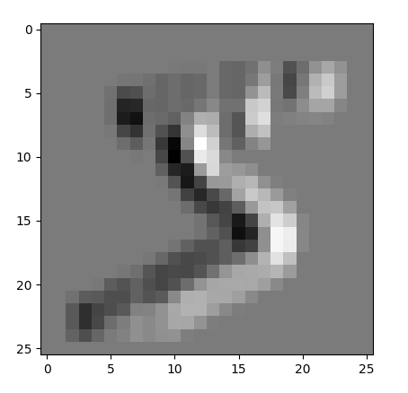

---

### [1. Same Convolution](./1-convolve_grayscale_same.py)

Write a function `def convolve_grayscale_same(images, kernel):` that performs a same convolution on grayscale images:

*   `images` is a `numpy.ndarray` with shape `(m, h, w)` containing multiple grayscale images
    *   `m` is the number of images
    *   `h` is the height in pixels of the images
    *   `w` is the width in pixels of the images
*   `kernel` is a `numpy.ndarray` with shape `(kh, kw)` containing the kernel for the convolution
    *   `kh` is the height of the kernel
    *   `kw` is the width of the kernel
*   if necessary, the image should be padded with 0’s
*   You are only allowed to use two `for` loops; any other loops of any kind are not allowed
*   Returns: a `numpy.ndarray` containing the convolved images

```
    ubuntu@alexa-ml:~/math/0x04-convolutions_and_pooling$ ./1-main.py 
    (50000, 28, 28)
    (50000, 28, 28)
```


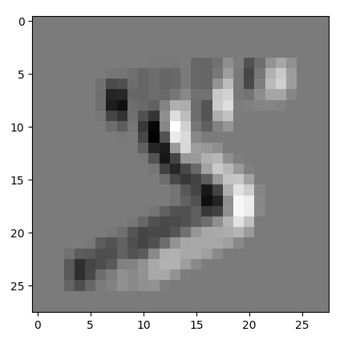

---

### [2. Convolution with Padding](./2-convolve_grayscale_padding.py)

Write a function `def convolve_grayscale_padding(images, kernel, padding):` that performs a convolution on grayscale images with custom padding:

*   `images` is a `numpy.ndarray` with shape `(m, h, w)` containing multiple grayscale images
    *   `m` is the number of images
    *   `h` is the height in pixels of the images
    *   `w` is the width in pixels of the images
*   `kernel` is a `numpy.ndarray` with shape `(kh, kw)` containing the kernel for the convolution
    *   `kh` is the height of the kernel
    *   `kw` is the width of the kernel
*   `padding` is a tuple of `(ph, pw)`
    *   `ph` is the padding for the height of the image
    *   `pw` is the padding for the width of the image
    *   the image should be padded with 0’s
*   You are only allowed to use two `for` loops; any other loops of any kind are not allowed
*   Returns: a `numpy.ndarray` containing the convolved images

```
    ubuntu@alexa-ml:~/math/0x04-convolutions_and_pooling$ ./2-main.py 
    (50000, 28, 28)
    (50000, 30, 34)
```
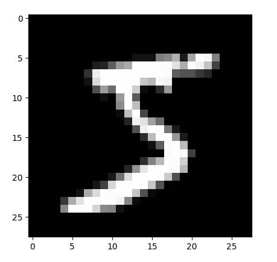

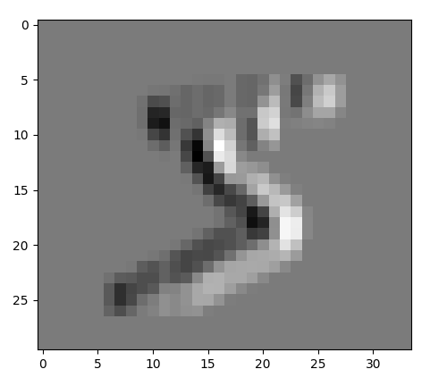

---

### [3. Strided Convolution](./3-convolve_grayscale.py)

Write a function `def convolve_grayscale(images, kernel, padding='same', stride=(1, 1)):` that performs a convolution on grayscale images:

*   `images` is a `numpy.ndarray` with shape `(m, h, w)` containing multiple grayscale images
    *   `m` is the number of images
    *   `h` is the height in pixels of the images
    *   `w` is the width in pixels of the images
*   `kernel` is a `numpy.ndarray` with shape `(kh, kw)` containing the kernel for the convolution
    *   `kh` is the height of the kernel
    *   `kw` is the width of the kernel
*   `padding` is either a tuple of `(ph, pw)`, ‘same’, or ‘valid’
    *   if ‘same’, performs a same convolution
    *   if ‘valid’, performs a valid convolution
    *   if a tuple:
        *   `ph` is the padding for the height of the image
        *   `pw` is the padding for the width of the image
    *   the image should be padded with 0’s
*   `stride` is a tuple of `(sh, sw)`
    *   `sh` is the stride for the height of the image
    *   `sw` is the stride for the width of the image
*   You are only allowed to use two `for` loops; any other loops of any kind are not allowed _Hint: loop over `i` and `j`_
*   Returns: a `numpy.ndarray` containing the convolved images

```
    ubuntu@alexa-ml:~/math/0x04-convolutions_and_pooling$ ./3-main.py 
    (50000, 28, 28)
    (50000, 13, 13)
```


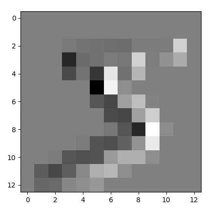

---

### [4. Convolution with Channels](./4-convolve_channels.py)

Write a function `def convolve_channels(images, kernel, padding='same', stride=(1, 1)):` that performs a convolution on images with channels:

*   `images` is a `numpy.ndarray` with shape `(m, h, w, c)` containing multiple images
    *   `m` is the number of images
    *   `h` is the height in pixels of the images
    *   `w` is the width in pixels of the images
    *   `c` is the number of channels in the image
*   `kernel` is a `numpy.ndarray` with shape `(kh, kw, c)` containing the kernel for the convolution
    *   `kh` is the height of the kernel
    *   `kw` is the width of the kernel
*   `padding` is either a tuple of `(ph, pw)`, ‘same’, or ‘valid’
    *   if ‘same’, performs a same convolution
    *   if ‘valid’, performs a valid convolution
    *   if a tuple:
        *   `ph` is the padding for the height of the image
        *   `pw` is the padding for the width of the image
    *   the image should be padded with 0’s
*   `stride` is a tuple of `(sh, sw)`
    *   `sh` is the stride for the height of the image
    *   `sw` is the stride for the width of the image
*   You are only allowed to use two `for` loops; any other loops of any kind are not allowed
*   Returns: a `numpy.ndarray` containing the convolved images

```
    ubuntu@alexa-ml:~/math/0x04-convolutions_and_pooling$ ./4-main.py 
    (10000, 32, 32, 3)
    (10000, 30, 30)
```


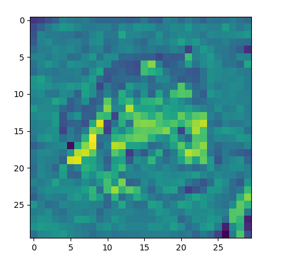

---

### [5. Multiple Kernels](./5-convolve.py)

Write a function `def convolve(images, kernels, padding='same', stride=(1, 1)):` that performs a convolution on images using multiple kernels:

*   `images` is a `numpy.ndarray` with shape `(m, h, w, c)` containing multiple images
    *   `m` is the number of images
    *   `h` is the height in pixels of the images
    *   `w` is the width in pixels of the images
    *   `c` is the number of channels in the image
*   `kernels` is a `numpy.ndarray` with shape `(kh, kw, c, nc)` containing the kernels for the convolution
    *   `kh` is the height of a kernel
    *   `kw` is the width of a kernel
    *   `nc` is the number of kernels
*   `padding` is either a tuple of `(ph, pw)`, ‘same’, or ‘valid’
    *   if ‘same’, performs a same convolution
    *   if ‘valid’, performs a valid convolution
    *   if a tuple:
        *   `ph` is the padding for the height of the image
        *   `pw` is the padding for the width of the image
    *   the image should be padded with 0’s
*   `stride` is a tuple of `(sh, sw)`
    *   `sh` is the stride for the height of the image
    *   `sw` is the stride for the width of the image
*   You are only allowed to use three `for` loops; any other loops of any kind are not allowed
*   Returns: a `numpy.ndarray` containing the convolved images

```
    ubuntu@alexa-ml:~/math/0x04-convolutions_and_pooling$ ./5-main.py 
    (10000, 32, 32, 3)
    (10000, 30, 30, 3)
```


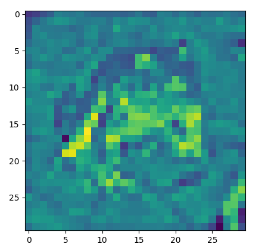

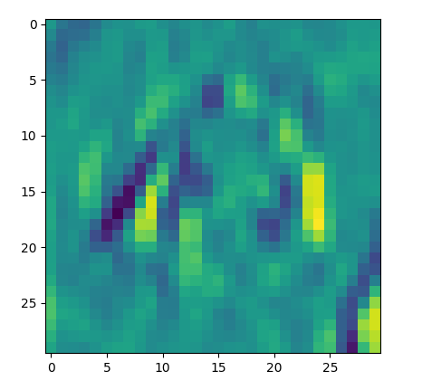

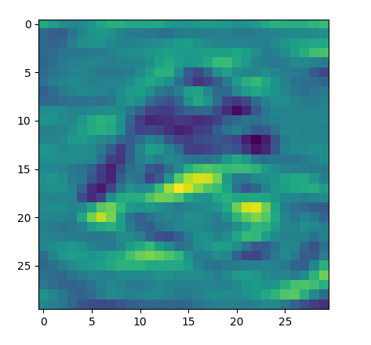

---

### [6. Pooling](./6-pool.py)

Write a function `def pool(images, kernel_shape, stride, mode='max'):` that performs pooling on images:

*   `images` is a `numpy.ndarray` with shape `(m, h, w, c)` containing multiple images
    *   `m` is the number of images
    *   `h` is the height in pixels of the images
    *   `w` is the width in pixels of the images
    *   `c` is the number of channels in the image
*   `kernel_shape` is a tuple of `(kh, kw)` containing the kernel shape for the pooling
    *   `kh` is the height of the kernel
    *   `kw` is the width of the kernel
*   `stride` is a tuple of `(sh, sw)`
    *   `sh` is the stride for the height of the image
    *   `sw` is the stride for the width of the image
*   `mode` indicates the type of pooling
    *   `max` indicates max pooling
    *   `avg` indicates average pooling
*   You are only allowed to use two `for` loops; any other loops of any kind are not allowed
*   Returns: a `numpy.ndarray` containing the pooled images

```
    ubuntu@alexa-ml:~/math/0x04-convolutions_and_pooling$ ./6-main.py 
    (10000, 32, 32, 3)
    (10000, 16, 16, 3)
```
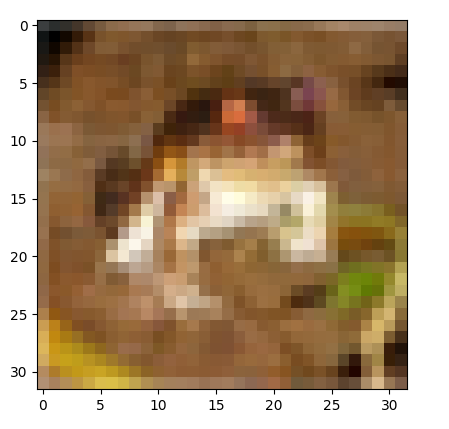

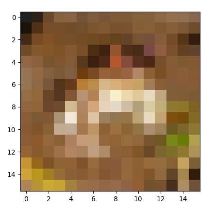

---

## Author

- **Pierre Beaujuge** - [PierreBeaujuge](https://github.com/PierreBeaujuge)