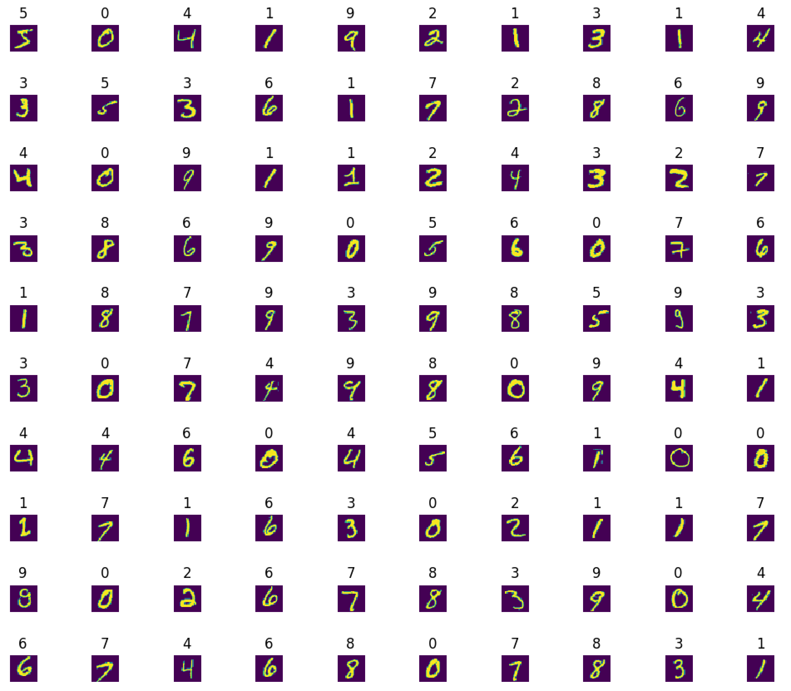
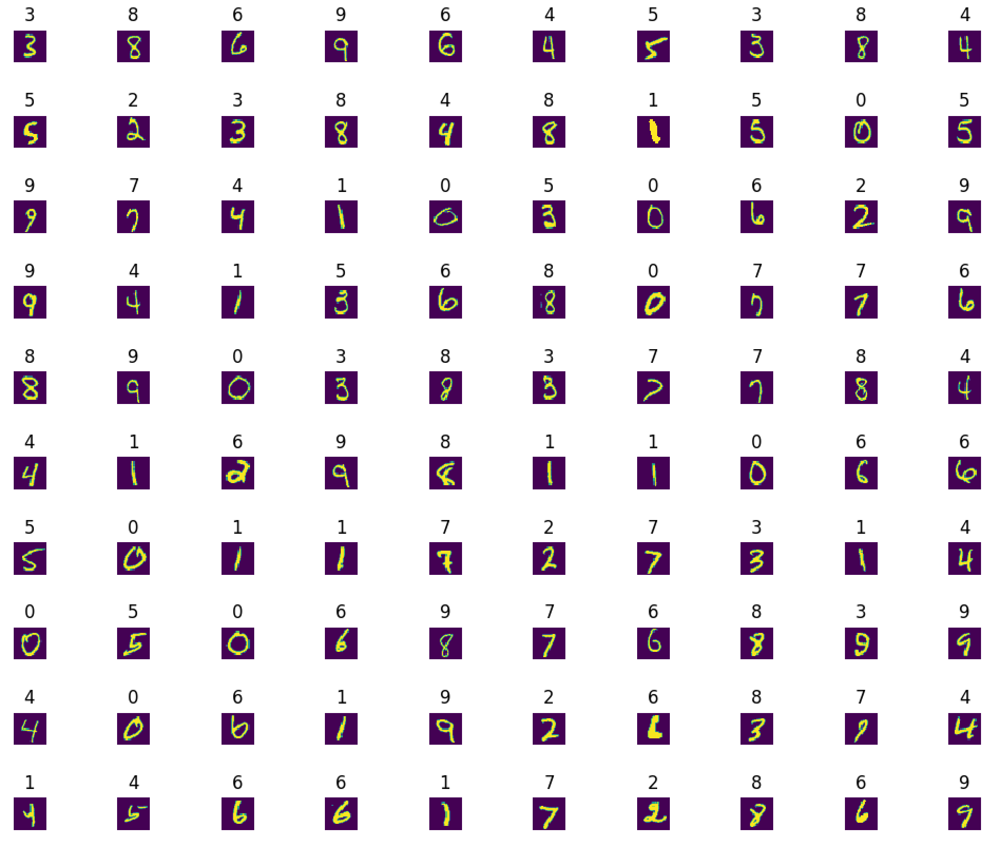
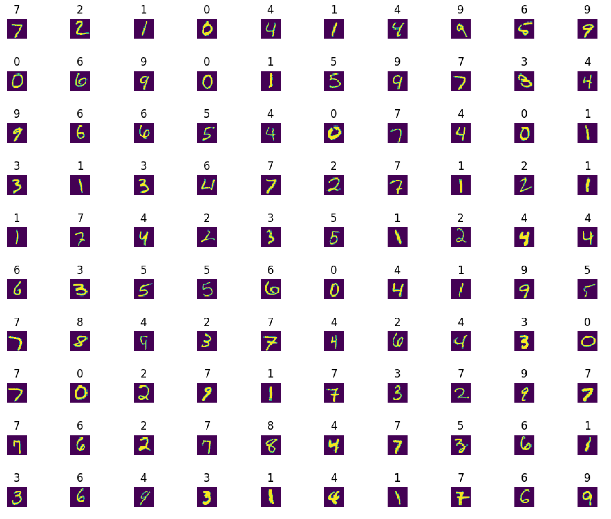
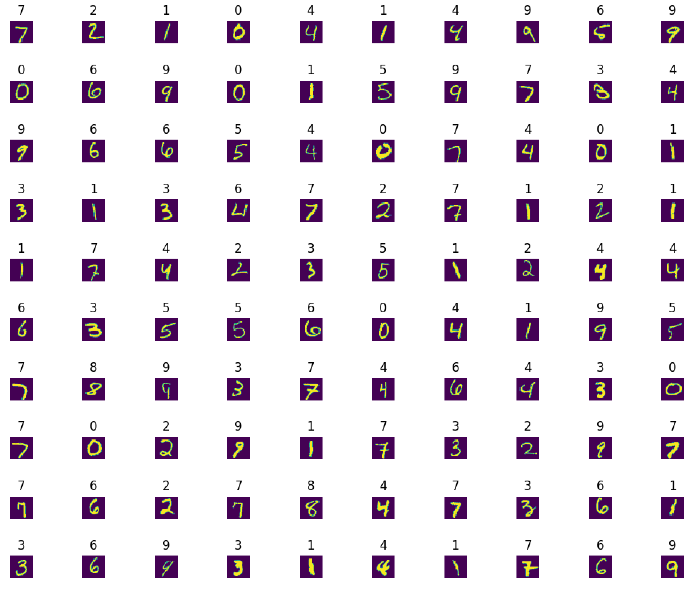

# 0x01. Multiclass Classification

## Learning Objectives

- What is multiclass classification?
- What is a one-hot vector?
- How to encode/decode one-hot vectors
- What is the softmax function and when do you use it?
- What is cross-entropy loss?
- What is pickling in Python?

## Requirements

- Allowed editors: `vi`, `vim`, `emacs`
- All your files will be interpreted/compiled on Ubuntu 16.04 LTS using `python3` (version 3.5)
- Your files will be executed with `numpy` (version 1.15)
- All your files should end with a new line
- The first line of all your files should be exactly `#!/usr/bin/env python3`
- All of your files must be executable
- A `README.md` file, at the root of the folder of the project, is mandatory
- Your code should use the `pycodestyle` style (version 2.4)
- All your modules should have documentation (`python3 -c 'print(__import__("my_module").__doc__)'`)
- All your classes should have documentation (`python3 -c 'print(__import__("my_module").MyClass.__doc__)'`)
- All your functions (inside and outside a class) should have documentation (`python3 -c 'print(__import__("my_module").my_function.__doc__)'` and `python3 -c 'print\
(__import__("my_module").MyClass.my_function.__doc__)'`)

## Testing your code

In order to test your code, you’ll need DATA! Please download this `dataset` to go along with all of the following main files. You do not need to upload this file to GitHub. Your code will not necessarily be tested with this dataset.

```
alexa@ubuntu-xenial:0x01-multiclass_classification$ cat show_data.py
```
```py
#!/usr/bin/env python3

import matplotlib.pyplot as plt
import numpy as np

lib = np.load('../data/MNIST.npz')
print(lib.files)
X_train_3D = lib['X_train']
Y_train = lib['Y_train']

fig = plt.figure(figsize=(10, 10))
for i in range(100):
    fig.add_subplot(10, 10, i + 1)
    plt.imshow(X_train_3D[i])
    plt.title(str(Y_train[i]))
    plt.axis('off')
plt.tight_layout()
plt.show()
```
```
alexa@ubuntu-xenial:0x01-multiclass_classification$ ./show_data.py
['Y_test', 'X_test', 'X_train', 'Y_train', 'X_valid', 'Y_valid']
```


## Tasks

### [0. One-Hot Encode](./0-one_hot_encode.py)

Write a function `def one_hot_encode(Y, classes):` that converts a numeric label vector into a one-hot matrix:

*   `Y` is a `numpy.ndarray` with shape (`m`,) containing numeric class labels
    *   `m` is the number of examples
*   `classes` is the maximum number of classes found in `Y`
*   Returns: a one-hot encoding of `Y` with shape (`classes`, `m`), or `None` on failure

```
    alexa@ubuntu-xenial:0x01-multiclass_classification$ ./0-main.py
    [5 0 4 1 9 2 1 3 1 4]
    [[0. 1. 0. 0. 0. 0. 0. 0. 0. 0.]
     [0. 0. 0. 1. 0. 0. 1. 0. 1. 0.]
     [0. 0. 0. 0. 0. 1. 0. 0. 0. 0.]
     [0. 0. 0. 0. 0. 0. 0. 1. 0. 0.]
     [0. 0. 1. 0. 0. 0. 0. 0. 0. 1.]
     [1. 0. 0. 0. 0. 0. 0. 0. 0. 0.]
     [0. 0. 0. 0. 0. 0. 0. 0. 0. 0.]
     [0. 0. 0. 0. 0. 0. 0. 0. 0. 0.]
     [0. 0. 0. 0. 0. 0. 0. 0. 0. 0.]
     [0. 0. 0. 0. 1. 0. 0. 0. 0. 0.]]
    alexa@ubuntu-xenial:0x01-multiclass_classification$
```

---

### [1. One-Hot Decode](./1-one_hot_decode.py)

Write a function `def one_hot_decode(one_hot):` that converts a one-hot matrix into a vector of labels:

*   `one_hot` is a one-hot encoded `numpy.ndarray` with shape (`classes`, `m`)
    *   `classes` is the maximum number of classes
    *   `m` is the number of examples
*   Returns: a `numpy.ndarray` with shape (`m`, ) containing the numeric labels for each example, or `None` on failure

```
    alexa@ubuntu-xenial:0x01-multiclass_classification$ ./1-main.py
    [5 0 4 1 9 2 1 3 1 4]
    [5 0 4 1 9 2 1 3 1 4]
    alexa@ubuntu-xenial:0x01-multiclass_classification$
```

---

### [2. Persistence is Key](./2-deep_neural_network.py)

Update the class `DeepNeuralNetwork` (based on [23-deep\_neural\_network.py](/rltoken/yPezX8nyo21M6tHjmNxklg "23-deep_neural_network.py")):

*   Create the instance method `def save(self, filename):`
    
    *   Saves the instance object to a file in `pickle` format
    *   `filename` is the file to which the object should be saved
    *   If `filename` does not have the extension `.pkl`, add it
*   Create the static method `def load(filename):`
    
    *   Loads a pickled `DeepNeuralNetwork` object
    *   `filename` is the file from which the object should be loaded
    *   Returns: the loaded object, or `None` if `filename` doesn’t exist

```
    alexa@ubuntu-xenial:0x01-multiclass_classification$ ls 2-output*
    ls: cannot access '2-output*': No such file or directory
    alexa@ubuntu-xenial:0x01-multiclass_classification$ ./2-main.py
    Cost after 0 iterations: 0.7773240521521816
    Cost after 100 iterations: 0.18751378071323066
    Cost after 200 iterations: 0.12117095705345622
    Cost after 300 iterations: 0.09031067302785326
    Cost after 400 iterations: 0.07222364349190777
    Cost after 500 iterations: 0.060335256947006956
    True
    alexa@ubuntu-xenial:0x01-multiclass_classification$ ls 2-output*
    2-output.pkl
    alexa@ubuntu-xenial:0x01-multiclass_classification$
```

---

### [3. Update DeepNeuralNetwork](./3-deep_neural_network.py)

Update the class `DeepNeuralNetwork` to perform multiclass classification (based on `2-deep_neural_network.py`):

*   You will need to update the instance methods `forward_prop`, `cost`, and `evaluate`
*   `Y` is now a one-hot `numpy.ndarray` of shape `(classes, m)`

_Ideally, you should not have to change the `__init__`, `gradient_descent`, or `train` instance methods_

Because the training process takes such a long time, I have pretrained a model for you to load and finish training ([3-saved.pkl](https://s3.amazonaws.com/intranet-projects-files/holbertonschool-ml/3-saved.pkl "3-saved.pkl")). This model has already been trained for 2000 iterations.

_The training process may take up to 5 minutes_

```
    ubuntu@alexa-ml:~$ ./3-main.py
    Cost after 0 iterations: 0.4388904112857044
    Cost after 10 iterations: 0.4377828804163359
    Cost after 20 iterations: 0.43668839872612714
    Cost after 30 iterations: 0.43560674736059446
    Cost after 40 iterations: 0.43453771176806555
    Cost after 50 iterations: 0.4334810815993252
    Cost after 60 iterations: 0.43243665061046205
    Cost after 70 iterations: 0.4314042165687683
    Cost after 80 iterations: 0.4303835811615513
    Cost after 90 iterations: 0.4293745499077264
    Cost after 100 iterations: 0.42837693207206473
    Train cost: 0.42837693207206473
    Train accuracy: 88.442%
    Validation cost: 0.39517557351173044
    Validation accuracy: 89.64%
```

_As you can see, our training has become very slow and is beginning to plateau. Let’s alter the model a little and see if we get a better result_

---

### [4. All the Activations](./4-deep_neural_network.py)

Update the class `DeepNeuralNetwork` to allow different activation functions (based on `3-deep_neural_network.py`):

*   Update the `__init__` method to `def __init__(self, nx, layers, activation='sig'):`
    *   `activation` represents the type of activation function used in the hidden layers
        *   `sig` represents a sigmoid activation
        *   `tanh` represents a tanh activation
        *   if `activation` is not `sig` or `tanh`, raise a `ValueError` with the exception: `activation must be 'sig' or 'tanh'`
    *   Create the private attribute `__activation` and set it to the value of `activation`
    *   Create a getter for the private attribute `__activation`
*   Update the `forward_prop` and `gradient_descent` instance methods to use the `__activation` function in the hidden layers

Because the training process takes such a long time, I have pre-trained a model for you to load and finish training ([4-saved.pkl](https://s3.amazonaws.com/intranet-projects-files/holbertonschool-ml/4-saved.pkl "4-saved.pkl")). This model has already been trained for 2000 iterations.

_The training process may take up to 5 minutes_

```
    alexa@ubuntu-xenial:0x01-multiclass_classification$ ./4-main.py
    Sigmoid activation:
    Train cost: 0.42837693207206473
    Train accuracy: 88.442%
    Validation cost: 0.39517557351173044
    Validation accuracy: 89.64%
    Test cost: 0.4074169894615401
    Test accuracy: 89.0%
```

```
    Tanh activaiton:
    Cost after 0 iterations: 0.18061815622291985
    Cost after 10 iterations: 0.18012009542718577
    Cost after 20 iterations: 0.1796242897834926
    Cost after 30 iterations: 0.17913072860418564
    Cost after 40 iterations: 0.1786394012066576
    Cost after 50 iterations: 0.17815029691267442
    Cost after 60 iterations: 0.1776634050478437
    Cost after 70 iterations: 0.1771787149412177
    Cost after 80 iterations: 0.1766962159250237
    Cost after 90 iterations: 0.1762158973345138
    Cost after 100 iterations: 0.1757377485079266
    Train cost: 0.1757377485079266
    Train accuracy: 95.006%
    Validation cost: 0.17689309600397934
    Validation accuracy: 95.13000000000001%
    Test cost: 0.1809489808838737
    Test accuracy: 94.77%
 ```

_The training of this model is also getting slow and plateauing after about 2000 iterations. However, just by changing the activation function, we have nearly halved the model’s cost and increased its accuracy by about 6%_

---

## Author

- **Pierre Beaujuge** - [PierreBeaujuge](https://github.com/PierreBeaujuge)