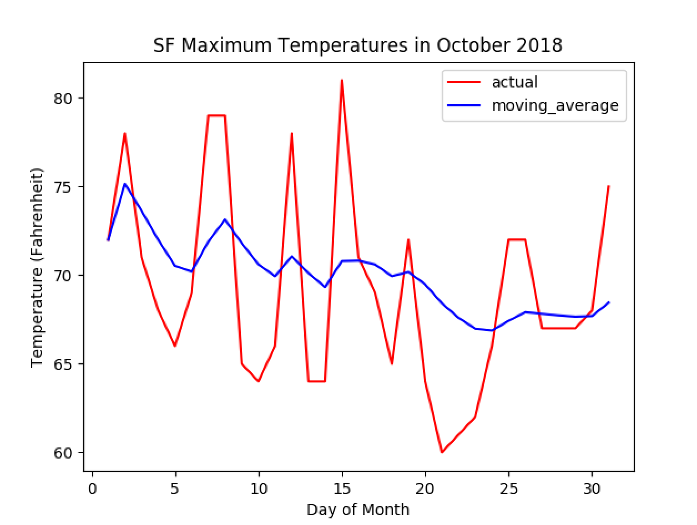
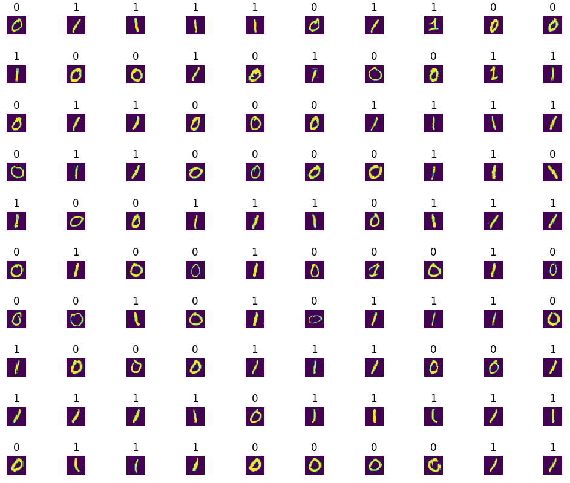
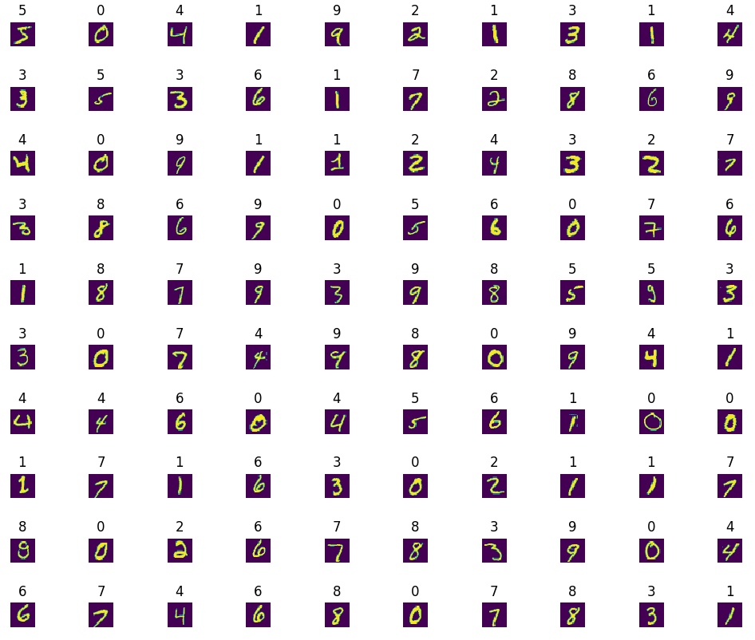
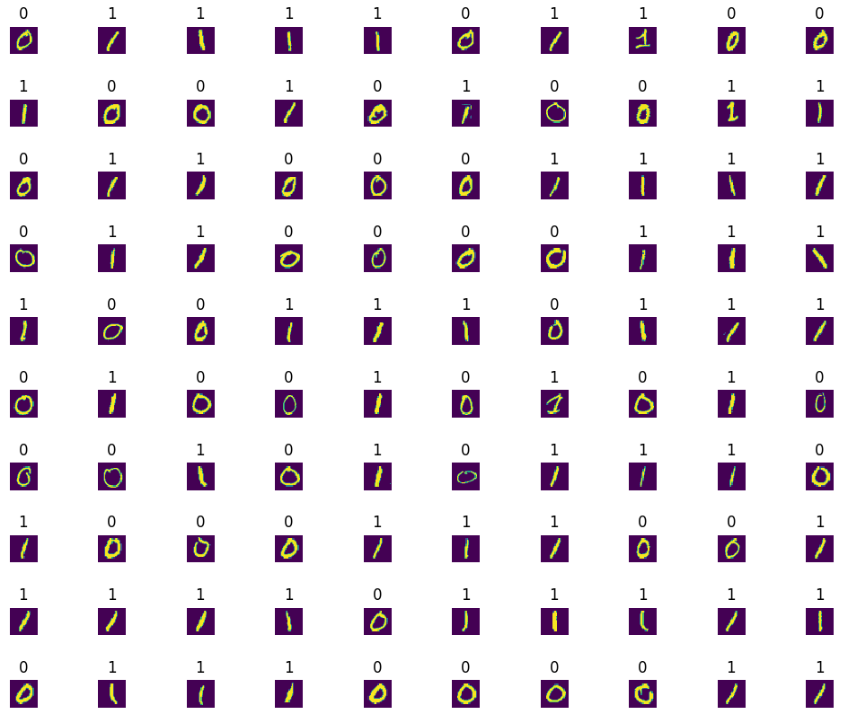
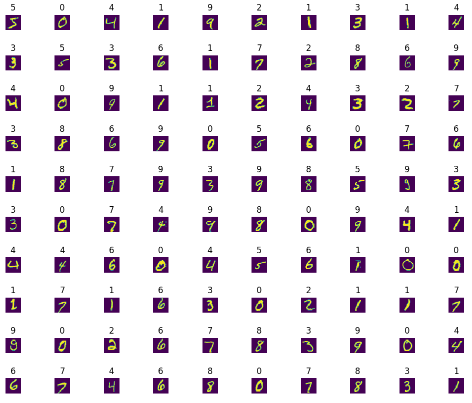
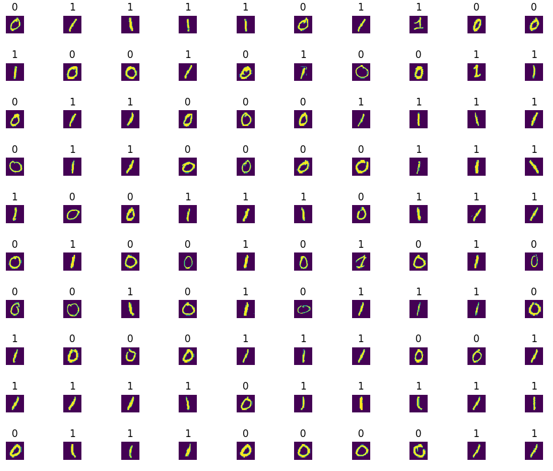
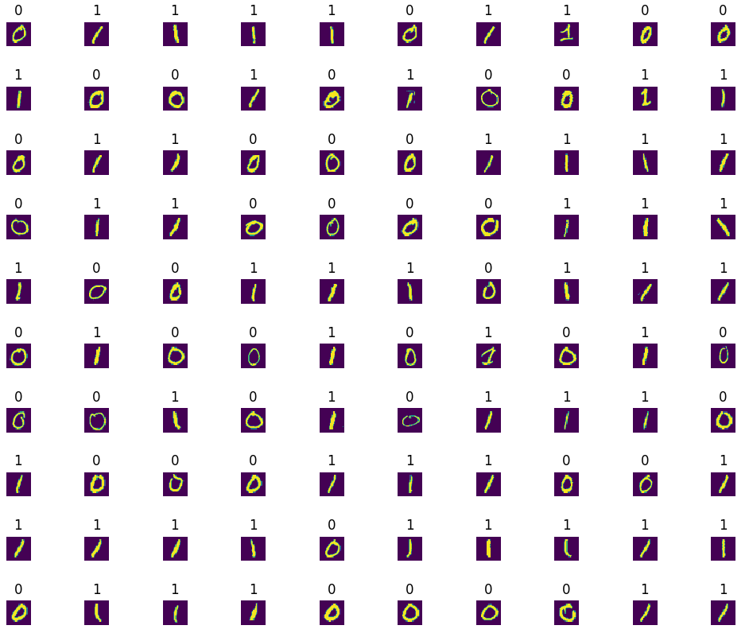

# 0x03. Optimization

## Learning Objectives

- What is a hyperparameter?
- How and why do you normalize your input data?
- What is a saddle point?
- What is stochastic gradient descent?
- What is mini-batch gradient descent?
- What is a moving average? How do you implement it?
- What is gradient descent with momentum? How do you implement it?
- What is RMSProp? How do you implement it?
- What is Adam optimization? How do you implement it?
- What is learning rate decay? How do you implement it?
- What is batch normalization? How do you implement it?

## Requirements

- Allowed editors: `vi`, `vim`, `emacs`
- All your files will be interpreted/compiled on Ubuntu 16.04 LTS using `python3` (version 3.5)
- Your files will be executed with `numpy` (version 1.15) and `tensorflow` (version 1.12)
- All your files should end with a new line
- The first line of all your files should be exactly `#!/usr/bin/env python3`
- All of your files must be executable
- A `README.md` file, at the root of the folder of the project, is mandatory
- Your code should use the `pycodestyle` style (version 2.4)
- All your modules should have documentation (`python3 -c 'print(__import__("my_module").__doc__)'`)
- All your classes should have documentation (`python3 -c 'print(__import__("my_module").MyClass.__doc__)'`)
- All your functions (inside and outside a class) should have documentation (`python3 -c 'print(__import__("my_module").my_function.__doc__)'` and `python3 -c 'print\
(__import__("my_module").MyClass.my_function.__doc__)'`)
- Unless otherwise noted, you are not allowed to import any module except import `numpy as np` and/or `import tensorflow as tf`
- You are not allowed to use the `keras` module in `tensorflow`
- You should not import any module unless it is being used

## Testing

Please use the following checkpoints for to accompany the following tensorflow main files. You do not need to push these files to GitHub. Your code will not be tested with these files.

- graph.ckpt.data-00000-of-00001
- graph.ckpt.index
- graph.ckpt.meta

## Tasks

### [0. Normalization Constants](./0-norm_constants.py)

Write the function `def normalization_constants(X):` that calculates the normalization (standardization) constants of a matrix:

*   `X` is the `numpy.ndarray` of shape `(m, nx)` to normalize
    *   `m` is the number of data points
    *   `nx` is the number of features
*   Returns: the mean and standard deviation of each feature, respectively

```
    ubuntu@alexa-ml:~/0x03-optimization$ ./0-main.py 
    [ 0.11961603  2.08201297 -3.59232261]
    [2.01576449 1.034667   9.52002619]
    ubuntu@alexa-ml:~/0x03-optimization$
```

---

### [1. Normalize](./1-normalize.py)

Write the function `def normalize(X, m, s):` that normalizes (standardizes) a matrix:

*   `X` is the `numpy.ndarray` of shape `(d, nx)` to normalize
    *   `d` is the number of data points
    *   `nx` is the number of features
*   `m` is a `numpy.ndarray` of shape `(nx,)` that contains the mean of all features of `X`
*   `s` is a `numpy.ndarray` of shape `(nx,)` that contains the standard deviation of all features of `X`
*   Returns: The normalized `X` matrix

```
    ubuntu@alexa-ml:~/0x03-optimization$ ./1-main.py 
    [[  3.52810469   3.8831507   -6.69181838]
     [  0.80031442   0.65224094  -5.39379178]
     [  1.95747597   0.729515     7.99659596]
     [  4.4817864    2.96939671   3.55263731]
     [  3.73511598   0.82687659   3.40131526]
     [ -1.95455576   3.94362119 -19.16956044]
     [  1.90017684   1.58638102  -3.24326124]
     [ -0.30271442   1.25254519 -10.38030909]
     [ -0.2064377    3.92294203  -0.20075401]
     [  0.821197     3.48051479  -3.9815039 ]]
    [[ 1.69091612  1.74078977 -0.32557639]
     [ 0.33768746 -1.38186686 -0.18922943]
     [ 0.91174338 -1.3071819   1.21732003]
     [ 2.16402779  0.85765153  0.75051893]
     [ 1.79361228 -1.21308245  0.73462381]
     [-1.02897526  1.79923417 -1.63625998]
     [ 0.88331787 -0.47902557  0.03666601]
     [-0.20951378 -0.80167608 -0.71302183]
     [-0.1617519   1.77924787  0.35625623]
     [ 0.34804709  1.35164437 -0.04088028]]
    [ 2.44249065e-17 -4.99600361e-16  1.46549439e-16]
    [1. 1. 1.]
    ubuntu@alexa-ml:~/0x03-optimization$
```

---

### [2. Shuffle Data](./2-shuffle_data.py)

Write the function `def shuffle_data(X, Y):` that shuffles the data points in two matrices the same way:

*   `X` is the first `numpy.ndarray` of shape `(m, nx)` to shuffle
    *   `m` is the number of data points
    *   `nx` is the number of features in `X`
*   `Y` is the second `numpy.ndarray` of shape `(m, ny)` to shuffle
    *   `m` is the same number of data points as in `X`
    *   `ny` is the number of features in `Y`
*   Returns: the shuffled `X` and `Y` matrices

_Hint: you should use `numpy.random.permutation`_

```
    ubuntu@alexa-ml:~/0x03-optimization$ ./2-main.py 
    [[ 5  6]
     [ 1  2]
     [ 3  4]
     [ 7  8]
     [ 9 10]]
    [[15 16]
     [11 12]
     [13 14]
     [17 18]
     [19 20]]
    ubuntu@alexa-ml:~/0x03-optimization$
 ```

---

### [3. Mini-Batch](./3-mini_batch.py)

Write the function `def train_mini_batch(X_train, Y_train, X_valid, Y_valid, batch_size=32, epochs=5, load_path="/tmp/model.ckpt", save_path="/tmp/model.ckpt"):` that trains a loaded neural network model using mini-batch gradient descent:

*   `X_train` is a `numpy.ndarray` of shape `(m, 784)` containing the training data
    *   `m` is the number of data points
    *   `784` is the number of input features
*   `Y_train` is a one-hot `numpy.ndarray` of shape `(m, 10)` containing the training labels
    *   `10` is the number of classes the model should classify
*   `X_valid` is a `numpy.ndarray` of shape `(m, 784)` containing the validation data
*   `Y_valid` is a one-hot `numpy.ndarray` of shape `(m, 10)` containing the validation labels
*   `batch_size` is the number of data points in a batch
*   `epochs` is the number of times the training should pass through the whole dataset
*   `load_path` is the path from which to load the model
*   `save_path` is the path to where the model should be saved after training
*   Returns: the path where the model was saved
*   Your training function should allow for a smaller final batch (a.k.a. use the _entire_ training set)
*   The model loaded from `load_path` will have the following tensors / ops saved in it’s collection:
    *   `x` is a placeholder for the input data
    *   `y` is a placeholder for the labels
    *   `accuracy` is an op to calculate the accuracy of the model
    *   `loss` is an op to calculate the cost of the model
    *   `train_op` is an op to perform one pass of gradient descent on the model
*   Before each epoch, you should shuffle your training data
*   You should use `shuffle_data = __import__('2-shuffle_data').shuffle_data`
*   Before the first epoch and after every subsequent epoch, the following should be printed:
    *   `After {epoch} epochs:` where `{epoch}` is the current epoch
    *   `\tTraining Cost: {train_cost}` where `{train_cost}` is the cost of the model on the entire training set
    *   `\tTraining Accuracy: {train_accuracy}` where `{train_accuracy}` is the accuracy of the model on the entire training set
    *   `\tValidation Cost: {valid_cost}` where `{valid_cost}` is the cost of the model on the entire validation set
    *   `\tValidation Accuracy: {valid_accuracy}` where `{valid_accuracy}` is the accuracy of the model on the entire validation set
*   After every 100 steps gradient descent within an epoch, the following should be printed:
    *   `\tStep {step_number}:` where `{step_number}` is the number of times gradient descent has been run in the current epoch
    *   `\t\tCost: {step_cost}` where `{step_cost}` is the cost of the model on the current mini-batch
    *   `\t\tAccuracy: {step_accuracy}` where `{step_accuracy}` is the accuracy of the model on the current mini-batch

```
    ubuntu@alexa-ml:~/0x03-optimization$ ./3-main.py 
    2018-11-10 02:10:48.277854: I tensorflow/core/common_runtime/process_util.cc:69] Creating new thread pool with default inter op setting: 2. Tune using inter_op_parallelism_threads for best performance.
    After 0 epochs:
        Training Cost: 2.8232288360595703
        Training Accuracy: 0.08726000040769577
        Validation Cost: 2.810532331466675
        Validation Accuracy: 0.08640000224113464
        Step 100:
            Cost: 0.9012309908866882
            Accuracy: 0.6875
        Step 200:
            Cost: 0.6328266263008118
            Accuracy: 0.8125
    
        ...
    
        Step 1500:
            Cost: 0.27602481842041016
            Accuracy: 0.9375
    After 1 epochs:
        Training Cost: 0.3164157569408417
        Training Accuracy: 0.9101600050926208
        Validation Cost: 0.291348934173584
        Validation Accuracy: 0.9168999791145325
    
    ...
    
    After 9 epochs:
        Training Cost: 0.12963168323040009
        Training Accuracy: 0.9642800092697144
        Validation Cost: 0.13914340734481812
        Validation Accuracy: 0.961899995803833
        Step 100:
            Cost: 0.10656605660915375
            Accuracy: 1.0
        Step 200:
            Cost: 0.09849657118320465
            Accuracy: 1.0
    
        ...
    
        Step 1500:
            Cost: 0.0914708822965622
            Accuracy: 0.96875
    After 10 epochs:
        Training Cost: 0.12012937664985657
        Training Accuracy: 0.9669600129127502
        Validation Cost: 0.13320672512054443
        Validation Accuracy: 0.9635999798774719
    Model saved in path: ./model.ckpt
    ubuntu@alexa-ml:~/0x03-optimization$
```

---

### [4. Moving Average](./4-moving_average.py)

Write the function `def moving_average(data, beta):` that calculates the weighted moving average of a data set:

*   `data` is the list of data to calculate the moving average of
*   `beta` is the weight used for the moving average
*   Your moving average calculation should use bias correction
*   Returns: a list containing the moving averages of `data`

```
    ubuntu@alexa-ml:~/0x03-optimization$ ./4-main.py 
    [72.0, 75.15789473684211, 73.62361623616238, 71.98836871183484, 70.52604332006544, 70.20035470453027, 71.88706986789997, 73.13597603396988, 71.80782582850702, 70.60905915023126, 69.93737009120935, 71.0609712312634, 70.11422355031073, 69.32143707981284, 70.79208718739721, 70.81760741911772, 70.59946700377961, 69.9406328280786, 70.17873340222755, 69.47534437750306, 68.41139351151023, 67.58929643210207, 66.97601174673004, 66.86995043877324, 67.42263231561797, 67.91198666959514, 67.8151574064495, 67.72913996327617, 67.65262186609462, 67.68889744321645, 68.44900744806469]
```


---

### [5. Momentum](./5-momentum.py)

Write the function `def update_variables_momentum(alpha, beta1, var, grad, v):` that updates a variable using the gradient descent with momentum optimization algorithm:

*   `alpha` is the learning rate
*   `beta1` is the momentum weight
*   `var` is a `numpy.ndarray` containing the variable to be updated
*   `grad` is a `numpy.ndarray` containing the gradient of `var`
*   `v` is the previous first moment of `var`
*   Returns: the updated variable and the new moment, respectively

```
    ubuntu@alexa-ml:~/0x03-optimization$ ./5-main.py
    Cost after 0 iterations: 4.365105010037203
    Cost after 100 iterations: 0.5729736703124042
    Cost after 200 iterations: 0.2449357405113111
    Cost after 300 iterations: 0.17711325087582164
    Cost after 400 iterations: 0.14286111618067307
    Cost after 500 iterations: 0.12051674907075896
    Cost after 600 iterations: 0.10450664363662196
    Cost after 700 iterations: 0.09245615061035156
    Cost after 800 iterations: 0.08308760082979068
    Cost after 900 iterations: 0.07562924162824029
    Cost after 1000 iterations: 0.0695782354732263
 ```


---

### [6. Momentum Upgraded](./6-momentum.py)

Write the function `def create_momentum_op(loss, alpha, beta1):` that creates the training operation for a neural network in `tensorflow` using the gradient descent with momentum optimization algorithm:

*   `loss` is the loss of the network
*   `alpha` is the learning rate
*   `beta1` is the momentum weight
*   Returns: the momentum optimization operation

```
    ubuntu@alexa-ml:~/0x03-optimization$ ./6-main.py
    2018-11-10 00:15:42.968586: I tensorflow/core/common_runtime/process_util.cc:69] Creating new thread pool with default inter op setting: 2. Tune using inter_op_parallelism_threads for best performance.
    Cost after 0 iterations: 2.8232274055480957
    Cost after 100 iterations: 0.356641948223114
    Cost after 200 iterations: 0.29699304699897766
    Cost after 300 iterations: 0.26470813155174255
    Cost after 400 iterations: 0.24141179025173187
    Cost after 500 iterations: 0.22264979779720306
    Cost after 600 iterations: 0.20677044987678528
    Cost after 700 iterations: 0.19298051297664642
    Cost after 800 iterations: 0.18082040548324585
    Cost after 900 iterations: 0.16998952627182007
    Cost after 1000 iterations: 0.1602744460105896
 ```


---

### [7. RMSProp](./7-RMSProp.py)

Write the function `def update_variables_RMSProp(alpha, beta2, epsilon, var, grad, s):` that updates a variable using the RMSProp optimization algorithm:

*   `alpha` is the learning rate
*   `beta2` is the RMSProp weight
*   `epsilon` is a small number to avoid division by zero
*   `var` is a `numpy.ndarray` containing the variable to be updated
*   `grad` is a `numpy.ndarray` containing the gradient of `var`
*   `s` is the previous second moment of `var`
*   Returns: the updated variable and the new moment, respectively

```
    ubuntu@alexa-ml:~/0x03-optimization$ ./7-main.py
    Cost after 0 iterations: 4.365105010037203
    Cost after 100 iterations: 1.3708321848806053
    Cost after 200 iterations: 0.22693392990308764
    Cost after 300 iterations: 0.05133394800221906
    Cost after 400 iterations: 0.01836557116372359
    Cost after 500 iterations: 0.008176390663315372
    Cost after 600 iterations: 0.004091348850058557
    Cost after 700 iterations: 0.002195647208708407
    Cost after 800 iterations: 0.001148167933229118
    Cost after 900 iterations: 0.0005599361043400206
    Cost after 1000 iterations: 0.0002655839831275339
```


---

### [8. RMSProp Upgraded](./8-RMSProp.py)

Write the function `def create_RMSProp_op(loss, alpha, beta2, epsilon):` that creates the training operation for a neural network in `tensorflow` using the RMSProp optimization algorithm:

*   `loss` is the loss of the network
*   `alpha` is the learning rate
*   `beta2` is the RMSProp weight
*   `epsilon` is a small number to avoid division by zero
*   Returns: the RMSProp optimization operation

```
    ubuntu@alexa-ml:~/0x03-optimization$ ./8-main.py 
    2018-11-10 00:28:48.894342: I tensorflow/core/common_runtime/process_util.cc:69] Creating new thread pool with default inter op setting: 2. Tune using inter_op_parallelism_threads for best performance.
    Cost after 0 iterations: 2.8232274055480957
    Cost after 100 iterations: 0.48531609773635864
    Cost after 200 iterations: 0.21557031571865082
    Cost after 300 iterations: 0.13388566672801971
    Cost after 400 iterations: 0.07422538101673126
    Cost after 500 iterations: 0.05024252086877823
    Cost after 600 iterations: 0.02709660679101944
    Cost after 700 iterations: 0.015626247972249985
    Cost after 800 iterations: 0.008653616532683372
    Cost after 900 iterations: 0.005407326854765415
    Cost after 1000 iterations: 0.003452717326581478
```


---

### [9. Adam](./9-Adam.py)

Write the function `def update_variables_Adam(alpha, beta1, beta2, epsilon, var, grad, v, s, t):` that updates a variable in place using the Adam optimization algorithm:

*   `alpha` is the learning rate
*   `beta1` is the weight used for the first moment
*   `beta2` is the weight used for the second moment
*   `epsilon` is a small number to avoid division by zero
*   `var` is a `numpy.ndarray` containing the variable to be updated
*   `grad` is a `numpy.ndarray` containing the gradient of `var`
*   `v` is the previous first moment of `var`
*   `s` is the previous second moment of `var`
*   `t` is the time step used for bias correction
*   Returns: the updated variable, the new first moment, and the new second moment, respectively

```
    ubuntu@alexa-ml:~/0x03-optimization$ ./9-main.py
    Cost after 0 iterations: 4.365105010037203
    Cost after 100 iterations: 1.5950468370180395
    Cost after 200 iterations: 0.390276184856453
    Cost after 300 iterations: 0.13737908627614337
    Cost after 400 iterations: 0.06963385247882238
    Cost after 500 iterations: 0.043186805401891
    Cost after 600 iterations: 0.029615890163981955
    Cost after 700 iterations: 0.02135952185721115
    Cost after 800 iterations: 0.01576513402620876
    Cost after 900 iterations: 0.011813533123333355
    Cost after 1000 iterations: 0.008996494409788116
```


---

### [10. Adam Upgraded](./10-Adam.py)

Write the function `def create_Adam_op(loss, alpha, beta1, beta2, epsilon):` that creates the training operation for a neural network in `tensorflow` using the Adam optimization algorithm:

*   `loss` is the loss of the network
*   `alpha` is the learning rate
*   `beta1` is the weight used for the first moment
*   `beta2` is the weight used for the second moment
*   `epsilon` is a small number to avoid division by zero
*   Returns: the Adam optimization operation

```
    ubuntu@alexa-ml:~/0x03-optimization$ ./10-main.py
    2018-11-09 23:37:09.188702: I tensorflow/core/common_runtime/process_util.cc:69] Creating new thread pool with default inter op setting: 2. Tune using inter_op_parallelism_threads for best performance.
    Cost after 0 iterations: 2.8232274055480957
    Cost after 100 iterations: 0.17724855244159698
    Cost after 200 iterations: 0.0870152935385704
    Cost after 300 iterations: 0.03907731547951698
    Cost after 400 iterations: 0.014239841140806675
    Cost after 500 iterations: 0.0048021236434578896
    Cost after 600 iterations: 0.0018489329377189279
    Cost after 700 iterations: 0.000814757077023387
    Cost after 800 iterations: 0.00038969298475421965
    Cost after 900 iterations: 0.00019614089978858829
    Cost after 1000 iterations: 0.00010206626757280901
```


---

### [11. Learning Rate Decay](./11-learning_rate_decay.py)

Write the function `def learning_rate_decay(alpha, decay_rate, global_step, decay_step):` that updates the learning rate using inverse time decay in `numpy`:

*   `alpha` is the original learning rate
*   `decay_rate` is the weight used to determine the rate at which `alpha` will decay
*   `global_step` is the number of passes of gradient descent that have elapsed
*   `decay_step` is the number of passes of gradient descent that should occur before alpha is decayed further
*   the learning rate decay should occur in a stepwise fashion
*   Returns: the updated value for `alpha`

```
    ubuntu@alexa-ml:~/0x03-optimization$ ./11-main.py
    0.1
    0.1
    0.1
    0.1
    0.1
    0.1
    0.1
    0.1
    0.1
    0.1
    0.05
    0.05
    0.05
    0.05
    0.05
    0.05
    0.05
    0.05
    0.05
    0.05
    0.03333333333333333
    0.03333333333333333
    0.03333333333333333
    0.03333333333333333
    0.03333333333333333
    0.03333333333333333
    0.03333333333333333
    0.03333333333333333
    0.03333333333333333
    0.03333333333333333
    0.025
    0.025
    0.025
    0.025
    0.025
    0.025
    0.025
    0.025
    0.025
    0.025
    0.02
    0.02
    0.02
    0.02
    0.02
    0.02
    0.02
    0.02
    0.02
    0.02
    0.016666666666666666
    0.016666666666666666
    0.016666666666666666
    0.016666666666666666
    0.016666666666666666
    0.016666666666666666
    0.016666666666666666
    0.016666666666666666
    0.016666666666666666
    0.016666666666666666
    0.014285714285714287
    0.014285714285714287
    0.014285714285714287
    0.014285714285714287
    0.014285714285714287
    0.014285714285714287
    0.014285714285714287
    0.014285714285714287
    0.014285714285714287
    0.014285714285714287
    0.0125
    0.0125
    0.0125
    0.0125
    0.0125
    0.0125
    0.0125
    0.0125
    0.0125
    0.0125
    0.011111111111111112
    0.011111111111111112
    0.011111111111111112
    0.011111111111111112
    0.011111111111111112
    0.011111111111111112
    0.011111111111111112
    0.011111111111111112
    0.011111111111111112
    0.011111111111111112
    0.01
    0.01
    0.01
    0.01
    0.01
    0.01
    0.01
    0.01
    0.01
    0.01
    ubuntu@alexa-ml:~/0x03-optimization$
 ```

---

### [12. Learning Rate Decay Upgraded](./12-learning_rate_decay.py)

Write the function `def learning_rate_decay(alpha, decay_rate, global_step, decay_step):` that creates a learning rate decay operation in `tensorflow` using inverse time decay:

*   `alpha` is the original learning rate
*   `decay_rate` is the weight used to determine the rate at which `alpha` will decay
*   `global_step` is the number of passes of gradient descent that have elapsed
*   `decay_step` is the number of passes of gradient descent that should occur before alpha is decayed further
*   the learning rate decay should occur in a stepwise fashion
*   Returns: the learning rate decay operation

```
    ubuntu@alexa-ml:~/0x03-optimization$ ./12-main.py
    2018-11-10 00:54:20.318892: I tensorflow/core/common_runtime/process_util.cc:69] Creating new thread pool with default inter op setting: 2. Tune using inter_op_parallelism_threads for best performance.
    0.1
    0.1
    0.1
    0.1
    0.1
    0.1
    0.1
    0.1
    0.1
    0.1
    0.05
    0.05
    0.05
    0.05
    0.05
    0.05
    0.05
    0.05
    0.05
    0.05
    0.033333335
    0.033333335
    0.033333335
    0.033333335
    0.033333335
    0.033333335
    0.033333335
    0.033333335
    0.033333335
    0.033333335
    0.025
    0.025
    0.025
    0.025
    0.025
    0.025
    0.025
    0.025
    0.025
    0.025
    0.02
    0.02
    0.02
    0.02
    0.02
    0.02
    0.02
    0.02
    0.02
    0.02
    0.016666668
    0.016666668
    0.016666668
    0.016666668
    0.016666668
    0.016666668
    0.016666668
    0.016666668
    0.016666668
    0.016666668
    0.014285714
    0.014285714
    0.014285714
    0.014285714
    0.014285714
    0.014285714
    0.014285714
    0.014285714
    0.014285714
    0.014285714
    0.0125
    0.0125
    0.0125
    0.0125
    0.0125
    0.0125
    0.0125
    0.0125
    0.0125
    0.0125
    0.011111111
    0.011111111
    0.011111111
    0.011111111
    0.011111111
    0.011111111
    0.011111111
    0.011111111
    0.011111111
    0.011111111
    0.01
    0.01
    0.01
    0.01
    0.01
    0.01
    0.01
    0.01
    0.01
    0.01
    ubuntu@alexa-ml:~/0x03-optimization$
```

---

### [13. Batch Normalization](./13-batch_norm.py)

Write the function `def batch_norm(Z, gamma, beta, epsilon):` that normalizes an unactivated output of a neural network using batch normalization:

*   `Z` is a `numpy.ndarray` of shape `(m, n)` that should be normalized
    *   `m` is the number of data points
    *   `n` is the number of features in `Z`
*   `gamma` is a `numpy.ndarray` of shape `(1, n)` containing the scales used for batch normalization
*   `beta` is a `numpy.ndarray` of shape `(1, n)` containing the offsets used for batch normalization
*   `epsilon` is a small number used to avoid division by zero
*   Returns: the normalized `Z` matrix

```
    ubuntu@alexa-ml:~/0x03-optimization$ ./13-main.py
    [[  3.52810469   3.8831507   -6.69181838]
     [  0.80031442   0.65224094  -5.39379178]
     [  1.95747597   0.729515     7.99659596]
     [  4.4817864    2.96939671   3.55263731]
     [  3.73511598   0.82687659   3.40131526]
     [ -1.95455576   3.94362119 -19.16956044]
     [  1.90017684   1.58638102  -3.24326124]
     [ -0.30271442   1.25254519 -10.38030909]
     [ -0.2064377    3.92294203  -0.20075401]
     [  0.821197     3.48051479  -3.9815039 ]]
    [[ 1.48744676  0.95227435  0.82862045]
     [ 0.63640337 -0.29189903  0.83717117]
     [ 0.99742624 -0.26214198  0.92538004]
     [ 1.78498595  0.60040182  0.89610557]
     [ 1.55203222 -0.22464954  0.89510874]
     [-0.22308868  0.9755606   0.74642361]
     [ 0.97954948  0.06782387  0.85133774]
     [ 0.29226936 -0.06073115  0.8043226 ]
     [ 0.32230674  0.96759737  0.87138019]
     [ 0.64291853  0.79722549  0.84647459]]
    ubuntu@alexa-ml:~/0x03-optimization$
```

---

### [14. Batch Normalization Upgraded](./14-batch_norm.py)

Write the function `def create_batch_norm_layer(prev, n, activation):` that creates a batch normalization layer for a neural network in `tensorflow`:

*   `prev` is the activated output of the previous layer
*   `n` is the number of nodes in the layer to be created
*   `activation` is the activation function that should be used on the output of the layer
*   you should use the `tf.layers.Dense` layer as the base layer with kernal initializer `tf.contrib.layers.variance_scaling_initializer(mode="FAN_AVG")`
*   your layer should incorporate two trainable parameters, `gamma` and `beta`, initialized as vectors of `1` and `0` respectively
*   you should use an `epsilon` of `1e-8`
*   Returns: a tensor of the activated output for the layer

```
    ubuntu@alexa-ml:~/0x03-optimization$ ./14-main.py
    [[-0.6847082  -0.8220385  -0.35229233 ...  0.464784   -0.8326035
      -0.96122414]
     [-0.77318543 -0.66306996  0.7523017  ...  0.811305    0.79587764
       0.47134086]
     [-0.21438502 -0.11646973 -0.59783506 ... -0.95093447 -0.67656237
       0.26563355]
     [ 0.3159215   0.93362606  0.8738444  ...  0.26363495 -0.320637
       0.683548  ]
     [ 0.9421419   0.37344548 -0.8536682  ... -0.06270568  0.85227346
       0.3293217 ]]
    ubuntu@alexa-ml:~/0x03-optimization$
```

---

### [15. Put it all together and what do you get?](./15-model.py)

Write the function `def model(Data_train, Data_valid, layers, activations, alpha=0.001, beta1=0.9, beta2=0.999, epsilon=1e-8, decay_rate=1, batch_size=32, epochs=5, save_path='/tmp/model.ckpt'):` that builds, trains, and saves a neural network model in `tensorflow` using Adam optimization, mini-batch gradient descent, learning rate decay, and batch normalization:

*   `Data_train` is a tuple containing the training inputs and training labels, respectively
*   `Data_valid` is a tuple containing the validation inputs and validation labels, respectively
*   `layers` is a list containing the number of nodes in each layer of the network
*   `activation` is a list containing the activation functions used for each layer of the network
*   `alpha` is the learning rate
*   `beta1` is the weight for the first moment of Adam Optimization
*   `beta2` is the weight for the second moment of Adam Optimization
*   `epsilon` is a small number used to avoid division by zero
*   `decay_rate` is the decay rate for inverse time decay of the learning rate _(the corresponding decay step should be `1`)_
*   `batch_size` is the number of data points that should be in a mini-batch
*   `epochs` is the number of times the training should pass through the whole dataset
*   `save_path` is the path where the model should be saved to
*   Returns: the path where the model was saved
*   Your training function should allow for a smaller final batch (a.k.a. use the _entire_ training set)
*   the learning rate should remain the same within the an epoch (a.k.a. all mini-batches within an epoch should use the same learning rate)
*   Before each epoch, you should shuffle your training data
*   Before the first epoch and after every subsequent epoch, the following should be printed:
    *   `After {epoch} epochs:` where `{epoch}` is the current epoch
    *   `\tTraining Cost: {train_cost}` where `{train_cost}` is the cost of the model on the entire training set
    *   `\tTraining Accuracy: {train_accuracy}` where `{train_accuracy}` is the accuracy of the model on the entire training set
    *   `\tValidation Cost: {valid_cost}` where `{valid_cost}` is the cost of the model on the entire validation set
    *   `\tValidation Accuracy: {valid_accuracy}` where `{valid_accuracy}` is the accuracy of the model on the entire validation set
*   After every 100 steps of gradient descent within an epoch, the following should be printed:
    *   `\tStep {step_number}:` where `{step_number}` is the number of times gradient descent has been run in the current epoch
    *   `\t\tCost: {step_cost}` where `{step_cost}` is the cost of the model on the current mini-batch
    *   `\t\tAccuracy: {step_accuracy}` where `{step_accuracy}` is the accuracy of the model on the current mini-batch

_Note: the input data does not need to be normalized as it has already been scaled to a range of \[0, 1\]_

```
    ubuntu@alexa-ml:~/0x03-optimization$ ./15-main.py
    After 0 epochs:
        Training Cost: 2.5810317993164062
        Training Accuracy: 0.16808000206947327
        Validation Cost: 2.5596187114715576
        Validation Accuracy: 0.16859999299049377
        Step 100:
            Cost: 0.297500342130661
            Accuracy 0.90625
        Step 200:
            Cost: 0.27544915676116943
            Accuracy 0.875
    
        ...
    
        Step 1500:
            Cost: 0.09414251148700714
            Accuracy 1.0
    After 1 epochs:
        Training Cost: 0.13064345717430115
        Training Accuracy: 0.9625800251960754
        Validation Cost: 0.14304184913635254
        Validation Accuracy: 0.9595000147819519
    
    ...
    
    After 4 epochs:
        Training Cost: 0.03584253042936325
        Training Accuracy: 0.9912999868392944
        Validation Cost: 0.0853486955165863
        Validation Accuracy: 0.9750999808311462
        Step 100:
            Cost: 0.03150765225291252
            Accuracy 1.0
        Step 200:
            Cost: 0.020879564806818962
            Accuracy 1.0
    
        ...
    
        Step 1500:
            Cost: 0.015160675160586834
            Accuracy 1.0
    After 5 epochs:
        Training Cost: 0.025094907730817795
        Training Accuracy: 0.9940199851989746
        Validation Cost: 0.08191727101802826
        Validation Accuracy: 0.9750999808311462
    Model saved in path: ./model.ckpt
    ubuntu@alexa-ml:~/0x03-optimization$
```

_Look at that! 99.4% accuracy on training set and 97.5% accuracy on the validation set!_

---

## Author

- **Pierre Beaujuge** - [PierreBeaujuge](https://github.com/PierreBeaujuge)