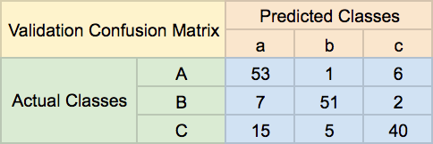

# 0x04. Error Analysis

## Learning Objectives

- What is the confusion matrix?
- What is type I error? type II?
- What is sensitivity? specificity? precision? recall?
- What is an F1 score?
- What is bias? variance?
- What is irreducible error?
- What is Bayes error?
- How can you approximate Bayes error?
- How to calculate bias and variance
- How to create a confusion matrix

## Requirements

- Allowed editors: `vi`, `vim`, `emacs`
- All your files will be interpreted/compiled on Ubuntu 16.04 LTS using `python3` (version 3.5)
- Your files will be executed with `numpy` (version 1.15)
- All your files should end with a new line
- The first line of all your files should be exactly `#!/usr/bin/env python3`
- All of your files must be executable
- A `README.md` file, at the root of the folder of the project, is mandatory
- Your code should use the `pycodestyle` style (version 2.4)
- All your modules should have documentation (`python3 -c 'print(__import__("my_module").__doc__)'`)
- All your classes should have documentation (`python3 -c 'print(__import__("my_module").MyClass.__doc__)'`)
- All your functions (inside and outside a class) should have documentation (`python3 -c 'print(__import__("my_module").my_function.__doc__)'` and `python3 -c 'print\
(__import__("my_module").MyClass.my_function.__doc__)'`)
- Unless otherwise noted, you are not allowed to import any module except import `numpy as np`

## Tasks

### [0. Create Confusion](./0-create_confusion.py)

Write the function `def create_confusion_matrix(labels, logits):` that creates a confusion matrix:

*   `labels` is a one-hot `numpy.ndarray` of shape `(m, classes)` containing the correct labels for each data point
    *   `m` is the number of data points
    *   `classes` is the number of classes
*   `logits` is a one-hot `numpy.ndarray` of shape `(m, classes)` containing the predicted labels
*   Returns: a confusion `numpy.ndarray` of shape `(classes, classes)` with row indices representing the correct labels and column indices representing the predicted labels

To accompany the following main file, you are provided with [labels\_logits.npz](https://s3.amazonaws.com/intranet-projects-files/holbertonschool-ml/labels_logits.npz "labels_logits.npz"). This file does not need to be pushed to GitHub, nor will it be used to check your code.

```
    alexa@ubuntu-xenial:0x04-error_analysis$ ./0-main.py
    [[4701.    0.   36.   17.   12.   81.   38.   11.   35.    1.]
     [   0. 5494.   36.   21.    3.   38.    7.   13.   59.    7.]
     [  64.   93. 4188.  103.  108.   17.  162.   80.  132.   21.]
     [  30.   48.  171. 4310.    2.  252.   22.   86.  128.   52.]
     [  17.   27.   35.    0. 4338.   11.   84.    9.   27.  311.]
     [  89.   57.   45.  235.   70. 3631.  123.   33.  163.   60.]
     [  47.   32.   87.    1.   64.   83. 4607.    0.   29.    1.]
     [  26.   95.   75.    7.   58.   18.    1. 4682.   13.  200.]
     [  31.  153.   82.  174.   27.  179.   64.    7. 4003.  122.]
     [  48.   37.   39.   71.  220.   49.    8.  244.   46. 4226.]]
    alexa@ubuntu-xenial:0x04-error_analysis$
```

---

### [1. Sensitivity](./1-sensitivity.py)

Write the function `def sensitivity(confusion):` that calculates the sensitivity for each class in a confusion matrix:

*   `confusion` is a confusion `numpy.ndarray` of shape `(classes, classes)` where row indices represent the correct labels and column indices represent the predicted labels
    *   `classes` is the number of classes
*   Returns: a `numpy.ndarray` of shape `(classes,)` containing the sensitivity of each class

```
    alexa@ubuntu-xenial:0x04-error_analysis$ ./1-main.py
    [0.95316302 0.96759422 0.84299517 0.84493237 0.89277629 0.80581447
     0.93051909 0.9047343  0.82672449 0.84723336]
    alexa@ubuntu-xenial:0x04-error_analysis$
```

---

### [2. Precision](./2-precision.py)

Write the function `def precision(confusion):` that calculates the precision for each class in a confusion matrix:

*   `confusion` is a confusion `numpy.ndarray` of shape `(classes, classes)` where row indices represent the correct labels and column indices represent the predicted labels
    *   `classes` is the number of classes
*   Returns: a `numpy.ndarray` of shape `(classes,)` containing the precision of each class

```
    alexa@ubuntu-xenial:0x04-error_analysis$ ./2-main.py
    [0.93033841 0.91020543 0.87359199 0.87264628 0.88494492 0.83298922
     0.90050821 0.90648596 0.86364617 0.84503099]
    alexa@ubuntu-xenial:0x04-error_analysis$
```

---

### [3. Specificity](./3-specificity.py)

Write the function `def specificity(confusion):` that calculates the specificity for each class in a confusion matrix:

*   `confusion` is a confusion `numpy.ndarray` of shape `(classes, classes)` where row indices represent the correct labels and column indices represent the predicted labels
    *   `classes` is the number of classes
*   Returns: a `numpy.ndarray` of shape `(classes,)` containing the specificity of each class

```
    alexa@ubuntu-xenial:0x04-error_analysis$ ./3-main.py
    [0.99218958 0.98777131 0.9865429  0.98599078 0.98750582 0.98399789
     0.98870119 0.98922476 0.98600469 0.98278237]
    alexa@ubuntu-xenial:0x04-error_analysis$
```

When there are more than two classes in a confusion matrix, sensitivity is not a useful metric as there are inherently more actual negatives than actual positives. It is much better to use sensitivity (recall) and precision.

---

### [4. F1 score](./4-f1_score.py)

Write the function `def f1_score(confusion):` that calculates the F1 score of a confusion matrix:

*   `confusion` is a confusion `numpy.ndarray` of shape `(classes, classes)` where row indices represent the correct labels and column indices represent the predicted labels
    *   `classes` is the number of classes
*   Returns: a `numpy.ndarray` of shape `(classes,)` containing the F1 score of each class
*   You may use `sensitivity = __import__('1-sensitivity').sensitivity` and `precision = __import__('2-precision').precision`

```
    alexa@ubuntu-xenial:0x04-error_analysis$ ./4-main.py
    [0.94161242 0.93802288 0.8580209  0.85856574 0.88884336 0.81917654
     0.91526771 0.90560928 0.8447821  0.84613074]
    alexa@ubuntu-xenial:0x04-error_analysis$
```

---

### [5. Dealing with Error](./5-error_handling)

In the text file `5-error_handling`, write the lettered answer to the question of how you should approach the following scenarios. Please write the answer to each scenario on a different line. If there is more than one way to approach a scenario, please use CSV formatting and place your answers in alphabetical order (ex. `A,B,C`):

Scenarios:

    1. High Bias, High Variance
    2. High Bias, Low Variance
    3. Low Bias, High Variance
    4. Low Bias, Low Variance

Approaches:

    A. Train more
    B. Try a different architecture
    C. Get more data
    D. Build a deeper network
    E. Use regularization
    F. Nothing

---

### [6. Compare and Contrast](./6-compare_and_contrast)

Given the following training and validation confusion matrices and the fact that human level performance has an error of ~14%, determine what the most important issue is and write the lettered answer in the file `6-compare_and_contrast`

Most important issue:
```
A. High Bias
B. High Variance
C. Nothing
```

## Author

- **Pierre Beaujuge** - [PierreBeaujuge](https://github.com/PierreBeaujuge)