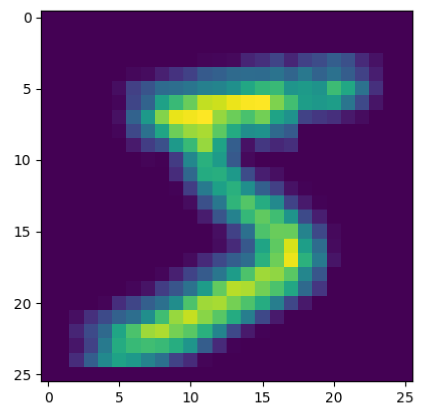
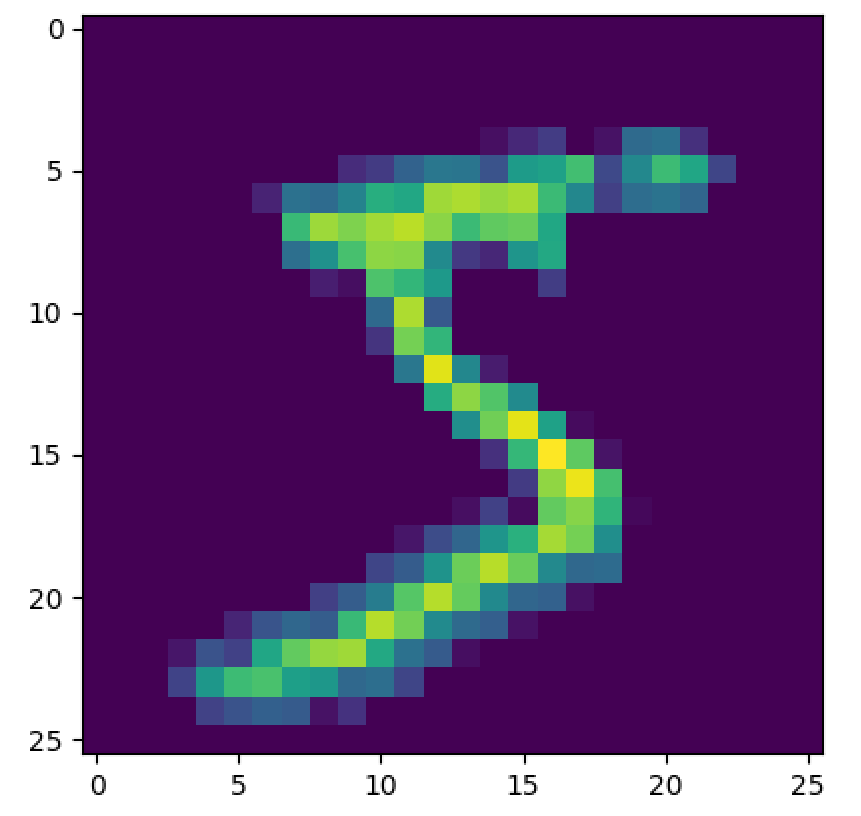
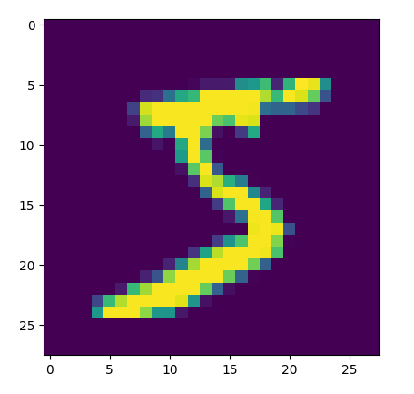
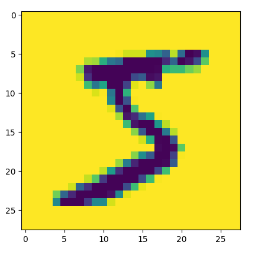
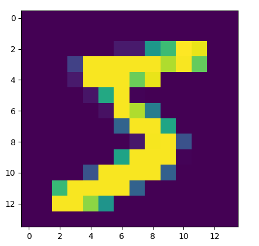
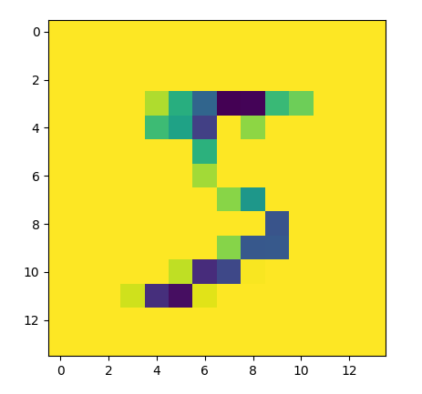
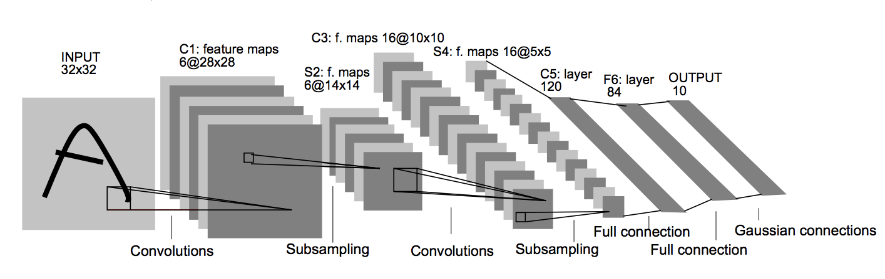
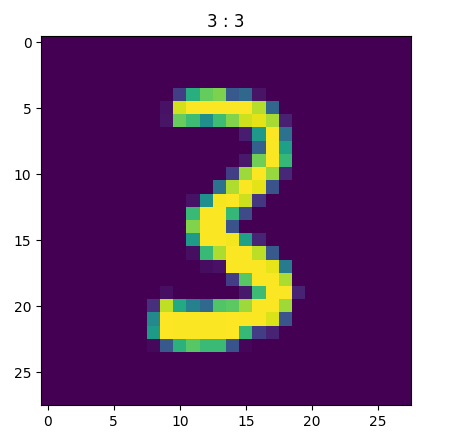

# 0x07. Convolutional Neural Networks

## Learning Objectives

- What is a convolutional layer?
- What is a pooling layer?
- Forward propagation over convolutional and pooling layers
- Back propagation over convolutional and pooling layers
- How to build a CNN using Tensorflow and Keras

## Requirements

- Allowed editors: `vi`, `vim`, `emacs`
- All your files will be interpreted/compiled on Ubuntu 16.04 LTS using `python3` (version 3.5)
- Your files will be executed with `numpy` (version 1.15) and tensorflow (version 1.12)
- All your files should end with a new line
- The first line of all your files should be exactly `#!/usr/bin/env python3`
- All of your files must be executable
- A `README.md` file, at the root of the folder of the project, is mandatory
- Your code should use the `pycodestyle` style (version 2.4)
- All your modules should have documentation (`python3 -c 'print(__import__("my_module").__doc__)'`)
- All your classes should have documentation (`python3 -c 'print(__import__("my_module").MyClass.__doc__)'`)
- All your functions (inside and outside a class) should have documentation (`python3 -c 'print(__import__("my_module").my_function.__doc__)'` and `python3 -c 'print\
(__import__("my_module").MyClass.my_function.__doc__)'`)
- Unless otherwise noted, you are not allowed to import any module

## Tasks

### [0. Convolutional Forward Prop](./0-conv_forward.py)

Write a function `def conv_forward(A_prev, W, b, activation, padding="same", stride=(1, 1)):` that performs forward propagation over a convolutional layer of a neural network:

*   `A_prev` is a `numpy.ndarray` of shape `(m, h_prev, w_prev, c_prev)` containing the output of the previous layer
    *   `m` is the number of examples
    *   `h_prev` is the height of the previous layer
    *   `w_prev` is the width of the previous layer
    *   `c_prev` is the number of channels in the previous layer
*   `W` is a `numpy.ndarray` of shape `(kh, kw, c_prev, c_new)` containing the kernels for the convolution
    *   `kh` is the filter height
    *   `kw` is the filter width
    *   `c_prev` is the number of channels in the previous layer
    *   `c_new` is the number of channels in the output
*   `b` is a `numpy.ndarray` of shape `(1, 1, 1, c_new)` containing the biases applied to the convolution
*   `activation` is an activation function applied to the convolution
*   `padding` is a string that is either `same` or `valid`, indicating the type of padding used
*   `stride` is a tuple of `(sh, sw)` containing the strides for the convolution
    *   `sh` is the stride for the height
    *   `sw` is the stride for the width
*   you may `import numpy as np`
*   Returns: the output of the convolutional layer

```
    ubuntu@alexa-ml:~/supervised_learning/0x07-cnn$ ./0-main.py
```

```
    (50000, 26, 26, 2)
```




---

### [1. Pooling Forward Prop](./1-pool_forward.py)

Write a function `def pool_forward(A_prev, kernel_shape, stride=(1, 1), mode='max'):` that performs forward propagation over a pooling layer of a neural network:

*   `A_prev` is a `numpy.ndarray` of shape `(m, h_prev, w_prev, c_prev)` containing the output of the previous layer
    *   `m` is the number of examples
    *   `h_prev` is the height of the previous layer
    *   `w_prev` is the width of the previous layer
    *   `c_prev` is the number of channels in the previous layer
*   `kernel_shape` is a tuple of `(kh, kw)` containing the size of the kernel for the pooling
    *   `kh` is the kernel height
    *   `kw` is the kernel width
*   `stride` is a tuple of `(sh, sw)` containing the strides for the pooling
    *   `sh` is the stride for the height
    *   `sw` is the stride for the width
*   `mode` is a string containing either `max` or `avg`, indicating whether to perform maximum or average pooling, respectively
*   you may `import numpy as np`
*   Returns: the output of the pooling layer

```
    ubuntu@alexa-ml:~/supervised_learning/0x07-cnn$ ./1-main.py 
    (50000, 28, 28, 2)
```



```
    (50000, 14, 14, 2)
```




---

### [2. Convolutional Back Prop](./2-conv_backward.py)

Write a function `def conv_backward(dZ, A_prev, W, b, padding="same", stride=(1, 1)):` that performs back propagation over a convolutional layer of a neural network:

*   `dZ` is a `numpy.ndarray` of shape `(m, h_new, w_new, c_new)` containing the partial derivatives with respect to the unactivated output of the convolutional layer
    *   `m` is the number of examples
    *   `h_new` is the height of the output
    *   `w_new` is the width of the output
    *   `c_new` is the number of channels in the output
*   `A_prev` is a `numpy.ndarray` of shape `(m, h_prev, w_prev, c_prev)` containing the output of the previous layer
    *   `h_prev` is the height of the previous layer
    *   `w_prev` is the width of the previous layer
    *   `c_prev` is the number of channels in the previous layer
*   `W` is a `numpy.ndarray` of shape `(kh, kw, c_prev, c_new)` containing the kernels for the convolution
    *   `kh` is the filter height
    *   `kw` is the filter width
*   `b` is a `numpy.ndarray` of shape `(1, 1, 1, c_new)` containing the biases applied to the convolution
*   `padding` is a string that is either `same` or `valid`, indicating the type of padding used
*   `stride` is a tuple of `(sh, sw)` containing the strides for the convolution
    *   `sh` is the stride for the height
    *   `sw` is the stride for the width
*   you may `import numpy as np`
*   Returns: the partial derivatives with respect to the previous layer (`dA_prev`), the kernels (`dW`), and the biases (`db`), respectively

```
    ubuntu@alexa-ml:~/supervised_learning/0x07-cnn$ ./2-main.py
    (array([[[[-4.24205748],
             [ 0.19390938],
             [-2.80168847],
             ...,
             [-2.93059274],
             [-0.74257184],
             [ 1.23556676]],
    
            [[-1.00865794],
             [ 0.24929631],
             [ 2.99153975],
             ...,
             [ 0.43357888],
             [ 4.96415936],
             [-0.44667327]],
    
            [[-1.87909273],
             [-1.52898354],
             [-1.03988664],
             ...,
             [-2.08719794],
             [ 0.72118428],
             [ 0.43712847]],
    
            ...,
    
            [[-1.85981381],
             [-4.35543293],
             [ 3.57636107],
             ...,
             [ 2.11136296],
             [ 0.53958723],
             [-3.52000282]],
    
            [[-1.0499573 ],
             [-2.04696766],
             [-3.65137871],
             ...,
             [-0.52756967],
             [-0.08825488],
             [ 0.62158883]],
    
            [[-0.33383597],
             [-0.68426308],
             [-1.16737412],
             ...,
             [ 0.38028383],
             [ 0.90910959],
             [ 1.1018034 ]]],
    
    
           [[[ 1.3242862 ],
             [ 3.35050521],
             [-2.61244835],
             ...,
             [-5.35657632],
             [ 0.76179689],
             [ 2.18585273]],
    
            [[ 0.41947984],
             [ 2.29805997],
             [ 0.70448521],
             ...,
             [-0.15055621],
             [-1.85010471],
             [ 0.22182008]],
    
            [[-0.44134373],
             [ 1.70998625],
             [-0.43519259],
             ...,
             [-0.84228164],
             [ 0.06743225],
             [-0.33952493]],
    
            ...,
    
            [[-0.84072841],
             [ 2.23096657],
             [ 4.2740757 ],
             ...,
             [-1.64328314],
             [-1.00825088],
             [ 0.06493264]],
    
            [[ 0.51461905],
             [ 1.74947396],
             [ 3.12442805],
             ...,
             [ 2.64632352],
             [ 1.11166957],
             [-2.17004665]],
    
            [[-0.15977939],
             [ 0.71088702],
             [ 0.58870058],
             ...,
             [ 0.79037467],
             [-1.872449  ],
             [ 0.22958953]]],
    
    
           [[[-2.55102529],
             [-1.43443829],
             [-6.43429192],
             ...,
             [ 4.43919873],
             [-2.3961974 ],
             [ 1.12105391]],
    
            [[-3.49933601],
             [ 2.97808   ],
             [-5.94765644],
             ...,
             [-1.52227952],
             [ 0.71633969],
             [-2.69268038]],
    
            [[-0.6049378 ],
             [ 3.00515277],
             [-3.82581326],
             ...,
             [-0.82612782],
             [ 1.10270878],
             [ 0.57341665]],
    
            ...,
    
            [[ 2.47206612],
             [ 6.12030267],
             [ 4.85570283],
             ...,
             [ 1.7069348 ],
             [-3.26558701],
             [-2.19265787]],
    
            [[ 0.82794065],
             [ 2.50876332],
             [ 4.94170337],
             ...,
             [-4.11611469],
             [-1.89129533],
             [ 1.02817795]],
    
            [[ 0.61583613],
             [ 1.21100799],
             [ 1.26340831],
             ...,
             [-1.46870175],
             [-2.48288945],
             [-2.49803816]]],
    
    
           ...,
    
    
           [[[ 0.36480084],
             [ 4.05009666],
             [ 2.40882213],
             ...,
             [-1.39742733],
             [-1.58184928],
             [ 1.5492834 ]],
    
            [[-0.59246796],
             [-5.14195445],
             [-4.73361645],
             ...,
             [-6.29937402],
             [ 2.57781547],
             [-6.22413954]],
    
            [[ 0.28940123],
             [ 3.30399397],
             [-9.92107171],
             ...,
             [-4.7873951 ],
             [-5.51345667],
             [ 2.59603062]],
    
            ...,
    
            [[ 0.31895703],
             [ 2.7620854 ],
             [ 2.40446498],
             ...,
             [ 2.68160757],
             [ 2.3774331 ],
             [-5.17924359]],
    
            [[-0.84079478],
             [ 0.92656007],
             [ 1.69220611],
             ...,
             [ 0.23381858],
             [ 0.65019692],
             [ 2.52647242]],
    
            [[-0.21035363],
             [-0.49657321],
             [-0.97588817],
             ...,
             [ 1.37568796],
             [ 0.75783393],
             [-2.06076966]]],
    
    
           [[[-0.8764177 ],
             [ 0.04226753],
             [-3.92342249],
             ...,
             [-3.04784534],
             [-0.40436888],
             [ 0.42939003]],
    
            [[-1.99854061],
             [-1.36763433],
             [-3.31601105],
             ...,
             [ 3.56163624],
             [-5.45977866],
             [-1.1221114 ]],
    
            [[-2.97880521],
             [-7.02474334],
             [-2.6208715 ],
             ...,
             [-2.66868613],
             [-3.35947227],
             [ 1.52739149]],
    
            ...,
    
            [[-0.76204177],
             [-2.39471119],
             [ 1.88614862],
             ...,
             [ 8.52140674],
             [ 2.87244213],
             [ 5.4831909 ]],
    
            [[-0.28094631],
             [-1.54524622],
             [-2.26649997],
             ...,
             [ 4.01337541],
             [ 1.72949251],
             [ 0.26894907]],
    
            [[ 0.2333244 ],
             [ 0.15360826],
             [ 0.61304729],
             ...,
             [ 4.82873779],
             [ 1.58564885],
             [ 3.77278834]]],
    
    
           [[[-4.64117569],
             [-6.30127451],
             [-1.35549413],
             ...,
             [ 5.73490276],
             [ 4.48763997],
             [ 0.90584946]],
    
            [[-2.06780074],
             [ 0.74310235],
             [ 2.32306348],
             ...,
             [-1.93057052],
             [ 1.73865934],
             [ 1.29870813]],
    
            [[ 0.48429556],
             [-3.18452582],
             [-3.1882709 ],
             ...,
             [ 1.14229413],
             [-0.68614631],
             [ 0.48510011]],
    
            ...,
    
            [[ 1.31359094],
             [ 1.80393793],
             [-2.56324511],
             ...,
             [ 1.87402318],
             [ 2.10343171],
             [ 4.90609163]],
    
            [[ 0.984754  ],
             [ 0.49587505],
             [-0.26741779],
             ...,
             [ 1.93306272],
             [ 3.19125427],
             [-0.9173847 ]],
    
            [[ 0.87318188],
             [ 0.96086254],
             [ 1.69739496],
             ...,
             [-0.28586324],
             [ 2.24643738],
             [ 0.74045003]]]]), array([[[[ 10.13352674, -25.15674655]],
    
            [[ 33.27872337, -64.99062958]],
    
            [[ 31.29539025, -77.29275492]]],
    
    
           [[[ 10.61025981, -31.7337223 ]],
    
            [[ 10.34048231, -65.19271124]],
    
            [[ -1.73024336, -76.98703808]]],
    
    
           [[[ -1.49204439, -33.46094911]],
    
            [[  4.04542976, -63.47295685]],
    
            [[  2.9243666 , -64.29296016]]]]), array([[[[-113.18404846, -121.902714  ]]]]))
    ubuntu@alexa-ml:~/supervised_learning/0x07-cnn$
```

---

### [3. Pooling Back Prop](./3-pool_backward.py)

Write a function `def pool_backward(dA, A_prev, kernel_shape, stride=(1, 1), mode='max'):` that performs back propagation over a pooling layer of a neural network:

*   `dA` is a `numpy.ndarray` of shape `(m, h_new, w_new, c_new)` containing the partial derivatives with respect to the output of the pooling layer
    *   `m` is the number of examples
    *   `h_new` is the height of the output
    *   `w_new` is the width of the output
    *   `c` is the number of channels
*   `A_prev` is a `numpy.ndarray` of shape `(m, h_prev, w_prev, c)` containing the output of the previous layer
    *   `h_prev` is the height of the previous layer
    *   `w_prev` is the width of the previous layer
*   `kernel_shape` is a tuple of `(kh, kw)` containing the size of the kernel for the pooling
    *   `kh` is the kernel height
    *   `kw` is the kernel width
*   `stride` is a tuple of `(sh, sw)` containing the strides for the pooling
    *   `sh` is the stride for the height
    *   `sw` is the stride for the width
*   `mode` is a string containing either `max` or `avg`, indicating whether to perform maximum or average pooling, respectively
*   you may `import numpy as np`
*   Returns: the partial derivatives with respect to the previous layer (`dA_prev`)

```
    ubuntu@alexa-ml:~/supervised_learning/0x07-cnn$ ./3-main.py
    [[[[ 1.76405235  0.40015721]
       [ 1.76405235  0.40015721]
       [ 1.76405235  0.40015721]
       ...
       [ 1.49407907 -0.20515826]
       [ 1.49407907 -0.20515826]
       [ 0.          0.        ]]
    
      [[ 1.76405235  0.40015721]
       [ 1.76405235  0.40015721]
       [ 1.76405235  0.40015721]
       ...
       [ 1.49407907 -0.20515826]
       [ 1.49407907 -0.20515826]
       [ 0.          0.        ]]
    
      [[ 1.76405235  0.40015721]
       [ 1.76405235  0.40015721]
       [ 1.76405235  0.40015721]
       ...
       [ 1.49407907 -0.20515826]
       [ 1.49407907 -0.20515826]
       [ 0.          0.        ]]
    
      ...
    
      [[ 2.38314477  0.94447949]
       [ 2.38314477  0.94447949]
       [ 2.38314477  0.94447949]
       ...
       [-0.49803245  1.92953205]
       [-0.49803245  1.92953205]
       [ 0.          0.        ]]
    
      [[ 2.38314477  0.94447949]
       [ 2.38314477  0.94447949]
       [ 2.38314477  0.94447949]
       ...
       [-0.49803245  1.92953205]
       [-0.49803245  1.92953205]
       [ 0.          0.        ]]
    
      [[ 0.          0.        ]
       [ 0.          0.        ]
       [ 0.          0.        ]
       ...
       [ 0.          0.        ]
       [ 0.          0.        ]
       [ 0.          0.        ]]]
    
    
     [[[ 0.94942081  0.08755124]
       [ 0.94942081  0.08755124]
       [ 0.94942081  0.08755124]
       ...
       [-0.4555325   0.01747916]
       [-0.4555325   0.01747916]
       [ 0.          0.        ]]
    
      [[ 0.94942081  0.08755124]
       [ 0.94942081  0.08755124]
       [ 0.94942081  0.08755124]
       ...
       [-0.4555325   0.01747916]
       [-0.4555325   0.01747916]
       [ 0.          0.        ]]
    
      [[ 0.94942081  0.08755124]
       [ 0.94942081  0.08755124]
       [ 0.94942081  0.08755124]
       ...
       [-0.4555325   0.01747916]
       [-0.4555325   0.01747916]
       [ 0.          0.        ]]
    
      ...
    
      [[-1.33425847 -1.34671751]
       [-1.33425847 -1.34671751]
       [-1.33425847 -1.34671751]
       ...
       [ 0.27451636 -0.89091508]
       [ 0.27451636 -0.89091508]
       [ 0.          0.        ]]
    
      [[-1.33425847 -1.34671751]
       [-1.33425847 -1.34671751]
       [-1.33425847 -1.34671751]
       ...
       [ 0.27451636 -0.89091508]
       [ 0.27451636 -0.89091508]
       [ 0.          0.        ]]
    
      [[ 0.          0.        ]
       [ 0.          0.        ]
       [ 0.          0.        ]
       ...
       [ 0.          0.        ]
       [ 0.          0.        ]
       [ 0.          0.        ]]]
    
    
     [[[-1.15735526 -0.31229225]
       [-1.15735526 -0.31229225]
       [-1.15735526 -0.31229225]
       ...
       [ 1.0685094  -0.4533858 ]
       [ 1.0685094  -0.4533858 ]
       [ 0.          0.        ]]
    
      [[-1.15735526 -0.31229225]
       [-1.15735526 -0.31229225]
       [-1.15735526 -0.31229225]
       ...
       [ 1.0685094  -0.4533858 ]
       [ 1.0685094  -0.4533858 ]
       [ 0.          0.        ]]
    
      [[-1.15735526 -0.31229225]
       [-1.15735526 -0.31229225]
       [-1.15735526 -0.31229225]
       ...
       [ 1.0685094  -0.4533858 ]
       [ 1.0685094  -0.4533858 ]
       [ 0.          0.        ]]
    
      ...
    
      [[-2.28862004  0.25148442]
       [-2.28862004  0.25148442]
       [-2.28862004  0.25148442]
       ...
       [ 0.86259601 -2.65561909]
       [ 0.86259601 -2.65561909]
       [ 0.          0.        ]]
    
      [[-2.28862004  0.25148442]
       [-2.28862004  0.25148442]
       [-2.28862004  0.25148442]
       ...
       [ 0.86259601 -2.65561909]
       [ 0.86259601 -2.65561909]
       [ 0.          0.        ]]
    
      [[ 0.          0.        ]
       [ 0.          0.        ]
       [ 0.          0.        ]
       ...
       [ 0.          0.        ]
       [ 0.          0.        ]
       [ 0.          0.        ]]]
    
    
     ...
    
    
     [[[-0.12824197 -0.27177157]
       [-0.12824197 -0.27177157]
       [-0.12824197 -0.27177157]
       ...
       [-0.03331928 -1.5308035 ]
       [-0.03331928 -1.5308035 ]
       [ 0.          0.        ]]
    
      [[-0.12824197 -0.27177157]
       [-0.12824197 -0.27177157]
       [-0.12824197 -0.27177157]
       ...
       [-0.03331928 -1.5308035 ]
       [-0.03331928 -1.5308035 ]
       [ 0.          0.        ]]
    
      [[-0.12824197 -0.27177157]
       [-0.12824197 -0.27177157]
       [-0.12824197 -0.27177157]
       ...
       [-0.03331928 -1.5308035 ]
       [-0.03331928 -1.5308035 ]
       [ 0.          0.        ]]
    
      ...
    
      [[-1.31771734  0.54100822]
       [-1.31771734  0.54100822]
       [-1.31771734  0.54100822]
       ...
       [ 1.60852216 -0.56157875]
       [ 1.60852216 -0.56157875]
       [ 0.          0.        ]]
    
      [[-1.31771734  0.54100822]
       [-1.31771734  0.54100822]
       [-1.31771734  0.54100822]
       ...
       [ 1.60852216 -0.56157875]
       [ 1.60852216 -0.56157875]
       [ 0.          0.        ]]
    
      [[ 0.          0.        ]
       [ 0.          0.        ]
       [ 0.          0.        ]
       ...
       [ 0.          0.        ]
       [ 0.          0.        ]
       [ 0.          0.        ]]]
    
    
     [[[ 0.20727075  0.30773257]
       [ 0.20727075  0.30773257]
       [ 0.20727075  0.30773257]
       ...
       [-0.25595767 -0.34804638]
       [-0.25595767 -0.34804638]
       [ 0.          0.        ]]
    
      [[ 0.20727075  0.30773257]
       [ 0.20727075  0.30773257]
       [ 0.20727075  0.30773257]
       ...
       [-0.25595767 -0.34804638]
       [-0.25595767 -0.34804638]
       [ 0.          0.        ]]
    
      [[ 0.20727075  0.30773257]
       [ 0.20727075  0.30773257]
       [ 0.20727075  0.30773257]
       ...
       [-0.25595767 -0.34804638]
       [-0.25595767 -0.34804638]
       [ 0.          0.        ]]
    
      ...
    
      [[ 0.1474344  -0.97746488]
       [ 0.1474344  -0.97746488]
       [ 0.1474344  -0.97746488]
       ...
       [-1.00432271 -0.99819173]
       [-1.00432271 -0.99819173]
       [ 0.          0.        ]]
    
      [[ 0.1474344  -0.97746488]
       [ 0.1474344  -0.97746488]
       [ 0.1474344  -0.97746488]
       ...
       [-1.00432271 -0.99819173]
       [-1.00432271 -0.99819173]
       [ 0.          0.        ]]
    
      [[ 0.          0.        ]
       [ 0.          0.        ]
       [ 0.          0.        ]
       ...
       [ 0.          0.        ]
       [ 0.          0.        ]
       [ 0.          0.        ]]]
    
    
     [[[-1.37304255 -1.06774201]
       [-1.37304255 -1.06774201]
       [-1.37304255 -1.06774201]
       ...
       [-0.02852887 -0.32473027]
       [-0.02852887 -0.32473027]
       [ 0.          0.        ]]
    
      [[-1.37304255 -1.06774201]
       [-1.37304255 -1.06774201]
       [-1.37304255 -1.06774201]
       ...
       [-0.02852887 -0.32473027]
       [-0.02852887 -0.32473027]
       [ 0.          0.        ]]
    
      [[-1.37304255 -1.06774201]
       [-1.37304255 -1.06774201]
       [-1.37304255 -1.06774201]
       ...
       [-0.02852887 -0.32473027]
       [-0.02852887 -0.32473027]
       [ 0.          0.        ]]
    
      ...
    
      [[-1.00603686 -0.82154983]
       [-1.00603686 -0.82154983]
       [-1.00603686 -0.82154983]
       ...
       [ 1.00859729  0.52759738]
       [ 1.00859729  0.52759738]
       [ 0.          0.        ]]
    
      [[-1.00603686 -0.82154983]
       [-1.00603686 -0.82154983]
       [-1.00603686 -0.82154983]
       ...
       [ 1.00859729  0.52759738]
       [ 1.00859729  0.52759738]
       [ 0.          0.        ]]
    
      [[ 0.          0.        ]
       [ 0.          0.        ]
       [ 0.          0.        ]
       ...
       [ 0.          0.        ]
       [ 0.          0.        ]
       [ 0.          0.        ]]]]
    ubuntu@alexa-ml:~/supervised_learning/0x07-cnn$
```

---

### [4. LeNet-5 (Tensorflow)](./4-lenet5.py)



Write a function `def lenet5(x, y):` that builds a modified version of the `LeNet-5` architecture using `tensorflow`:

*   `x` is a `tf.placeholder` of shape `(m, 28, 28, 1)` containing the input images for the network
    *   `m` is the number of images
*   `y` is a `tf.placeholder` of shape `(m, 10)` containing the one-hot labels for the network
*   The model should consist of the following layers in order:
    *   Convolutional layer with 6 kernels of shape 5x5 with `same` padding
    *   Max pooling layer with kernels of shape 2x2 with 2x2 strides
    *   Convolutional layer with 16 kernels of shape 5x5 with `valid` padding
    *   Max pooling layer with kernels of shape 2x2 with 2x2 strides
    *   Fully connected layer with 120 nodes
    *   Fully connected layer with 84 nodes
    *   Fully connected softmax output layer with 10 nodes
*   All layers requiring initialization should initialize their kernels with the `he_normal` initialization method: `tf.contrib.layers.variance_scaling_initializer()`
*   All hidden layers requiring activation should use the `relu` activation function
*   Returns:
    *   a tensor for the softmax activated output
    *   a training operation that utilizes `Adam` optimization (with default hyperparameters)
    *   a tensor for the loss of the netowrk
    *   a tensor for the accuracy of the network

```
    ubuntu@alexa-ml:~/supervised_learning/0x07-cnn$ ./4-main.py 
    2018-12-11 01:13:48.838837: I tensorflow/core/common_runtime/process_util.cc:69] Creating new thread pool with default inter op setting: 2. Tune using inter_op_parallelism_threads for best performance.
    After 0 epochs: 3.6953983306884766 cost, 0.09554000198841095 accuracy, 3.6907131671905518 validation cost, 0.09960000216960907 validation accuracy
    After 1 epochs: 0.07145008444786072 cost, 0.9778800010681152 accuracy, 0.07876613736152649 validation cost, 0.9760000109672546 validation accuracy
    After 2 epochs: 0.052659813314676285 cost, 0.9831399917602539 accuracy, 0.06290869414806366 validation cost, 0.9807999730110168 validation accuracy
    After 3 epochs: 0.04133499041199684 cost, 0.9859799742698669 accuracy, 0.05631111562252045 validation cost, 0.9818000197410583 validation accuracy
    After 4 epochs: 0.02096478082239628 cost, 0.9934599995613098 accuracy, 0.04536684602499008 validation cost, 0.988099992275238 validation accuracy
    After 5 epochs: 0.01851615309715271 cost, 0.9940599799156189 accuracy, 0.04946666955947876 validation cost, 0.9879999756813049 validation accuracy
    [2.3144582e-16 9.3501662e-10 1.5114866e-11 1.0000000e+00 4.1006549e-14
     3.0734011e-09 5.3557121e-11 4.1970327e-11 1.2145798e-09 5.1159105e-10]
```


---

### [5. LeNet-5 (Keras)](./5-lenet5.py)

Write a function `def lenet5(X):` that builds a modified version of the `LeNet-5` architecture using `keras`:

*   `X` is a `K.Input` of shape `(m, 28, 28, 1)` containing the input images for the network
    *   `m` is the number of images
*   The model should consist of the following layers in order:
    *   Convolutional layer with 6 kernels of shape 5x5 with `same` padding
    *   Max pooling layer with kernels of shape 2x2 with 2x2 strides
    *   Convolutional layer with 16 kernels of shape 5x5 with `valid` padding
    *   Max pooling layer with kernels of shape 2x2 with 2x2 strides
    *   Fully connected layer with 120 nodes
    *   Fully connected layer with 84 nodes
    *   Fully connected softmax output layer with 10 nodes
*   All layers requiring initialization should initialize their kernels with the `he_normal` initialization method
*   All hidden layers requiring activation should use the `relu` activation function
*   you may `import tensorflow.keras as K`
*   Returns: a `K.Model` compiled to use `Adam` optimization (with default hyperparameters) and `accuracy` metrics

```
    ubuntu@alexa-ml:~/supervised_learning/0x07-cnn$ ./5-main.py
    Train on 50000 samples, validate on 10000 samples
    50000/50000 [==============================] - 21s 421us/step - loss: 0.1947 - acc: 0.9397 - val_loss: 0.0723 - val_acc: 0.9797
    Epoch 2/5
    50000/50000 [==============================] - 18s 365us/step - loss: 0.0704 - acc: 0.9789 - val_loss: 0.0771 - val_acc: 0.9784
    Epoch 3/5
    50000/50000 [==============================] - 21s 422us/step - loss: 0.0513 - acc: 0.9838 - val_loss: 0.0599 - val_acc: 0.9816
    Epoch 4/5
    50000/50000 [==============================] - 18s 362us/step - loss: 0.0410 - acc: 0.9866 - val_loss: 0.0489 - val_acc: 0.9851
    Epoch 5/5
    50000/50000 [==============================] - 18s 352us/step - loss: 0.0326 - acc: 0.9900 - val_loss: 0.0529 - val_acc: 0.9850
    [[3.60779711e-13 3.50271645e-10 1.41052965e-08 ... 1.73390262e-08
      4.57004639e-08 5.73111059e-10]
     [4.58685607e-12 9.24339251e-12 2.07525321e-08 ... 2.94720970e-10
      1.00000000e+00 1.16060583e-09]
     [1.35935228e-08 7.73517275e-12 2.21779235e-08 ... 2.41118271e-11
      3.26854921e-09 9.73731318e-10]
     ...
     [2.57867187e-12 9.21552704e-15 8.15331309e-12 ... 1.86548520e-12
      6.65438149e-10 2.81891005e-07]
     [1.80051552e-06 2.54148341e-10 7.45133022e-08 ... 5.42816660e-11
      1.01990827e-06 1.56006745e-08]
     [1.46054626e-05 9.91086857e-09 9.40336733e-08 ... 1.30083482e-08
      9.99984980e-01 6.66213822e-08]]
```


---

## Author

- **Pierre Beaujuge** - [PierreBeaujuge](https://github.com/PierreBeaujuge)