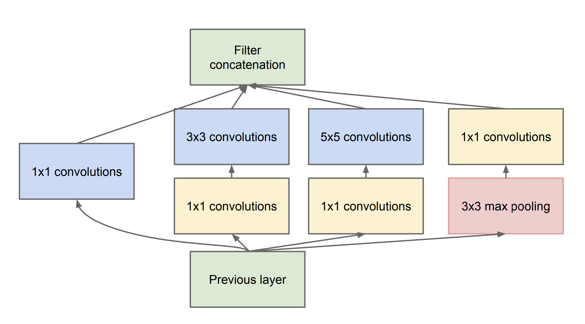
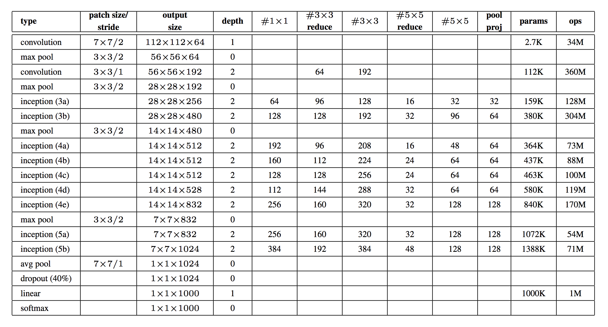
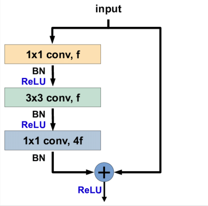
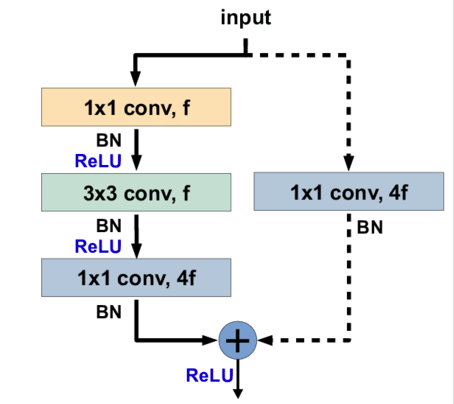
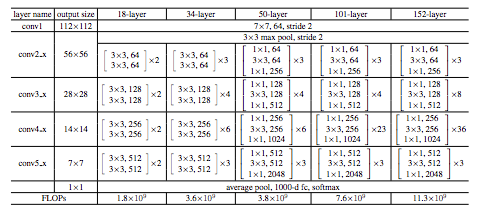
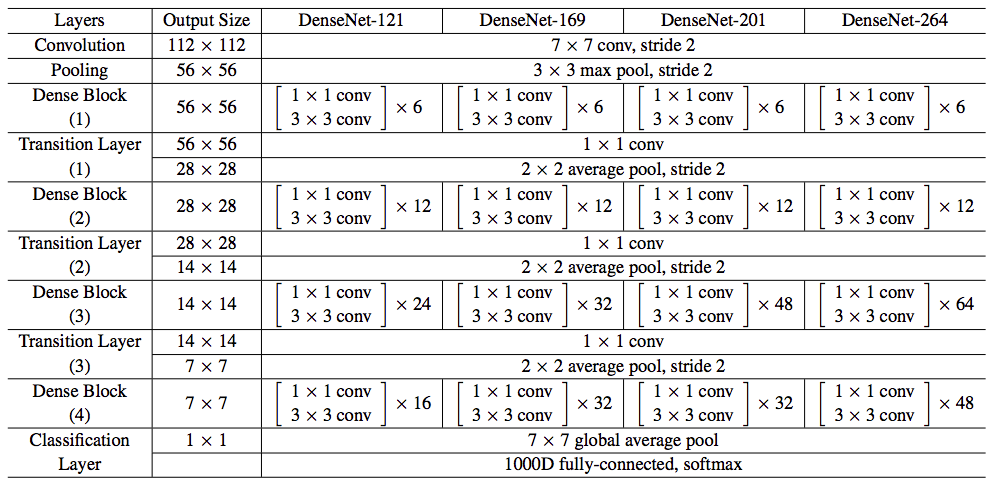

# 0x08. Deep Convolutional Architectures

## Learning Objectives

- What is a skip connection?
- What is a bottleneck layer?
- What is the Inception Network?
- What is ResNet? ResNeXt? DenseNet?
- How to replicate a network architecture by reading a journal article

## Requirements

- Allowed editors: `vi`, `vim`, `emacs`
- All your files will be interpreted/compiled on Ubuntu 16.04 LTS using `python3` (version 3.5)
- Your files will be executed with `numpy` (version 1.15) and tensorflow (version 1.12)
- All your files should end with a new line
- The first line of all your files should be exactly `#!/usr/bin/env python3`
- All of your files must be executable
- A `README.md` file, at the root of the folder of the project, is mandatory
- Your code should use the `pycodestyle` style (version 2.4)
- All your modules should have documentation (`python3 -c 'print(__import__("my_module").__doc__)'`)
- All your classes should have documentation (`python3 -c 'print(__import__("my_module").MyClass.__doc__)'`)
- All your functions (inside and outside a class) should have documentation (`python3 -c 'print(__import__("my_module").my_function.__doc__)'` and `python3 -c 'print\
(__import__("my_module").MyClass.my_function.__doc__)'`)
- Unless otherwise noted, you are not allowed to import any module except `import tensorflow.keras as K`

## Tasks

### [0. Inception Block](./0-inception_block.py)



Write a function `def inception_block(A_prev, filters):` that builds an inception block as described in `Going Deeper with Convolutions (2014)`:

*   `A_prev` is the output from the previous layer
*   `filters` is a tuple or list containing `F1`, `F3R`, `F3`,`F5R`, `F5`, `FPP`, respectively:
    *   `F1` is the number of filters in the 1x1 convolution
    *   `F3R` is the number of filters in the 1x1 convolution before the 3x3 convolution
    *   `F3` is the number of filters in the 3x3 convolution
    *   `F5R` is the number of filters in the 1x1 convolution before the 5x5 convolution
    *   `F5` is the number of filters in the 5x5 convolution
    *   `FPP` is the number of filters in the 1x1 convolution after the max pooling
*   All convolutions inside the inception block should use a rectified linear activation (ReLU)
*   Returns: the concatenated output of the inception block

```
    ubuntu@alexa-ml:~/supervised_learning/0x08-deep_cnns$ ./0-main.py
    __________________________________________________________________________________________________
    Layer (type)                    Output Shape         Param #     Connected to                     
    ==================================================================================================
    input_1 (InputLayer)            (None, 224, 224, 3)  0                                            
    __________________________________________________________________________________________________
    conv2d_1 (Conv2D)               (None, 224, 224, 96) 384         input_1[0][0]                    
    __________________________________________________________________________________________________
    conv2d_3 (Conv2D)               (None, 224, 224, 16) 64          input_1[0][0]                    
    __________________________________________________________________________________________________
    max_pooling2d (MaxPooling2D)    (None, 224, 224, 3)  0           input_1[0][0]                    
    __________________________________________________________________________________________________
    conv2d (Conv2D)                 (None, 224, 224, 64) 256         input_1[0][0]                    
    __________________________________________________________________________________________________
    conv2d_2 (Conv2D)               (None, 224, 224, 128 110720      conv2d_1[0][0]                   
    __________________________________________________________________________________________________
    conv2d_4 (Conv2D)               (None, 224, 224, 32) 12832       conv2d_3[0][0]                   
    __________________________________________________________________________________________________
    conv2d_5 (Conv2D)               (None, 224, 224, 32) 128         max_pooling2d[0][0]              
    __________________________________________________________________________________________________
    concatenate (Concatenate)       (None, 224, 224, 256 0           conv2d[0][0]                     
                                                                     conv2d_2[0][0]                   
                                                                     conv2d_4[0][0]                   
                                                                     conv2d_5[0][0]                   
    ==================================================================================================
    Total params: 124,384
    Trainable params: 124,384
    Non-trainable params: 0
    __________________________________________________________________________________________________
    ubuntu@alexa-ml:~/supervised_learning/0x08-deep_cnns$
```

---

### [1. Inception Network](./1-inception_network.py)

Write a function `def inception_network():` that builds the inception network as described in `Going Deeper with Convolutions (2014)`:

*   You can assume the input data will have shape (224, 224, 3)
*   All convolutions inside and outside the inception block should use a rectified linear activation (ReLU)
*   You may use `inception_block = __import__('0-inception_block').inception_block`
*   Returns: the keras model



```
    ubuntu@alexa-ml:~/supervised_learning/0x08-deep_cnns$ ./1-main.py 
    __________________________________________________________________________________________________
    Layer (type)                    Output Shape         Param #     Connected to                     
    ==================================================================================================
    input_1 (InputLayer)            (None, 224, 224, 3)  0                                            
    __________________________________________________________________________________________________
    conv2d (Conv2D)                 (None, 112, 112, 64) 9472        input_1[0][0]                    
    __________________________________________________________________________________________________
    max_pooling2d (MaxPooling2D)    (None, 56, 56, 64)   0           conv2d[0][0]                     
    __________________________________________________________________________________________________
    conv2d_1 (Conv2D)               (None, 56, 56, 64)   4160        max_pooling2d[0][0]              
    __________________________________________________________________________________________________
    conv2d_2 (Conv2D)               (None, 56, 56, 192)  110784      conv2d_1[0][0]                   
    __________________________________________________________________________________________________
    max_pooling2d_1 (MaxPooling2D)  (None, 28, 28, 192)  0           conv2d_2[0][0]                   
    __________________________________________________________________________________________________
    conv2d_4 (Conv2D)               (None, 28, 28, 96)   18528       max_pooling2d_1[0][0]            
    __________________________________________________________________________________________________
    conv2d_6 (Conv2D)               (None, 28, 28, 16)   3088        max_pooling2d_1[0][0]            
    __________________________________________________________________________________________________
    max_pooling2d_2 (MaxPooling2D)  (None, 28, 28, 192)  0           max_pooling2d_1[0][0]            
    __________________________________________________________________________________________________
    conv2d_3 (Conv2D)               (None, 28, 28, 64)   12352       max_pooling2d_1[0][0]            
    __________________________________________________________________________________________________
    conv2d_5 (Conv2D)               (None, 28, 28, 128)  110720      conv2d_4[0][0]                   
    __________________________________________________________________________________________________
    conv2d_7 (Conv2D)               (None, 28, 28, 32)   12832       conv2d_6[0][0]                   
    __________________________________________________________________________________________________
    conv2d_8 (Conv2D)               (None, 28, 28, 32)   6176        max_pooling2d_2[0][0]            
    __________________________________________________________________________________________________
    concatenate (Concatenate)       (None, 28, 28, 256)  0           conv2d_3[0][0]                   
                                                                     conv2d_5[0][0]                   
                                                                     conv2d_7[0][0]                   
                                                                     conv2d_8[0][0]                   
    __________________________________________________________________________________________________
    conv2d_10 (Conv2D)              (None, 28, 28, 128)  32896       concatenate[0][0]                
    __________________________________________________________________________________________________
    conv2d_12 (Conv2D)              (None, 28, 28, 32)   8224        concatenate[0][0]                
    __________________________________________________________________________________________________
    max_pooling2d_3 (MaxPooling2D)  (None, 28, 28, 256)  0           concatenate[0][0]                
    __________________________________________________________________________________________________
    conv2d_9 (Conv2D)               (None, 28, 28, 128)  32896       concatenate[0][0]                
    __________________________________________________________________________________________________
    conv2d_11 (Conv2D)              (None, 28, 28, 192)  221376      conv2d_10[0][0]                  
    __________________________________________________________________________________________________
    conv2d_13 (Conv2D)              (None, 28, 28, 96)   76896       conv2d_12[0][0]                  
    __________________________________________________________________________________________________
    conv2d_14 (Conv2D)              (None, 28, 28, 64)   16448       max_pooling2d_3[0][0]            
    __________________________________________________________________________________________________
    concatenate_1 (Concatenate)     (None, 28, 28, 480)  0           conv2d_9[0][0]                   
                                                                     conv2d_11[0][0]                  
                                                                     conv2d_13[0][0]                  
                                                                     conv2d_14[0][0]                  
    __________________________________________________________________________________________________
    max_pooling2d_4 (MaxPooling2D)  (None, 14, 14, 480)  0           concatenate_1[0][0]              
    __________________________________________________________________________________________________
    conv2d_16 (Conv2D)              (None, 14, 14, 96)   46176       max_pooling2d_4[0][0]            
    __________________________________________________________________________________________________
    conv2d_18 (Conv2D)              (None, 14, 14, 16)   7696        max_pooling2d_4[0][0]            
    __________________________________________________________________________________________________
    max_pooling2d_5 (MaxPooling2D)  (None, 14, 14, 480)  0           max_pooling2d_4[0][0]            
    __________________________________________________________________________________________________
    conv2d_15 (Conv2D)              (None, 14, 14, 192)  92352       max_pooling2d_4[0][0]            
    __________________________________________________________________________________________________
    conv2d_17 (Conv2D)              (None, 14, 14, 208)  179920      conv2d_16[0][0]                  
    __________________________________________________________________________________________________
    conv2d_19 (Conv2D)              (None, 14, 14, 48)   19248       conv2d_18[0][0]                  
    __________________________________________________________________________________________________
    conv2d_20 (Conv2D)              (None, 14, 14, 64)   30784       max_pooling2d_5[0][0]            
    __________________________________________________________________________________________________
    concatenate_2 (Concatenate)     (None, 14, 14, 512)  0           conv2d_15[0][0]                  
                                                                     conv2d_17[0][0]                  
                                                                     conv2d_19[0][0]                  
                                                                     conv2d_20[0][0]                  
    __________________________________________________________________________________________________
    conv2d_22 (Conv2D)              (None, 14, 14, 112)  57456       concatenate_2[0][0]              
    __________________________________________________________________________________________________
    conv2d_24 (Conv2D)              (None, 14, 14, 24)   12312       concatenate_2[0][0]              
    __________________________________________________________________________________________________
    max_pooling2d_6 (MaxPooling2D)  (None, 14, 14, 512)  0           concatenate_2[0][0]              
    __________________________________________________________________________________________________
    conv2d_21 (Conv2D)              (None, 14, 14, 160)  82080       concatenate_2[0][0]              
    __________________________________________________________________________________________________
    conv2d_23 (Conv2D)              (None, 14, 14, 224)  226016      conv2d_22[0][0]                  
    __________________________________________________________________________________________________
    conv2d_25 (Conv2D)              (None, 14, 14, 64)   38464       conv2d_24[0][0]                  
    __________________________________________________________________________________________________
    conv2d_26 (Conv2D)              (None, 14, 14, 64)   32832       max_pooling2d_6[0][0]            
    __________________________________________________________________________________________________
    concatenate_3 (Concatenate)     (None, 14, 14, 512)  0           conv2d_21[0][0]                  
                                                                     conv2d_23[0][0]                  
                                                                     conv2d_25[0][0]                  
                                                                     conv2d_26[0][0]                  
    __________________________________________________________________________________________________
    conv2d_28 (Conv2D)              (None, 14, 14, 128)  65664       concatenate_3[0][0]              
    __________________________________________________________________________________________________
    conv2d_30 (Conv2D)              (None, 14, 14, 24)   12312       concatenate_3[0][0]              
    __________________________________________________________________________________________________
    max_pooling2d_7 (MaxPooling2D)  (None, 14, 14, 512)  0           concatenate_3[0][0]              
    __________________________________________________________________________________________________
    conv2d_27 (Conv2D)              (None, 14, 14, 128)  65664       concatenate_3[0][0]              
    __________________________________________________________________________________________________
    conv2d_29 (Conv2D)              (None, 14, 14, 256)  295168      conv2d_28[0][0]                  
    __________________________________________________________________________________________________
    conv2d_31 (Conv2D)              (None, 14, 14, 64)   38464       conv2d_30[0][0]                  
    __________________________________________________________________________________________________
    conv2d_32 (Conv2D)              (None, 14, 14, 64)   32832       max_pooling2d_7[0][0]            
    __________________________________________________________________________________________________
    concatenate_4 (Concatenate)     (None, 14, 14, 512)  0           conv2d_27[0][0]                  
                                                                     conv2d_29[0][0]                  
                                                                     conv2d_31[0][0]                  
                                                                     conv2d_32[0][0]                  
    __________________________________________________________________________________________________
    conv2d_34 (Conv2D)              (None, 14, 14, 144)  73872       concatenate_4[0][0]              
    __________________________________________________________________________________________________
    conv2d_36 (Conv2D)              (None, 14, 14, 32)   16416       concatenate_4[0][0]              
    __________________________________________________________________________________________________
    max_pooling2d_8 (MaxPooling2D)  (None, 14, 14, 512)  0           concatenate_4[0][0]              
    __________________________________________________________________________________________________
    conv2d_33 (Conv2D)              (None, 14, 14, 112)  57456       concatenate_4[0][0]              
    __________________________________________________________________________________________________
    conv2d_35 (Conv2D)              (None, 14, 14, 288)  373536      conv2d_34[0][0]                  
    __________________________________________________________________________________________________
    conv2d_37 (Conv2D)              (None, 14, 14, 64)   51264       conv2d_36[0][0]                  
    __________________________________________________________________________________________________
    conv2d_38 (Conv2D)              (None, 14, 14, 64)   32832       max_pooling2d_8[0][0]            
    __________________________________________________________________________________________________
    concatenate_5 (Concatenate)     (None, 14, 14, 528)  0           conv2d_33[0][0]                  
                                                                     conv2d_35[0][0]                  
                                                                     conv2d_37[0][0]                  
                                                                     conv2d_38[0][0]                  
    __________________________________________________________________________________________________
    conv2d_40 (Conv2D)              (None, 14, 14, 160)  84640       concatenate_5[0][0]              
    __________________________________________________________________________________________________
    conv2d_42 (Conv2D)              (None, 14, 14, 32)   16928       concatenate_5[0][0]              
    __________________________________________________________________________________________________
    max_pooling2d_9 (MaxPooling2D)  (None, 14, 14, 528)  0           concatenate_5[0][0]              
    __________________________________________________________________________________________________
    conv2d_39 (Conv2D)              (None, 14, 14, 256)  135424      concatenate_5[0][0]              
    __________________________________________________________________________________________________
    conv2d_41 (Conv2D)              (None, 14, 14, 320)  461120      conv2d_40[0][0]                  
    __________________________________________________________________________________________________
    conv2d_43 (Conv2D)              (None, 14, 14, 128)  102528      conv2d_42[0][0]                  
    __________________________________________________________________________________________________
    conv2d_44 (Conv2D)              (None, 14, 14, 128)  67712       max_pooling2d_9[0][0]            
    __________________________________________________________________________________________________
    concatenate_6 (Concatenate)     (None, 14, 14, 832)  0           conv2d_39[0][0]                  
                                                                     conv2d_41[0][0]                  
                                                                     conv2d_43[0][0]                  
                                                                     conv2d_44[0][0]                  
    __________________________________________________________________________________________________
    max_pooling2d_10 (MaxPooling2D) (None, 7, 7, 832)    0           concatenate_6[0][0]              
    __________________________________________________________________________________________________
    conv2d_46 (Conv2D)              (None, 7, 7, 160)    133280      max_pooling2d_10[0][0]           
    __________________________________________________________________________________________________
    conv2d_48 (Conv2D)              (None, 7, 7, 32)     26656       max_pooling2d_10[0][0]           
    __________________________________________________________________________________________________
    max_pooling2d_11 (MaxPooling2D) (None, 7, 7, 832)    0           max_pooling2d_10[0][0]           
    __________________________________________________________________________________________________
    conv2d_45 (Conv2D)              (None, 7, 7, 256)    213248      max_pooling2d_10[0][0]           
    __________________________________________________________________________________________________
    conv2d_47 (Conv2D)              (None, 7, 7, 320)    461120      conv2d_46[0][0]                  
    __________________________________________________________________________________________________
    conv2d_49 (Conv2D)              (None, 7, 7, 128)    102528      conv2d_48[0][0]                  
    __________________________________________________________________________________________________
    conv2d_50 (Conv2D)              (None, 7, 7, 128)    106624      max_pooling2d_11[0][0]           
    __________________________________________________________________________________________________
    concatenate_7 (Concatenate)     (None, 7, 7, 832)    0           conv2d_45[0][0]                  
                                                                     conv2d_47[0][0]                  
                                                                     conv2d_49[0][0]                  
                                                                     conv2d_50[0][0]                  
    __________________________________________________________________________________________________
    conv2d_52 (Conv2D)              (None, 7, 7, 192)    159936      concatenate_7[0][0]              
    __________________________________________________________________________________________________
    conv2d_54 (Conv2D)              (None, 7, 7, 48)     39984       concatenate_7[0][0]              
    __________________________________________________________________________________________________
    max_pooling2d_12 (MaxPooling2D) (None, 7, 7, 832)    0           concatenate_7[0][0]              
    __________________________________________________________________________________________________
    conv2d_51 (Conv2D)              (None, 7, 7, 384)    319872      concatenate_7[0][0]              
    __________________________________________________________________________________________________
    conv2d_53 (Conv2D)              (None, 7, 7, 384)    663936      conv2d_52[0][0]                  
    __________________________________________________________________________________________________
    conv2d_55 (Conv2D)              (None, 7, 7, 128)    153728      conv2d_54[0][0]                  
    __________________________________________________________________________________________________
    conv2d_56 (Conv2D)              (None, 7, 7, 128)    106624      max_pooling2d_12[0][0]           
    __________________________________________________________________________________________________
    concatenate_8 (Concatenate)     (None, 7, 7, 1024)   0           conv2d_51[0][0]                  
                                                                     conv2d_53[0][0]                  
                                                                     conv2d_55[0][0]                  
                                                                     conv2d_56[0][0]                  
    __________________________________________________________________________________________________
    average_pooling2d (AveragePooli (None, 1, 1, 1024)   0           concatenate_8[0][0]              
    __________________________________________________________________________________________________
    dropout (Dropout)               (None, 1, 1, 1024)   0           average_pooling2d[0][0]          
    __________________________________________________________________________________________________
    dense (Dense)                   (None, 1, 1, 1000)   1025000     dropout[0][0]                    
    ==================================================================================================
    Total params: 6,998,552
    Trainable params: 6,998,552
    Non-trainable params: 0
    __________________________________________________________________________________________________
    ubuntu@alexa-ml:~/supervised_learning/0x08-deep_cnns$
```

---

### [2. Identity Block](./2-identity_block.py)



Write a function `def identity_block(A_prev, filters):` that builds an identity block as described in [Deep Residual Learning for Image Recognition (2015)](/rltoken/wuLTyqZfGDJGXQr7ZD2s7A "Deep Residual Learning for Image Recognition (2015)"):

*   `A_prev` is the output from the previous layer
*   `filters` is a tuple or list containing `F11`, `F3`, `F12`, respectively:
    *   `F11` is the number of filters in the first 1x1 convolution
    *   `F3` is the number of filters in the 3x3 convolution
    *   `F12` is the number of filters in the second 1x1 convolution
*   All convolutions inside the block should be followed by batch normalization along the channels axis and a rectified linear activation (ReLU), respectively.
*   All weights should use he normal initialization
*   Returns: the activated output of the identity block

```
    ubuntu@alexa-ml:~/supervised_learning/0x08-deep_cnns$ ./2-main.py 
    __________________________________________________________________________________________________
    Layer (type)                    Output Shape         Param #     Connected to                     
    ==================================================================================================
    input_1 (InputLayer)            (None, 224, 224, 256 0                                            
    __________________________________________________________________________________________________
    conv2d (Conv2D)                 (None, 224, 224, 64) 16448       input_1[0][0]                    
    __________________________________________________________________________________________________
    batch_normalization (BatchNorma (None, 224, 224, 64) 256         conv2d[0][0]                     
    __________________________________________________________________________________________________
    activation (Activation)         (None, 224, 224, 64) 0           batch_normalization[0][0]        
    __________________________________________________________________________________________________
    conv2d_1 (Conv2D)               (None, 224, 224, 64) 36928       activation[0][0]                 
    __________________________________________________________________________________________________
    batch_normalization_1 (BatchNor (None, 224, 224, 64) 256         conv2d_1[0][0]                   
    __________________________________________________________________________________________________
    activation_1 (Activation)       (None, 224, 224, 64) 0           batch_normalization_1[0][0]      
    __________________________________________________________________________________________________
    conv2d_2 (Conv2D)               (None, 224, 224, 256 16640       activation_1[0][0]               
    __________________________________________________________________________________________________
    batch_normalization_2 (BatchNor (None, 224, 224, 256 1024        conv2d_2[0][0]                   
    __________________________________________________________________________________________________
    add (Add)                       (None, 224, 224, 256 0           batch_normalization_2[0][0]      
                                                                     input_1[0][0]                    
    __________________________________________________________________________________________________
    activation_2 (Activation)       (None, 224, 224, 256 0           add[0][0]                        
    ==================================================================================================
    Total params: 71,552
    Trainable params: 70,784
    Non-trainable params: 768
    __________________________________________________________________________________________________
    ubuntu@alexa-ml:~/supervised_learning/0x08-deep_cnns$ 
```

---

### [3. Projection Block](./3-projection_block.py)



Write a function `def projection_block(A_prev, filters, s=2):` that builds a projection block as described in [Deep Residual Learning for Image Recognition (2015)](/rltoken/wuLTyqZfGDJGXQr7ZD2s7A "Deep Residual Learning for Image Recognition (2015)"):

*   `A_prev` is the output from the previous layer
*   `filters` is a tuple or list containing `F11`, `F3`, `F12`, respectively:
    *   `F11` is the number of filters in the first 1x1 convolution
    *   `F3` is the number of filters in the 3x3 convolution
    *   `F12` is the number of filters in the second 1x1 convolution as well as the 1x1 convolution in the shortcut connection
*   `s` is the stride of the first convolution in both the main path and the shortcut connection
*   All convolutions inside the block should be followed by batch normalization along the channels axis and a rectified linear activation (ReLU), respectively.
*   All weights should use he normal initialization
*   Returns: the activated output of the projection block

```
    ubuntu@alexa-ml:~/supervised_learning/0x08-deep_cnns$ ./3-main.py 
    __________________________________________________________________________________________________
    Layer (type)                    Output Shape         Param #     Connected to                     
    ==================================================================================================
    input_1 (InputLayer)            (None, 224, 224, 3)  0                                            
    __________________________________________________________________________________________________
    conv2d (Conv2D)                 (None, 112, 112, 64) 256         input_1[0][0]                    
    __________________________________________________________________________________________________
    batch_normalization (BatchNorma (None, 112, 112, 64) 256         conv2d[0][0]                     
    __________________________________________________________________________________________________
    activation (Activation)         (None, 112, 112, 64) 0           batch_normalization[0][0]        
    __________________________________________________________________________________________________
    conv2d_1 (Conv2D)               (None, 112, 112, 64) 36928       activation[0][0]                 
    __________________________________________________________________________________________________
    batch_normalization_1 (BatchNor (None, 112, 112, 64) 256         conv2d_1[0][0]                   
    __________________________________________________________________________________________________
    activation_1 (Activation)       (None, 112, 112, 64) 0           batch_normalization_1[0][0]      
    __________________________________________________________________________________________________
    conv2d_2 (Conv2D)               (None, 112, 112, 256 16640       activation_1[0][0]               
    __________________________________________________________________________________________________
    conv2d_3 (Conv2D)               (None, 112, 112, 256 1024        input_1[0][0]                    
    __________________________________________________________________________________________________
    batch_normalization_2 (BatchNor (None, 112, 112, 256 1024        conv2d_2[0][0]                   
    __________________________________________________________________________________________________
    batch_normalization_3 (BatchNor (None, 112, 112, 256 1024        conv2d_3[0][0]                   
    __________________________________________________________________________________________________
    add (Add)                       (None, 112, 112, 256 0           batch_normalization_2[0][0]      
                                                                     batch_normalization_3[0][0]      
    __________________________________________________________________________________________________
    activation_2 (Activation)       (None, 112, 112, 256 0           add[0][0]                        
    ==================================================================================================
    Total params: 57,408
    Trainable params: 56,128
    Non-trainable params: 1,280
    __________________________________________________________________________________________________
    ubuntu@alexa-ml:~/supervised_learning/0x08-deep_cnns$
```

---

### [4. ResNet-50](./4-resnet50.py)



Write a function `def resnet50():` that builds the ResNet-50 architecture as described in [Deep Residual Learning for Image Recognition (2015)](/rltoken/wuLTyqZfGDJGXQr7ZD2s7A "Deep Residual Learning for Image Recognition (2015)"):

*   You can assume the input data will have shape (224, 224, 3)
*   All convolutions inside and outside the blocks should be followed by batch normalization along the channels axis and a rectified linear activation (ReLU), respectively.
*   All weights should use he normal initialization
*   You may use:
    *   `identity_block = __import__('2-identity_block').identity_block`
    *   `projection_block = __import__('3-projection_block').projection_block`
*   Returns: the keras model

```
    ubuntu@alexa-ml:~/supervised_learning/0x08-deep_cnns$ ./4-main.py 
    __________________________________________________________________________________________________
    Layer (type)                    Output Shape         Param #     Connected to                     
    ==================================================================================================
    input_1 (InputLayer)            (None, 224, 224, 3)  0                                            
    __________________________________________________________________________________________________
    conv2d (Conv2D)                 (None, 112, 112, 64) 9472        input_1[0][0]                    
    __________________________________________________________________________________________________
    batch_normalization (BatchNorma (None, 112, 112, 64) 256         conv2d[0][0]                     
    __________________________________________________________________________________________________
    activation (Activation)         (None, 112, 112, 64) 0           batch_normalization[0][0]        
    __________________________________________________________________________________________________
    max_pooling2d (MaxPooling2D)    (None, 56, 56, 64)   0           activation[0][0]                 
    __________________________________________________________________________________________________
    conv2d_1 (Conv2D)               (None, 56, 56, 64)   4160        max_pooling2d[0][0]              
    __________________________________________________________________________________________________
    batch_normalization_1 (BatchNor (None, 56, 56, 64)   256         conv2d_1[0][0]                   
    __________________________________________________________________________________________________
    activation_1 (Activation)       (None, 56, 56, 64)   0           batch_normalization_1[0][0]      
    __________________________________________________________________________________________________
    conv2d_2 (Conv2D)               (None, 56, 56, 64)   36928       activation_1[0][0]               
    __________________________________________________________________________________________________
    batch_normalization_2 (BatchNor (None, 56, 56, 64)   256         conv2d_2[0][0]                   
    __________________________________________________________________________________________________
    activation_2 (Activation)       (None, 56, 56, 64)   0           batch_normalization_2[0][0]      
    __________________________________________________________________________________________________
    conv2d_3 (Conv2D)               (None, 56, 56, 256)  16640       activation_2[0][0]               
    __________________________________________________________________________________________________
    conv2d_4 (Conv2D)               (None, 56, 56, 256)  16640       max_pooling2d[0][0]              
    __________________________________________________________________________________________________
    batch_normalization_3 (BatchNor (None, 56, 56, 256)  1024        conv2d_3[0][0]                   
    __________________________________________________________________________________________________
    batch_normalization_4 (BatchNor (None, 56, 56, 256)  1024        conv2d_4[0][0]                   
    __________________________________________________________________________________________________
    add (Add)                       (None, 56, 56, 256)  0           batch_normalization_3[0][0]      
                                                                     batch_normalization_4[0][0]      
    __________________________________________________________________________________________________
    activation_3 (Activation)       (None, 56, 56, 256)  0           add[0][0]                        
    __________________________________________________________________________________________________
    conv2d_5 (Conv2D)               (None, 56, 56, 64)   16448       activation_3[0][0]               
    __________________________________________________________________________________________________
    batch_normalization_5 (BatchNor (None, 56, 56, 64)   256         conv2d_5[0][0]                   
    __________________________________________________________________________________________________
    activation_4 (Activation)       (None, 56, 56, 64)   0           batch_normalization_5[0][0]      
    __________________________________________________________________________________________________
    conv2d_6 (Conv2D)               (None, 56, 56, 64)   36928       activation_4[0][0]               
    __________________________________________________________________________________________________
    batch_normalization_6 (BatchNor (None, 56, 56, 64)   256         conv2d_6[0][0]                   
    __________________________________________________________________________________________________
    activation_5 (Activation)       (None, 56, 56, 64)   0           batch_normalization_6[0][0]      
    __________________________________________________________________________________________________
    conv2d_7 (Conv2D)               (None, 56, 56, 256)  16640       activation_5[0][0]               
    __________________________________________________________________________________________________
    batch_normalization_7 (BatchNor (None, 56, 56, 256)  1024        conv2d_7[0][0]                   
    __________________________________________________________________________________________________
    add_1 (Add)                     (None, 56, 56, 256)  0           batch_normalization_7[0][0]      
                                                                     activation_3[0][0]               
    __________________________________________________________________________________________________
    activation_6 (Activation)       (None, 56, 56, 256)  0           add_1[0][0]                      
    __________________________________________________________________________________________________
    conv2d_8 (Conv2D)               (None, 56, 56, 64)   16448       activation_6[0][0]               
    __________________________________________________________________________________________________
    batch_normalization_8 (BatchNor (None, 56, 56, 64)   256         conv2d_8[0][0]                   
    __________________________________________________________________________________________________
    activation_7 (Activation)       (None, 56, 56, 64)   0           batch_normalization_8[0][0]      
    __________________________________________________________________________________________________
    conv2d_9 (Conv2D)               (None, 56, 56, 64)   36928       activation_7[0][0]               
    __________________________________________________________________________________________________
    batch_normalization_9 (BatchNor (None, 56, 56, 64)   256         conv2d_9[0][0]                   
    __________________________________________________________________________________________________
    activation_8 (Activation)       (None, 56, 56, 64)   0           batch_normalization_9[0][0]      
    __________________________________________________________________________________________________
    conv2d_10 (Conv2D)              (None, 56, 56, 256)  16640       activation_8[0][0]               
    __________________________________________________________________________________________________
    batch_normalization_10 (BatchNo (None, 56, 56, 256)  1024        conv2d_10[0][0]                  
    __________________________________________________________________________________________________
    add_2 (Add)                     (None, 56, 56, 256)  0           batch_normalization_10[0][0]     
                                                                     activation_6[0][0]               
    __________________________________________________________________________________________________
    activation_9 (Activation)       (None, 56, 56, 256)  0           add_2[0][0]                      
    __________________________________________________________________________________________________
    conv2d_11 (Conv2D)              (None, 28, 28, 128)  32896       activation_9[0][0]               
    __________________________________________________________________________________________________
    batch_normalization_11 (BatchNo (None, 28, 28, 128)  512         conv2d_11[0][0]                  
    __________________________________________________________________________________________________
    activation_10 (Activation)      (None, 28, 28, 128)  0           batch_normalization_11[0][0]     
    __________________________________________________________________________________________________
    conv2d_12 (Conv2D)              (None, 28, 28, 128)  147584      activation_10[0][0]              
    __________________________________________________________________________________________________
    batch_normalization_12 (BatchNo (None, 28, 28, 128)  512         conv2d_12[0][0]                  
    __________________________________________________________________________________________________
    activation_11 (Activation)      (None, 28, 28, 128)  0           batch_normalization_12[0][0]     
    __________________________________________________________________________________________________
    conv2d_13 (Conv2D)              (None, 28, 28, 512)  66048       activation_11[0][0]              
    __________________________________________________________________________________________________
    conv2d_14 (Conv2D)              (None, 28, 28, 512)  131584      activation_9[0][0]               
    __________________________________________________________________________________________________
    batch_normalization_13 (BatchNo (None, 28, 28, 512)  2048        conv2d_13[0][0]                  
    __________________________________________________________________________________________________
    batch_normalization_14 (BatchNo (None, 28, 28, 512)  2048        conv2d_14[0][0]                  
    __________________________________________________________________________________________________
    add_3 (Add)                     (None, 28, 28, 512)  0           batch_normalization_13[0][0]     
                                                                     batch_normalization_14[0][0]     
    __________________________________________________________________________________________________
    activation_12 (Activation)      (None, 28, 28, 512)  0           add_3[0][0]                      
    __________________________________________________________________________________________________
    conv2d_15 (Conv2D)              (None, 28, 28, 128)  65664       activation_12[0][0]              
    __________________________________________________________________________________________________
    batch_normalization_15 (BatchNo (None, 28, 28, 128)  512         conv2d_15[0][0]                  
    __________________________________________________________________________________________________
    activation_13 (Activation)      (None, 28, 28, 128)  0           batch_normalization_15[0][0]     
    __________________________________________________________________________________________________
    conv2d_16 (Conv2D)              (None, 28, 28, 128)  147584      activation_13[0][0]              
    __________________________________________________________________________________________________
    batch_normalization_16 (BatchNo (None, 28, 28, 128)  512         conv2d_16[0][0]                  
    __________________________________________________________________________________________________
    activation_14 (Activation)      (None, 28, 28, 128)  0           batch_normalization_16[0][0]     
    __________________________________________________________________________________________________
    conv2d_17 (Conv2D)              (None, 28, 28, 512)  66048       activation_14[0][0]              
    __________________________________________________________________________________________________
    batch_normalization_17 (BatchNo (None, 28, 28, 512)  2048        conv2d_17[0][0]                  
    __________________________________________________________________________________________________
    add_4 (Add)                     (None, 28, 28, 512)  0           batch_normalization_17[0][0]     
                                                                     activation_12[0][0]              
    __________________________________________________________________________________________________
    activation_15 (Activation)      (None, 28, 28, 512)  0           add_4[0][0]                      
    __________________________________________________________________________________________________
    conv2d_18 (Conv2D)              (None, 28, 28, 128)  65664       activation_15[0][0]              
    __________________________________________________________________________________________________
    batch_normalization_18 (BatchNo (None, 28, 28, 128)  512         conv2d_18[0][0]                  
    __________________________________________________________________________________________________
    activation_16 (Activation)      (None, 28, 28, 128)  0           batch_normalization_18[0][0]     
    __________________________________________________________________________________________________
    conv2d_19 (Conv2D)              (None, 28, 28, 128)  147584      activation_16[0][0]              
    __________________________________________________________________________________________________
    batch_normalization_19 (BatchNo (None, 28, 28, 128)  512         conv2d_19[0][0]                  
    __________________________________________________________________________________________________
    activation_17 (Activation)      (None, 28, 28, 128)  0           batch_normalization_19[0][0]     
    __________________________________________________________________________________________________
    conv2d_20 (Conv2D)              (None, 28, 28, 512)  66048       activation_17[0][0]              
    __________________________________________________________________________________________________
    batch_normalization_20 (BatchNo (None, 28, 28, 512)  2048        conv2d_20[0][0]                  
    __________________________________________________________________________________________________
    add_5 (Add)                     (None, 28, 28, 512)  0           batch_normalization_20[0][0]     
                                                                     activation_15[0][0]              
    __________________________________________________________________________________________________
    activation_18 (Activation)      (None, 28, 28, 512)  0           add_5[0][0]                      
    __________________________________________________________________________________________________
    conv2d_21 (Conv2D)              (None, 28, 28, 128)  65664       activation_18[0][0]              
    __________________________________________________________________________________________________
    batch_normalization_21 (BatchNo (None, 28, 28, 128)  512         conv2d_21[0][0]                  
    __________________________________________________________________________________________________
    activation_19 (Activation)      (None, 28, 28, 128)  0           batch_normalization_21[0][0]     
    __________________________________________________________________________________________________
    conv2d_22 (Conv2D)              (None, 28, 28, 128)  147584      activation_19[0][0]              
    __________________________________________________________________________________________________
    batch_normalization_22 (BatchNo (None, 28, 28, 128)  512         conv2d_22[0][0]                  
    __________________________________________________________________________________________________
    activation_20 (Activation)      (None, 28, 28, 128)  0           batch_normalization_22[0][0]     
    __________________________________________________________________________________________________
    conv2d_23 (Conv2D)              (None, 28, 28, 512)  66048       activation_20[0][0]              
    __________________________________________________________________________________________________
    batch_normalization_23 (BatchNo (None, 28, 28, 512)  2048        conv2d_23[0][0]                  
    __________________________________________________________________________________________________
    add_6 (Add)                     (None, 28, 28, 512)  0           batch_normalization_23[0][0]     
                                                                     activation_18[0][0]              
    __________________________________________________________________________________________________
    activation_21 (Activation)      (None, 28, 28, 512)  0           add_6[0][0]                      
    __________________________________________________________________________________________________
    conv2d_24 (Conv2D)              (None, 14, 14, 256)  131328      activation_21[0][0]              
    __________________________________________________________________________________________________
    batch_normalization_24 (BatchNo (None, 14, 14, 256)  1024        conv2d_24[0][0]                  
    __________________________________________________________________________________________________
    activation_22 (Activation)      (None, 14, 14, 256)  0           batch_normalization_24[0][0]     
    __________________________________________________________________________________________________
    conv2d_25 (Conv2D)              (None, 14, 14, 256)  590080      activation_22[0][0]              
    __________________________________________________________________________________________________
    batch_normalization_25 (BatchNo (None, 14, 14, 256)  1024        conv2d_25[0][0]                  
    __________________________________________________________________________________________________
    activation_23 (Activation)      (None, 14, 14, 256)  0           batch_normalization_25[0][0]     
    __________________________________________________________________________________________________
    conv2d_26 (Conv2D)              (None, 14, 14, 1024) 263168      activation_23[0][0]              
    __________________________________________________________________________________________________
    conv2d_27 (Conv2D)              (None, 14, 14, 1024) 525312      activation_21[0][0]              
    __________________________________________________________________________________________________
    batch_normalization_26 (BatchNo (None, 14, 14, 1024) 4096        conv2d_26[0][0]                  
    __________________________________________________________________________________________________
    batch_normalization_27 (BatchNo (None, 14, 14, 1024) 4096        conv2d_27[0][0]                  
    __________________________________________________________________________________________________
    add_7 (Add)                     (None, 14, 14, 1024) 0           batch_normalization_26[0][0]     
                                                                     batch_normalization_27[0][0]     
    __________________________________________________________________________________________________
    activation_24 (Activation)      (None, 14, 14, 1024) 0           add_7[0][0]                      
    __________________________________________________________________________________________________
    conv2d_28 (Conv2D)              (None, 14, 14, 256)  262400      activation_24[0][0]              
    __________________________________________________________________________________________________
    batch_normalization_28 (BatchNo (None, 14, 14, 256)  1024        conv2d_28[0][0]                  
    __________________________________________________________________________________________________
    activation_25 (Activation)      (None, 14, 14, 256)  0           batch_normalization_28[0][0]     
    __________________________________________________________________________________________________
    conv2d_29 (Conv2D)              (None, 14, 14, 256)  590080      activation_25[0][0]              
    __________________________________________________________________________________________________
    batch_normalization_29 (BatchNo (None, 14, 14, 256)  1024        conv2d_29[0][0]                  
    __________________________________________________________________________________________________
    activation_26 (Activation)      (None, 14, 14, 256)  0           batch_normalization_29[0][0]     
    __________________________________________________________________________________________________
    conv2d_30 (Conv2D)              (None, 14, 14, 1024) 263168      activation_26[0][0]              
    __________________________________________________________________________________________________
    batch_normalization_30 (BatchNo (None, 14, 14, 1024) 4096        conv2d_30[0][0]                  
    __________________________________________________________________________________________________
    add_8 (Add)                     (None, 14, 14, 1024) 0           batch_normalization_30[0][0]     
                                                                     activation_24[0][0]              
    __________________________________________________________________________________________________
    activation_27 (Activation)      (None, 14, 14, 1024) 0           add_8[0][0]                      
    __________________________________________________________________________________________________
    conv2d_31 (Conv2D)              (None, 14, 14, 256)  262400      activation_27[0][0]              
    __________________________________________________________________________________________________
    batch_normalization_31 (BatchNo (None, 14, 14, 256)  1024        conv2d_31[0][0]                  
    __________________________________________________________________________________________________
    activation_28 (Activation)      (None, 14, 14, 256)  0           batch_normalization_31[0][0]     
    __________________________________________________________________________________________________
    conv2d_32 (Conv2D)              (None, 14, 14, 256)  590080      activation_28[0][0]              
    __________________________________________________________________________________________________
    batch_normalization_32 (BatchNo (None, 14, 14, 256)  1024        conv2d_32[0][0]                  
    __________________________________________________________________________________________________
    activation_29 (Activation)      (None, 14, 14, 256)  0           batch_normalization_32[0][0]     
    __________________________________________________________________________________________________
    conv2d_33 (Conv2D)              (None, 14, 14, 1024) 263168      activation_29[0][0]              
    __________________________________________________________________________________________________
    batch_normalization_33 (BatchNo (None, 14, 14, 1024) 4096        conv2d_33[0][0]                  
    __________________________________________________________________________________________________
    add_9 (Add)                     (None, 14, 14, 1024) 0           batch_normalization_33[0][0]     
                                                                     activation_27[0][0]              
    __________________________________________________________________________________________________
    activation_30 (Activation)      (None, 14, 14, 1024) 0           add_9[0][0]                      
    __________________________________________________________________________________________________
    conv2d_34 (Conv2D)              (None, 14, 14, 256)  262400      activation_30[0][0]              
    __________________________________________________________________________________________________
    batch_normalization_34 (BatchNo (None, 14, 14, 256)  1024        conv2d_34[0][0]                  
    __________________________________________________________________________________________________
    activation_31 (Activation)      (None, 14, 14, 256)  0           batch_normalization_34[0][0]     
    __________________________________________________________________________________________________
    conv2d_35 (Conv2D)              (None, 14, 14, 256)  590080      activation_31[0][0]              
    __________________________________________________________________________________________________
    batch_normalization_35 (BatchNo (None, 14, 14, 256)  1024        conv2d_35[0][0]                  
    __________________________________________________________________________________________________
    activation_32 (Activation)      (None, 14, 14, 256)  0           batch_normalization_35[0][0]     
    __________________________________________________________________________________________________
    conv2d_36 (Conv2D)              (None, 14, 14, 1024) 263168      activation_32[0][0]              
    __________________________________________________________________________________________________
    batch_normalization_36 (BatchNo (None, 14, 14, 1024) 4096        conv2d_36[0][0]                  
    __________________________________________________________________________________________________
    add_10 (Add)                    (None, 14, 14, 1024) 0           batch_normalization_36[0][0]     
                                                                     activation_30[0][0]              
    __________________________________________________________________________________________________
    activation_33 (Activation)      (None, 14, 14, 1024) 0           add_10[0][0]                     
    __________________________________________________________________________________________________
    conv2d_37 (Conv2D)              (None, 14, 14, 256)  262400      activation_33[0][0]              
    __________________________________________________________________________________________________
    batch_normalization_37 (BatchNo (None, 14, 14, 256)  1024        conv2d_37[0][0]                  
    __________________________________________________________________________________________________
    activation_34 (Activation)      (None, 14, 14, 256)  0           batch_normalization_37[0][0]     
    __________________________________________________________________________________________________
    conv2d_38 (Conv2D)              (None, 14, 14, 256)  590080      activation_34[0][0]              
    __________________________________________________________________________________________________
    batch_normalization_38 (BatchNo (None, 14, 14, 256)  1024        conv2d_38[0][0]                  
    __________________________________________________________________________________________________
    activation_35 (Activation)      (None, 14, 14, 256)  0           batch_normalization_38[0][0]     
    __________________________________________________________________________________________________
    conv2d_39 (Conv2D)              (None, 14, 14, 1024) 263168      activation_35[0][0]              
    __________________________________________________________________________________________________
    batch_normalization_39 (BatchNo (None, 14, 14, 1024) 4096        conv2d_39[0][0]                  
    __________________________________________________________________________________________________
    add_11 (Add)                    (None, 14, 14, 1024) 0           batch_normalization_39[0][0]     
                                                                     activation_33[0][0]              
    __________________________________________________________________________________________________
    activation_36 (Activation)      (None, 14, 14, 1024) 0           add_11[0][0]                     
    __________________________________________________________________________________________________
    conv2d_40 (Conv2D)              (None, 14, 14, 256)  262400      activation_36[0][0]              
    __________________________________________________________________________________________________
    batch_normalization_40 (BatchNo (None, 14, 14, 256)  1024        conv2d_40[0][0]                  
    __________________________________________________________________________________________________
    activation_37 (Activation)      (None, 14, 14, 256)  0           batch_normalization_40[0][0]     
    __________________________________________________________________________________________________
    conv2d_41 (Conv2D)              (None, 14, 14, 256)  590080      activation_37[0][0]              
    __________________________________________________________________________________________________
    batch_normalization_41 (BatchNo (None, 14, 14, 256)  1024        conv2d_41[0][0]                  
    __________________________________________________________________________________________________
    activation_38 (Activation)      (None, 14, 14, 256)  0           batch_normalization_41[0][0]     
    __________________________________________________________________________________________________
    conv2d_42 (Conv2D)              (None, 14, 14, 1024) 263168      activation_38[0][0]              
    __________________________________________________________________________________________________
    batch_normalization_42 (BatchNo (None, 14, 14, 1024) 4096        conv2d_42[0][0]                  
    __________________________________________________________________________________________________
    add_12 (Add)                    (None, 14, 14, 1024) 0           batch_normalization_42[0][0]     
                                                                     activation_36[0][0]              
    __________________________________________________________________________________________________
    activation_39 (Activation)      (None, 14, 14, 1024) 0           add_12[0][0]                     
    __________________________________________________________________________________________________
    conv2d_43 (Conv2D)              (None, 7, 7, 512)    524800      activation_39[0][0]              
    __________________________________________________________________________________________________
    batch_normalization_43 (BatchNo (None, 7, 7, 512)    2048        conv2d_43[0][0]                  
    __________________________________________________________________________________________________
    activation_40 (Activation)      (None, 7, 7, 512)    0           batch_normalization_43[0][0]     
    __________________________________________________________________________________________________
    conv2d_44 (Conv2D)              (None, 7, 7, 512)    2359808     activation_40[0][0]              
    __________________________________________________________________________________________________
    batch_normalization_44 (BatchNo (None, 7, 7, 512)    2048        conv2d_44[0][0]                  
    __________________________________________________________________________________________________
    activation_41 (Activation)      (None, 7, 7, 512)    0           batch_normalization_44[0][0]     
    __________________________________________________________________________________________________
    conv2d_45 (Conv2D)              (None, 7, 7, 2048)   1050624     activation_41[0][0]              
    __________________________________________________________________________________________________
    conv2d_46 (Conv2D)              (None, 7, 7, 2048)   2099200     activation_39[0][0]              
    __________________________________________________________________________________________________
    batch_normalization_45 (BatchNo (None, 7, 7, 2048)   8192        conv2d_45[0][0]                  
    __________________________________________________________________________________________________
    batch_normalization_46 (BatchNo (None, 7, 7, 2048)   8192        conv2d_46[0][0]                  
    __________________________________________________________________________________________________
    add_13 (Add)                    (None, 7, 7, 2048)   0           batch_normalization_45[0][0]     
                                                                     batch_normalization_46[0][0]     
    __________________________________________________________________________________________________
    activation_42 (Activation)      (None, 7, 7, 2048)   0           add_13[0][0]                     
    __________________________________________________________________________________________________
    conv2d_47 (Conv2D)              (None, 7, 7, 512)    1049088     activation_42[0][0]              
    __________________________________________________________________________________________________
    batch_normalization_47 (BatchNo (None, 7, 7, 512)    2048        conv2d_47[0][0]                  
    __________________________________________________________________________________________________
    activation_43 (Activation)      (None, 7, 7, 512)    0           batch_normalization_47[0][0]     
    __________________________________________________________________________________________________
    conv2d_48 (Conv2D)              (None, 7, 7, 512)    2359808     activation_43[0][0]              
    __________________________________________________________________________________________________
    batch_normalization_48 (BatchNo (None, 7, 7, 512)    2048        conv2d_48[0][0]                  
    __________________________________________________________________________________________________
    activation_44 (Activation)      (None, 7, 7, 512)    0           batch_normalization_48[0][0]     
    __________________________________________________________________________________________________
    conv2d_49 (Conv2D)              (None, 7, 7, 2048)   1050624     activation_44[0][0]              
    __________________________________________________________________________________________________
    batch_normalization_49 (BatchNo (None, 7, 7, 2048)   8192        conv2d_49[0][0]                  
    __________________________________________________________________________________________________
    add_14 (Add)                    (None, 7, 7, 2048)   0           batch_normalization_49[0][0]     
                                                                     activation_42[0][0]              
    __________________________________________________________________________________________________
    activation_45 (Activation)      (None, 7, 7, 2048)   0           add_14[0][0]                     
    __________________________________________________________________________________________________
    conv2d_50 (Conv2D)              (None, 7, 7, 512)    1049088     activation_45[0][0]              
    __________________________________________________________________________________________________
    batch_normalization_50 (BatchNo (None, 7, 7, 512)    2048        conv2d_50[0][0]                  
    __________________________________________________________________________________________________
    activation_46 (Activation)      (None, 7, 7, 512)    0           batch_normalization_50[0][0]     
    __________________________________________________________________________________________________
    conv2d_51 (Conv2D)              (None, 7, 7, 512)    2359808     activation_46[0][0]              
    __________________________________________________________________________________________________
    batch_normalization_51 (BatchNo (None, 7, 7, 512)    2048        conv2d_51[0][0]                  
    __________________________________________________________________________________________________
    activation_47 (Activation)      (None, 7, 7, 512)    0           batch_normalization_51[0][0]     
    __________________________________________________________________________________________________
    conv2d_52 (Conv2D)              (None, 7, 7, 2048)   1050624     activation_47[0][0]              
    __________________________________________________________________________________________________
    batch_normalization_52 (BatchNo (None, 7, 7, 2048)   8192        conv2d_52[0][0]                  
    __________________________________________________________________________________________________
    add_15 (Add)                    (None, 7, 7, 2048)   0           batch_normalization_52[0][0]     
                                                                     activation_45[0][0]              
    __________________________________________________________________________________________________
    activation_48 (Activation)      (None, 7, 7, 2048)   0           add_15[0][0]                     
    __________________________________________________________________________________________________
    average_pooling2d (AveragePooli (None, 1, 1, 2048)   0           activation_48[0][0]              
    __________________________________________________________________________________________________
    dense (Dense)                   (None, 1, 1, 1000)   2049000     average_pooling2d[0][0]          
    ==================================================================================================
    Total params: 25,636,712
    Trainable params: 25,583,592
    Non-trainable params: 53,120
    __________________________________________________________________________________________________
    ubuntu@alexa-ml:~/supervised_learning/0x08-deep_cnns$ 
```

---

### [5. Dense Block](./5-dense_block.py)


Write a function `def dense_block(X, nb_filters, growth_rate, layers):` that builds a dense block as described in [Densely Connected Convolutional Networks](/rltoken/Qs0mYOJOO77ZiZBEdREYzQ "Densely Connected Convolutional Networks"):

*   `X` is the output from the previous layer
*   `nb_filters` is an integer representing the number of filters in `X`
*   `growth_rate` is the growth rate for the dense block
*   `layers` is the number of layers in the dense block
*   You should use the bottleneck layers used for DenseNet-B
*   All weights should use he normal initialization
*   All convolutions should be preceded by Batch Normalization and a rectified linear activation (ReLU), respectively
*   Returns: The concatenated output of each layer within the Dense Block and the number of filters within the concatenated outputs, respectively

```
    ubuntu@alexa-ml:~/supervised_learning/0x08-deep_cnns$ ./5-main.py
    __________________________________________________________________________________________________
    Layer (type)                    Output Shape         Param #     Connected to                     
    ==================================================================================================
    input_1 (InputLayer)            (None, 56, 56, 64)   0                                            
    __________________________________________________________________________________________________
    batch_normalization (BatchNorma (None, 56, 56, 64)   256         input_1[0][0]                    
    __________________________________________________________________________________________________
    activation (Activation)         (None, 56, 56, 64)   0           batch_normalization[0][0]        
    __________________________________________________________________________________________________
    conv2d (Conv2D)                 (None, 56, 56, 128)  8320        activation[0][0]                 
    __________________________________________________________________________________________________
    batch_normalization_1 (BatchNor (None, 56, 56, 128)  512         conv2d[0][0]                     
    __________________________________________________________________________________________________
    activation_1 (Activation)       (None, 56, 56, 128)  0           batch_normalization_1[0][0]      
    __________________________________________________________________________________________________
    conv2d_1 (Conv2D)               (None, 56, 56, 32)   36896       activation_1[0][0]               
    __________________________________________________________________________________________________
    concatenate (Concatenate)       (None, 56, 56, 96)   0           input_1[0][0]                    
                                                                     conv2d_1[0][0]                   
    __________________________________________________________________________________________________
    batch_normalization_2 (BatchNor (None, 56, 56, 96)   384         concatenate[0][0]                
    __________________________________________________________________________________________________
    activation_2 (Activation)       (None, 56, 56, 96)   0           batch_normalization_2[0][0]      
    __________________________________________________________________________________________________
    conv2d_2 (Conv2D)               (None, 56, 56, 128)  12416       activation_2[0][0]               
    __________________________________________________________________________________________________
    batch_normalization_3 (BatchNor (None, 56, 56, 128)  512         conv2d_2[0][0]                   
    __________________________________________________________________________________________________
    activation_3 (Activation)       (None, 56, 56, 128)  0           batch_normalization_3[0][0]      
    __________________________________________________________________________________________________
    conv2d_3 (Conv2D)               (None, 56, 56, 32)   36896       activation_3[0][0]               
    __________________________________________________________________________________________________
    concatenate_1 (Concatenate)     (None, 56, 56, 128)  0           concatenate[0][0]                
                                                                     conv2d_3[0][0]                   
    __________________________________________________________________________________________________
    batch_normalization_4 (BatchNor (None, 56, 56, 128)  512         concatenate_1[0][0]              
    __________________________________________________________________________________________________
    activation_4 (Activation)       (None, 56, 56, 128)  0           batch_normalization_4[0][0]      
    __________________________________________________________________________________________________
    conv2d_4 (Conv2D)               (None, 56, 56, 128)  16512       activation_4[0][0]               
    __________________________________________________________________________________________________
    batch_normalization_5 (BatchNor (None, 56, 56, 128)  512         conv2d_4[0][0]                   
    __________________________________________________________________________________________________
    activation_5 (Activation)       (None, 56, 56, 128)  0           batch_normalization_5[0][0]      
    __________________________________________________________________________________________________
    conv2d_5 (Conv2D)               (None, 56, 56, 32)   36896       activation_5[0][0]               
    __________________________________________________________________________________________________
    concatenate_2 (Concatenate)     (None, 56, 56, 160)  0           concatenate_1[0][0]              
                                                                     conv2d_5[0][0]                   
    __________________________________________________________________________________________________
    batch_normalization_6 (BatchNor (None, 56, 56, 160)  640         concatenate_2[0][0]              
    __________________________________________________________________________________________________
    activation_6 (Activation)       (None, 56, 56, 160)  0           batch_normalization_6[0][0]      
    __________________________________________________________________________________________________
    conv2d_6 (Conv2D)               (None, 56, 56, 128)  20608       activation_6[0][0]               
    __________________________________________________________________________________________________
    batch_normalization_7 (BatchNor (None, 56, 56, 128)  512         conv2d_6[0][0]                   
    __________________________________________________________________________________________________
    activation_7 (Activation)       (None, 56, 56, 128)  0           batch_normalization_7[0][0]      
    __________________________________________________________________________________________________
    conv2d_7 (Conv2D)               (None, 56, 56, 32)   36896       activation_7[0][0]               
    __________________________________________________________________________________________________
    concatenate_3 (Concatenate)     (None, 56, 56, 192)  0           concatenate_2[0][0]              
                                                                     conv2d_7[0][0]                   
    __________________________________________________________________________________________________
    batch_normalization_8 (BatchNor (None, 56, 56, 192)  768         concatenate_3[0][0]              
    __________________________________________________________________________________________________
    activation_8 (Activation)       (None, 56, 56, 192)  0           batch_normalization_8[0][0]      
    __________________________________________________________________________________________________
    conv2d_8 (Conv2D)               (None, 56, 56, 128)  24704       activation_8[0][0]               
    __________________________________________________________________________________________________
    batch_normalization_9 (BatchNor (None, 56, 56, 128)  512         conv2d_8[0][0]                   
    __________________________________________________________________________________________________
    activation_9 (Activation)       (None, 56, 56, 128)  0           batch_normalization_9[0][0]      
    __________________________________________________________________________________________________
    conv2d_9 (Conv2D)               (None, 56, 56, 32)   36896       activation_9[0][0]               
    __________________________________________________________________________________________________
    concatenate_4 (Concatenate)     (None, 56, 56, 224)  0           concatenate_3[0][0]              
                                                                     conv2d_9[0][0]                   
    __________________________________________________________________________________________________
    batch_normalization_10 (BatchNo (None, 56, 56, 224)  896         concatenate_4[0][0]              
    __________________________________________________________________________________________________
    activation_10 (Activation)      (None, 56, 56, 224)  0           batch_normalization_10[0][0]     
    __________________________________________________________________________________________________
    conv2d_10 (Conv2D)              (None, 56, 56, 128)  28800       activation_10[0][0]              
    __________________________________________________________________________________________________
    batch_normalization_11 (BatchNo (None, 56, 56, 128)  512         conv2d_10[0][0]                  
    __________________________________________________________________________________________________
    activation_11 (Activation)      (None, 56, 56, 128)  0           batch_normalization_11[0][0]     
    __________________________________________________________________________________________________
    conv2d_11 (Conv2D)              (None, 56, 56, 32)   36896       activation_11[0][0]              
    __________________________________________________________________________________________________
    concatenate_5 (Concatenate)     (None, 56, 56, 256)  0           concatenate_4[0][0]              
                                                                     conv2d_11[0][0]                  
    ==================================================================================================
    Total params: 339,264
    Trainable params: 336,000
    Non-trainable params: 3,264
    __________________________________________________________________________________________________
    256
    ubuntu@alexa-ml:~/supervised_learning/0x08-deep_cnns$
```

---

### [6. Transition Layer](./6-transition_layer.py)

Write a function `def transition_layer(X, nb_filters, compression):` that builds a transition layer as described in [Densely Connected Convolutional Networks](/rltoken/Qs0mYOJOO77ZiZBEdREYzQ "Densely Connected Convolutional Networks"):

*   `X` is the output from the previous layer
*   `nb_filters` is an integer representing the number of filters in `X`
*   `compression` is the compression factor for the transition layer
*   Your code should implement compression as used in DenseNet-C
*   All weights should use he normal initialization
*   All convolutions should be preceded by Batch Normalization and a rectified linear activation (ReLU), respectively
*   Returns: The output of the transition layer and the number of filters within the output, respectively

```
    ubuntu@alexa-ml:~/supervised_learning/0x08-deep_cnns$ ./6-main.py
    _________________________________________________________________
    Layer (type)                 Output Shape              Param #   
    =================================================================
    input_1 (InputLayer)         (None, 56, 56, 256)       0         
    _________________________________________________________________
    batch_normalization (BatchNo (None, 56, 56, 256)       1024      
    _________________________________________________________________
    activation (Activation)      (None, 56, 56, 256)       0         
    _________________________________________________________________
    conv2d (Conv2D)              (None, 56, 56, 128)       32896     
    _________________________________________________________________
    average_pooling2d (AveragePo (None, 28, 28, 128)       0         
    =================================================================
    Total params: 33,920
    Trainable params: 33,408
    Non-trainable params: 512
    _________________________________________________________________
    128
    ubuntu@alexa-ml:~/supervised_learning/0x08-deep_cnns$ 
```

---

### [7. DenseNet-121](./7-densenet121.py)

Write a function `def densenet121(growth_rate=32, compression=1.0):` that builds the DenseNet-121 architecture as described in [Densely Connected Convolutional Networks](/rltoken/Qs0mYOJOO77ZiZBEdREYzQ "Densely Connected Convolutional Networks"):

*   `growth_rate` is the growth rate
*   `compression` is the compression factor
*   You can assume the input data will have shape (224, 224, 3)
*   All convolutions should be preceded by Batch Normalization and a rectified linear activation (ReLU), respectively
*   All weights should use he normal initialization
*   You may use:
    *   `dense_block = __import__('5-dense_block').dense_block`
    *   `transition_layer = __import__('6-transition_layer').transition_layer`
*   Returns: the keras model



```
    ubuntu@alexa-ml:~/supervised_learning/0x08-deep_cnns$ ./7-main.py 
    __________________________________________________________________________________________________
    Layer (type)                    Output Shape         Param #     Connected to                     
    ==================================================================================================
    input_1 (InputLayer)            (None, 224, 224, 3)  0                                            
    __________________________________________________________________________________________________
    batch_normalization (BatchNorma (None, 224, 224, 3)  12          input_1[0][0]                    
    __________________________________________________________________________________________________
    activation (Activation)         (None, 224, 224, 3)  0           batch_normalization[0][0]        
    __________________________________________________________________________________________________
    conv2d (Conv2D)                 (None, 112, 112, 64) 9472        activation[0][0]                 
    __________________________________________________________________________________________________
    max_pooling2d (MaxPooling2D)    (None, 56, 56, 64)   0           conv2d[0][0]                     
    __________________________________________________________________________________________________
    batch_normalization_1 (BatchNor (None, 56, 56, 64)   256         max_pooling2d[0][0]              
    __________________________________________________________________________________________________
    activation_1 (Activation)       (None, 56, 56, 64)   0           batch_normalization_1[0][0]      
    __________________________________________________________________________________________________
    conv2d_1 (Conv2D)               (None, 56, 56, 128)  8320        activation_1[0][0]               
    __________________________________________________________________________________________________
    batch_normalization_2 (BatchNor (None, 56, 56, 128)  512         conv2d_1[0][0]                   
    __________________________________________________________________________________________________
    activation_2 (Activation)       (None, 56, 56, 128)  0           batch_normalization_2[0][0]      
    __________________________________________________________________________________________________
    conv2d_2 (Conv2D)               (None, 56, 56, 32)   36896       activation_2[0][0]               
    __________________________________________________________________________________________________
    concatenate (Concatenate)       (None, 56, 56, 96)   0           max_pooling2d[0][0]              
                                                                     conv2d_2[0][0]                   
    __________________________________________________________________________________________________
    batch_normalization_3 (BatchNor (None, 56, 56, 96)   384         concatenate[0][0]                
    __________________________________________________________________________________________________
    activation_3 (Activation)       (None, 56, 56, 96)   0           batch_normalization_3[0][0]      
    __________________________________________________________________________________________________
    conv2d_3 (Conv2D)               (None, 56, 56, 128)  12416       activation_3[0][0]               
    __________________________________________________________________________________________________
    batch_normalization_4 (BatchNor (None, 56, 56, 128)  512         conv2d_3[0][0]                   
    __________________________________________________________________________________________________
    activation_4 (Activation)       (None, 56, 56, 128)  0           batch_normalization_4[0][0]      
    __________________________________________________________________________________________________
    conv2d_4 (Conv2D)               (None, 56, 56, 32)   36896       activation_4[0][0]               
    __________________________________________________________________________________________________
    concatenate_1 (Concatenate)     (None, 56, 56, 128)  0           concatenate[0][0]                
                                                                     conv2d_4[0][0]                   
    __________________________________________________________________________________________________
    batch_normalization_5 (BatchNor (None, 56, 56, 128)  512         concatenate_1[0][0]              
    __________________________________________________________________________________________________
    activation_5 (Activation)       (None, 56, 56, 128)  0           batch_normalization_5[0][0]      
    __________________________________________________________________________________________________
    conv2d_5 (Conv2D)               (None, 56, 56, 128)  16512       activation_5[0][0]               
    __________________________________________________________________________________________________
    batch_normalization_6 (BatchNor (None, 56, 56, 128)  512         conv2d_5[0][0]                   
    __________________________________________________________________________________________________
    activation_6 (Activation)       (None, 56, 56, 128)  0           batch_normalization_6[0][0]      
    __________________________________________________________________________________________________
    conv2d_6 (Conv2D)               (None, 56, 56, 32)   36896       activation_6[0][0]               
    __________________________________________________________________________________________________
    concatenate_2 (Concatenate)     (None, 56, 56, 160)  0           concatenate_1[0][0]              
                                                                     conv2d_6[0][0]                   
    __________________________________________________________________________________________________
    batch_normalization_7 (BatchNor (None, 56, 56, 160)  640         concatenate_2[0][0]              
    __________________________________________________________________________________________________
    activation_7 (Activation)       (None, 56, 56, 160)  0           batch_normalization_7[0][0]      
    __________________________________________________________________________________________________
    conv2d_7 (Conv2D)               (None, 56, 56, 128)  20608       activation_7[0][0]               
    __________________________________________________________________________________________________
    batch_normalization_8 (BatchNor (None, 56, 56, 128)  512         conv2d_7[0][0]                   
    __________________________________________________________________________________________________
    activation_8 (Activation)       (None, 56, 56, 128)  0           batch_normalization_8[0][0]      
    __________________________________________________________________________________________________
    conv2d_8 (Conv2D)               (None, 56, 56, 32)   36896       activation_8[0][0]               
    __________________________________________________________________________________________________
    concatenate_3 (Concatenate)     (None, 56, 56, 192)  0           concatenate_2[0][0]              
                                                                     conv2d_8[0][0]                   
    __________________________________________________________________________________________________
    batch_normalization_9 (BatchNor (None, 56, 56, 192)  768         concatenate_3[0][0]              
    __________________________________________________________________________________________________
    activation_9 (Activation)       (None, 56, 56, 192)  0           batch_normalization_9[0][0]      
    __________________________________________________________________________________________________
    conv2d_9 (Conv2D)               (None, 56, 56, 128)  24704       activation_9[0][0]               
    __________________________________________________________________________________________________
    batch_normalization_10 (BatchNo (None, 56, 56, 128)  512         conv2d_9[0][0]                   
    __________________________________________________________________________________________________
    activation_10 (Activation)      (None, 56, 56, 128)  0           batch_normalization_10[0][0]     
    __________________________________________________________________________________________________
    conv2d_10 (Conv2D)              (None, 56, 56, 32)   36896       activation_10[0][0]              
    __________________________________________________________________________________________________
    concatenate_4 (Concatenate)     (None, 56, 56, 224)  0           concatenate_3[0][0]              
                                                                     conv2d_10[0][0]                  
    __________________________________________________________________________________________________
    batch_normalization_11 (BatchNo (None, 56, 56, 224)  896         concatenate_4[0][0]              
    __________________________________________________________________________________________________
    activation_11 (Activation)      (None, 56, 56, 224)  0           batch_normalization_11[0][0]     
    __________________________________________________________________________________________________
    conv2d_11 (Conv2D)              (None, 56, 56, 128)  28800       activation_11[0][0]              
    __________________________________________________________________________________________________
    batch_normalization_12 (BatchNo (None, 56, 56, 128)  512         conv2d_11[0][0]                  
    __________________________________________________________________________________________________
    activation_12 (Activation)      (None, 56, 56, 128)  0           batch_normalization_12[0][0]     
    __________________________________________________________________________________________________
    conv2d_12 (Conv2D)              (None, 56, 56, 32)   36896       activation_12[0][0]              
    __________________________________________________________________________________________________
    concatenate_5 (Concatenate)     (None, 56, 56, 256)  0           concatenate_4[0][0]              
                                                                     conv2d_12[0][0]                  
    __________________________________________________________________________________________________
    batch_normalization_13 (BatchNo (None, 56, 56, 256)  1024        concatenate_5[0][0]              
    __________________________________________________________________________________________________
    activation_13 (Activation)      (None, 56, 56, 256)  0           batch_normalization_13[0][0]     
    __________________________________________________________________________________________________
    conv2d_13 (Conv2D)              (None, 56, 56, 128)  32896       activation_13[0][0]              
    __________________________________________________________________________________________________
    average_pooling2d (AveragePooli (None, 28, 28, 128)  0           conv2d_13[0][0]                  
    __________________________________________________________________________________________________
    batch_normalization_14 (BatchNo (None, 28, 28, 128)  512         average_pooling2d[0][0]          
    __________________________________________________________________________________________________
    activation_14 (Activation)      (None, 28, 28, 128)  0           batch_normalization_14[0][0]     
    __________________________________________________________________________________________________
    conv2d_14 (Conv2D)              (None, 28, 28, 128)  16512       activation_14[0][0]              
    __________________________________________________________________________________________________
    batch_normalization_15 (BatchNo (None, 28, 28, 128)  512         conv2d_14[0][0]                  
    __________________________________________________________________________________________________
    activation_15 (Activation)      (None, 28, 28, 128)  0           batch_normalization_15[0][0]     
    __________________________________________________________________________________________________
    conv2d_15 (Conv2D)              (None, 28, 28, 32)   36896       activation_15[0][0]              
    __________________________________________________________________________________________________
    concatenate_6 (Concatenate)     (None, 28, 28, 160)  0           average_pooling2d[0][0]          
                                                                     conv2d_15[0][0]                  
    __________________________________________________________________________________________________
    batch_normalization_16 (BatchNo (None, 28, 28, 160)  640         concatenate_6[0][0]              
    __________________________________________________________________________________________________
    activation_16 (Activation)      (None, 28, 28, 160)  0           batch_normalization_16[0][0]     
    __________________________________________________________________________________________________
    conv2d_16 (Conv2D)              (None, 28, 28, 128)  20608       activation_16[0][0]              
    __________________________________________________________________________________________________
    batch_normalization_17 (BatchNo (None, 28, 28, 128)  512         conv2d_16[0][0]                  
    __________________________________________________________________________________________________
    activation_17 (Activation)      (None, 28, 28, 128)  0           batch_normalization_17[0][0]     
    __________________________________________________________________________________________________
    conv2d_17 (Conv2D)              (None, 28, 28, 32)   36896       activation_17[0][0]              
    __________________________________________________________________________________________________
    concatenate_7 (Concatenate)     (None, 28, 28, 192)  0           concatenate_6[0][0]              
                                                                     conv2d_17[0][0]                  
    __________________________________________________________________________________________________
    batch_normalization_18 (BatchNo (None, 28, 28, 192)  768         concatenate_7[0][0]              
    __________________________________________________________________________________________________
    activation_18 (Activation)      (None, 28, 28, 192)  0           batch_normalization_18[0][0]     
    __________________________________________________________________________________________________
    conv2d_18 (Conv2D)              (None, 28, 28, 128)  24704       activation_18[0][0]              
    __________________________________________________________________________________________________
    batch_normalization_19 (BatchNo (None, 28, 28, 128)  512         conv2d_18[0][0]                  
    __________________________________________________________________________________________________
    activation_19 (Activation)      (None, 28, 28, 128)  0           batch_normalization_19[0][0]     
    __________________________________________________________________________________________________
    conv2d_19 (Conv2D)              (None, 28, 28, 32)   36896       activation_19[0][0]              
    __________________________________________________________________________________________________
    concatenate_8 (Concatenate)     (None, 28, 28, 224)  0           concatenate_7[0][0]              
                                                                     conv2d_19[0][0]                  
    __________________________________________________________________________________________________
    batch_normalization_20 (BatchNo (None, 28, 28, 224)  896         concatenate_8[0][0]              
    __________________________________________________________________________________________________
    activation_20 (Activation)      (None, 28, 28, 224)  0           batch_normalization_20[0][0]     
    __________________________________________________________________________________________________
    conv2d_20 (Conv2D)              (None, 28, 28, 128)  28800       activation_20[0][0]              
    __________________________________________________________________________________________________
    batch_normalization_21 (BatchNo (None, 28, 28, 128)  512         conv2d_20[0][0]                  
    __________________________________________________________________________________________________
    activation_21 (Activation)      (None, 28, 28, 128)  0           batch_normalization_21[0][0]     
    __________________________________________________________________________________________________
    conv2d_21 (Conv2D)              (None, 28, 28, 32)   36896       activation_21[0][0]              
    __________________________________________________________________________________________________
    concatenate_9 (Concatenate)     (None, 28, 28, 256)  0           concatenate_8[0][0]              
                                                                     conv2d_21[0][0]                  
    __________________________________________________________________________________________________
    batch_normalization_22 (BatchNo (None, 28, 28, 256)  1024        concatenate_9[0][0]              
    __________________________________________________________________________________________________
    activation_22 (Activation)      (None, 28, 28, 256)  0           batch_normalization_22[0][0]     
    __________________________________________________________________________________________________
    conv2d_22 (Conv2D)              (None, 28, 28, 128)  32896       activation_22[0][0]              
    __________________________________________________________________________________________________
    batch_normalization_23 (BatchNo (None, 28, 28, 128)  512         conv2d_22[0][0]                  
    __________________________________________________________________________________________________
    activation_23 (Activation)      (None, 28, 28, 128)  0           batch_normalization_23[0][0]     
    __________________________________________________________________________________________________
    conv2d_23 (Conv2D)              (None, 28, 28, 32)   36896       activation_23[0][0]              
    __________________________________________________________________________________________________
    concatenate_10 (Concatenate)    (None, 28, 28, 288)  0           concatenate_9[0][0]              
                                                                     conv2d_23[0][0]                  
    __________________________________________________________________________________________________
    batch_normalization_24 (BatchNo (None, 28, 28, 288)  1152        concatenate_10[0][0]             
    __________________________________________________________________________________________________
    activation_24 (Activation)      (None, 28, 28, 288)  0           batch_normalization_24[0][0]     
    __________________________________________________________________________________________________
    conv2d_24 (Conv2D)              (None, 28, 28, 128)  36992       activation_24[0][0]              
    __________________________________________________________________________________________________
    batch_normalization_25 (BatchNo (None, 28, 28, 128)  512         conv2d_24[0][0]                  
    __________________________________________________________________________________________________
    activation_25 (Activation)      (None, 28, 28, 128)  0           batch_normalization_25[0][0]     
    __________________________________________________________________________________________________
    conv2d_25 (Conv2D)              (None, 28, 28, 32)   36896       activation_25[0][0]              
    __________________________________________________________________________________________________
    concatenate_11 (Concatenate)    (None, 28, 28, 320)  0           concatenate_10[0][0]             
                                                                     conv2d_25[0][0]                  
    __________________________________________________________________________________________________
    batch_normalization_26 (BatchNo (None, 28, 28, 320)  1280        concatenate_11[0][0]             
    __________________________________________________________________________________________________
    activation_26 (Activation)      (None, 28, 28, 320)  0           batch_normalization_26[0][0]     
    __________________________________________________________________________________________________
    conv2d_26 (Conv2D)              (None, 28, 28, 128)  41088       activation_26[0][0]              
    __________________________________________________________________________________________________
    batch_normalization_27 (BatchNo (None, 28, 28, 128)  512         conv2d_26[0][0]                  
    __________________________________________________________________________________________________
    activation_27 (Activation)      (None, 28, 28, 128)  0           batch_normalization_27[0][0]     
    __________________________________________________________________________________________________
    conv2d_27 (Conv2D)              (None, 28, 28, 32)   36896       activation_27[0][0]              
    __________________________________________________________________________________________________
    concatenate_12 (Concatenate)    (None, 28, 28, 352)  0           concatenate_11[0][0]             
                                                                     conv2d_27[0][0]                  
    __________________________________________________________________________________________________
    batch_normalization_28 (BatchNo (None, 28, 28, 352)  1408        concatenate_12[0][0]             
    __________________________________________________________________________________________________
    activation_28 (Activation)      (None, 28, 28, 352)  0           batch_normalization_28[0][0]     
    __________________________________________________________________________________________________
    conv2d_28 (Conv2D)              (None, 28, 28, 128)  45184       activation_28[0][0]              
    __________________________________________________________________________________________________
    batch_normalization_29 (BatchNo (None, 28, 28, 128)  512         conv2d_28[0][0]                  
    __________________________________________________________________________________________________
    activation_29 (Activation)      (None, 28, 28, 128)  0           batch_normalization_29[0][0]     
    __________________________________________________________________________________________________
    conv2d_29 (Conv2D)              (None, 28, 28, 32)   36896       activation_29[0][0]              
    __________________________________________________________________________________________________
    concatenate_13 (Concatenate)    (None, 28, 28, 384)  0           concatenate_12[0][0]             
                                                                     conv2d_29[0][0]                  
    __________________________________________________________________________________________________
    batch_normalization_30 (BatchNo (None, 28, 28, 384)  1536        concatenate_13[0][0]             
    __________________________________________________________________________________________________
    activation_30 (Activation)      (None, 28, 28, 384)  0           batch_normalization_30[0][0]     
    __________________________________________________________________________________________________
    conv2d_30 (Conv2D)              (None, 28, 28, 128)  49280       activation_30[0][0]              
    __________________________________________________________________________________________________
    batch_normalization_31 (BatchNo (None, 28, 28, 128)  512         conv2d_30[0][0]                  
    __________________________________________________________________________________________________
    activation_31 (Activation)      (None, 28, 28, 128)  0           batch_normalization_31[0][0]     
    __________________________________________________________________________________________________
    conv2d_31 (Conv2D)              (None, 28, 28, 32)   36896       activation_31[0][0]              
    __________________________________________________________________________________________________
    concatenate_14 (Concatenate)    (None, 28, 28, 416)  0           concatenate_13[0][0]             
                                                                     conv2d_31[0][0]                  
    __________________________________________________________________________________________________
    batch_normalization_32 (BatchNo (None, 28, 28, 416)  1664        concatenate_14[0][0]             
    __________________________________________________________________________________________________
    activation_32 (Activation)      (None, 28, 28, 416)  0           batch_normalization_32[0][0]     
    __________________________________________________________________________________________________
    conv2d_32 (Conv2D)              (None, 28, 28, 128)  53376       activation_32[0][0]              
    __________________________________________________________________________________________________
    batch_normalization_33 (BatchNo (None, 28, 28, 128)  512         conv2d_32[0][0]                  
    __________________________________________________________________________________________________
    activation_33 (Activation)      (None, 28, 28, 128)  0           batch_normalization_33[0][0]     
    __________________________________________________________________________________________________
    conv2d_33 (Conv2D)              (None, 28, 28, 32)   36896       activation_33[0][0]              
    __________________________________________________________________________________________________
    concatenate_15 (Concatenate)    (None, 28, 28, 448)  0           concatenate_14[0][0]             
                                                                     conv2d_33[0][0]                  
    __________________________________________________________________________________________________
    batch_normalization_34 (BatchNo (None, 28, 28, 448)  1792        concatenate_15[0][0]             
    __________________________________________________________________________________________________
    activation_34 (Activation)      (None, 28, 28, 448)  0           batch_normalization_34[0][0]     
    __________________________________________________________________________________________________
    conv2d_34 (Conv2D)              (None, 28, 28, 128)  57472       activation_34[0][0]              
    __________________________________________________________________________________________________
    batch_normalization_35 (BatchNo (None, 28, 28, 128)  512         conv2d_34[0][0]                  
    __________________________________________________________________________________________________
    activation_35 (Activation)      (None, 28, 28, 128)  0           batch_normalization_35[0][0]     
    __________________________________________________________________________________________________
    conv2d_35 (Conv2D)              (None, 28, 28, 32)   36896       activation_35[0][0]              
    __________________________________________________________________________________________________
    concatenate_16 (Concatenate)    (None, 28, 28, 480)  0           concatenate_15[0][0]             
                                                                     conv2d_35[0][0]                  
    __________________________________________________________________________________________________
    batch_normalization_36 (BatchNo (None, 28, 28, 480)  1920        concatenate_16[0][0]             
    __________________________________________________________________________________________________
    activation_36 (Activation)      (None, 28, 28, 480)  0           batch_normalization_36[0][0]     
    __________________________________________________________________________________________________
    conv2d_36 (Conv2D)              (None, 28, 28, 128)  61568       activation_36[0][0]              
    __________________________________________________________________________________________________
    batch_normalization_37 (BatchNo (None, 28, 28, 128)  512         conv2d_36[0][0]                  
    __________________________________________________________________________________________________
    activation_37 (Activation)      (None, 28, 28, 128)  0           batch_normalization_37[0][0]     
    __________________________________________________________________________________________________
    conv2d_37 (Conv2D)              (None, 28, 28, 32)   36896       activation_37[0][0]              
    __________________________________________________________________________________________________
    concatenate_17 (Concatenate)    (None, 28, 28, 512)  0           concatenate_16[0][0]             
                                                                     conv2d_37[0][0]                  
    __________________________________________________________________________________________________
    batch_normalization_38 (BatchNo (None, 28, 28, 512)  2048        concatenate_17[0][0]             
    __________________________________________________________________________________________________
    activation_38 (Activation)      (None, 28, 28, 512)  0           batch_normalization_38[0][0]     
    __________________________________________________________________________________________________
    conv2d_38 (Conv2D)              (None, 28, 28, 256)  131328      activation_38[0][0]              
    __________________________________________________________________________________________________
    average_pooling2d_1 (AveragePoo (None, 14, 14, 256)  0           conv2d_38[0][0]                  
    __________________________________________________________________________________________________
    batch_normalization_39 (BatchNo (None, 14, 14, 256)  1024        average_pooling2d_1[0][0]        
    __________________________________________________________________________________________________
    activation_39 (Activation)      (None, 14, 14, 256)  0           batch_normalization_39[0][0]     
    __________________________________________________________________________________________________
    conv2d_39 (Conv2D)              (None, 14, 14, 128)  32896       activation_39[0][0]              
    __________________________________________________________________________________________________
    batch_normalization_40 (BatchNo (None, 14, 14, 128)  512         conv2d_39[0][0]                  
    __________________________________________________________________________________________________
    activation_40 (Activation)      (None, 14, 14, 128)  0           batch_normalization_40[0][0]     
    __________________________________________________________________________________________________
    conv2d_40 (Conv2D)              (None, 14, 14, 32)   36896       activation_40[0][0]              
    __________________________________________________________________________________________________
    concatenate_18 (Concatenate)    (None, 14, 14, 288)  0           average_pooling2d_1[0][0]        
                                                                     conv2d_40[0][0]                  
    __________________________________________________________________________________________________
    batch_normalization_41 (BatchNo (None, 14, 14, 288)  1152        concatenate_18[0][0]             
    __________________________________________________________________________________________________
    activation_41 (Activation)      (None, 14, 14, 288)  0           batch_normalization_41[0][0]     
    __________________________________________________________________________________________________
    conv2d_41 (Conv2D)              (None, 14, 14, 128)  36992       activation_41[0][0]              
    __________________________________________________________________________________________________
    batch_normalization_42 (BatchNo (None, 14, 14, 128)  512         conv2d_41[0][0]                  
    __________________________________________________________________________________________________
    activation_42 (Activation)      (None, 14, 14, 128)  0           batch_normalization_42[0][0]     
    __________________________________________________________________________________________________
    conv2d_42 (Conv2D)              (None, 14, 14, 32)   36896       activation_42[0][0]              
    __________________________________________________________________________________________________
    concatenate_19 (Concatenate)    (None, 14, 14, 320)  0           concatenate_18[0][0]             
                                                                     conv2d_42[0][0]                  
    __________________________________________________________________________________________________
    batch_normalization_43 (BatchNo (None, 14, 14, 320)  1280        concatenate_19[0][0]             
    __________________________________________________________________________________________________
    activation_43 (Activation)      (None, 14, 14, 320)  0           batch_normalization_43[0][0]     
    __________________________________________________________________________________________________
    conv2d_43 (Conv2D)              (None, 14, 14, 128)  41088       activation_43[0][0]              
    __________________________________________________________________________________________________
    batch_normalization_44 (BatchNo (None, 14, 14, 128)  512         conv2d_43[0][0]                  
    __________________________________________________________________________________________________
    activation_44 (Activation)      (None, 14, 14, 128)  0           batch_normalization_44[0][0]     
    __________________________________________________________________________________________________
    conv2d_44 (Conv2D)              (None, 14, 14, 32)   36896       activation_44[0][0]              
    __________________________________________________________________________________________________
    concatenate_20 (Concatenate)    (None, 14, 14, 352)  0           concatenate_19[0][0]             
                                                                     conv2d_44[0][0]                  
    __________________________________________________________________________________________________
    batch_normalization_45 (BatchNo (None, 14, 14, 352)  1408        concatenate_20[0][0]             
    __________________________________________________________________________________________________
    activation_45 (Activation)      (None, 14, 14, 352)  0           batch_normalization_45[0][0]     
    __________________________________________________________________________________________________
    conv2d_45 (Conv2D)              (None, 14, 14, 128)  45184       activation_45[0][0]              
    __________________________________________________________________________________________________
    batch_normalization_46 (BatchNo (None, 14, 14, 128)  512         conv2d_45[0][0]                  
    __________________________________________________________________________________________________
    activation_46 (Activation)      (None, 14, 14, 128)  0           batch_normalization_46[0][0]     
    __________________________________________________________________________________________________
    conv2d_46 (Conv2D)              (None, 14, 14, 32)   36896       activation_46[0][0]              
    __________________________________________________________________________________________________
    concatenate_21 (Concatenate)    (None, 14, 14, 384)  0           concatenate_20[0][0]             
                                                                     conv2d_46[0][0]                  
    __________________________________________________________________________________________________
    batch_normalization_47 (BatchNo (None, 14, 14, 384)  1536        concatenate_21[0][0]             
    __________________________________________________________________________________________________
    activation_47 (Activation)      (None, 14, 14, 384)  0           batch_normalization_47[0][0]     
    __________________________________________________________________________________________________
    conv2d_47 (Conv2D)              (None, 14, 14, 128)  49280       activation_47[0][0]              
    __________________________________________________________________________________________________
    batch_normalization_48 (BatchNo (None, 14, 14, 128)  512         conv2d_47[0][0]                  
    __________________________________________________________________________________________________
    activation_48 (Activation)      (None, 14, 14, 128)  0           batch_normalization_48[0][0]     
    __________________________________________________________________________________________________
    conv2d_48 (Conv2D)              (None, 14, 14, 32)   36896       activation_48[0][0]              
    __________________________________________________________________________________________________
    concatenate_22 (Concatenate)    (None, 14, 14, 416)  0           concatenate_21[0][0]             
                                                                     conv2d_48[0][0]                  
    __________________________________________________________________________________________________
    batch_normalization_49 (BatchNo (None, 14, 14, 416)  1664        concatenate_22[0][0]             
    __________________________________________________________________________________________________
    activation_49 (Activation)      (None, 14, 14, 416)  0           batch_normalization_49[0][0]     
    __________________________________________________________________________________________________
    conv2d_49 (Conv2D)              (None, 14, 14, 128)  53376       activation_49[0][0]              
    __________________________________________________________________________________________________
    batch_normalization_50 (BatchNo (None, 14, 14, 128)  512         conv2d_49[0][0]                  
    __________________________________________________________________________________________________
    activation_50 (Activation)      (None, 14, 14, 128)  0           batch_normalization_50[0][0]     
    __________________________________________________________________________________________________
    conv2d_50 (Conv2D)              (None, 14, 14, 32)   36896       activation_50[0][0]              
    __________________________________________________________________________________________________
    concatenate_23 (Concatenate)    (None, 14, 14, 448)  0           concatenate_22[0][0]             
                                                                     conv2d_50[0][0]                  
    __________________________________________________________________________________________________
    batch_normalization_51 (BatchNo (None, 14, 14, 448)  1792        concatenate_23[0][0]             
    __________________________________________________________________________________________________
    activation_51 (Activation)      (None, 14, 14, 448)  0           batch_normalization_51[0][0]     
    __________________________________________________________________________________________________
    conv2d_51 (Conv2D)              (None, 14, 14, 128)  57472       activation_51[0][0]              
    __________________________________________________________________________________________________
    batch_normalization_52 (BatchNo (None, 14, 14, 128)  512         conv2d_51[0][0]                  
    __________________________________________________________________________________________________
    activation_52 (Activation)      (None, 14, 14, 128)  0           batch_normalization_52[0][0]     
    __________________________________________________________________________________________________
    conv2d_52 (Conv2D)              (None, 14, 14, 32)   36896       activation_52[0][0]              
    __________________________________________________________________________________________________
    concatenate_24 (Concatenate)    (None, 14, 14, 480)  0           concatenate_23[0][0]             
                                                                     conv2d_52[0][0]                  
    __________________________________________________________________________________________________
    batch_normalization_53 (BatchNo (None, 14, 14, 480)  1920        concatenate_24[0][0]             
    __________________________________________________________________________________________________
    activation_53 (Activation)      (None, 14, 14, 480)  0           batch_normalization_53[0][0]     
    __________________________________________________________________________________________________
    conv2d_53 (Conv2D)              (None, 14, 14, 128)  61568       activation_53[0][0]              
    __________________________________________________________________________________________________
    batch_normalization_54 (BatchNo (None, 14, 14, 128)  512         conv2d_53[0][0]                  
    __________________________________________________________________________________________________
    activation_54 (Activation)      (None, 14, 14, 128)  0           batch_normalization_54[0][0]     
    __________________________________________________________________________________________________
    conv2d_54 (Conv2D)              (None, 14, 14, 32)   36896       activation_54[0][0]              
    __________________________________________________________________________________________________
    concatenate_25 (Concatenate)    (None, 14, 14, 512)  0           concatenate_24[0][0]             
                                                                     conv2d_54[0][0]                  
    __________________________________________________________________________________________________
    batch_normalization_55 (BatchNo (None, 14, 14, 512)  2048        concatenate_25[0][0]             
    __________________________________________________________________________________________________
    activation_55 (Activation)      (None, 14, 14, 512)  0           batch_normalization_55[0][0]     
    __________________________________________________________________________________________________
    conv2d_55 (Conv2D)              (None, 14, 14, 128)  65664       activation_55[0][0]              
    __________________________________________________________________________________________________
    batch_normalization_56 (BatchNo (None, 14, 14, 128)  512         conv2d_55[0][0]                  
    __________________________________________________________________________________________________
    activation_56 (Activation)      (None, 14, 14, 128)  0           batch_normalization_56[0][0]     
    __________________________________________________________________________________________________
    conv2d_56 (Conv2D)              (None, 14, 14, 32)   36896       activation_56[0][0]              
    __________________________________________________________________________________________________
    concatenate_26 (Concatenate)    (None, 14, 14, 544)  0           concatenate_25[0][0]             
                                                                     conv2d_56[0][0]                  
    __________________________________________________________________________________________________
    batch_normalization_57 (BatchNo (None, 14, 14, 544)  2176        concatenate_26[0][0]             
    __________________________________________________________________________________________________
    activation_57 (Activation)      (None, 14, 14, 544)  0           batch_normalization_57[0][0]     
    __________________________________________________________________________________________________
    conv2d_57 (Conv2D)              (None, 14, 14, 128)  69760       activation_57[0][0]              
    __________________________________________________________________________________________________
    batch_normalization_58 (BatchNo (None, 14, 14, 128)  512         conv2d_57[0][0]                  
    __________________________________________________________________________________________________
    activation_58 (Activation)      (None, 14, 14, 128)  0           batch_normalization_58[0][0]     
    __________________________________________________________________________________________________
    conv2d_58 (Conv2D)              (None, 14, 14, 32)   36896       activation_58[0][0]              
    __________________________________________________________________________________________________
    concatenate_27 (Concatenate)    (None, 14, 14, 576)  0           concatenate_26[0][0]             
                                                                     conv2d_58[0][0]                  
    __________________________________________________________________________________________________
    batch_normalization_59 (BatchNo (None, 14, 14, 576)  2304        concatenate_27[0][0]             
    __________________________________________________________________________________________________
    activation_59 (Activation)      (None, 14, 14, 576)  0           batch_normalization_59[0][0]     
    __________________________________________________________________________________________________
    conv2d_59 (Conv2D)              (None, 14, 14, 128)  73856       activation_59[0][0]              
    __________________________________________________________________________________________________
    batch_normalization_60 (BatchNo (None, 14, 14, 128)  512         conv2d_59[0][0]                  
    __________________________________________________________________________________________________
    activation_60 (Activation)      (None, 14, 14, 128)  0           batch_normalization_60[0][0]     
    __________________________________________________________________________________________________
    conv2d_60 (Conv2D)              (None, 14, 14, 32)   36896       activation_60[0][0]              
    __________________________________________________________________________________________________
    concatenate_28 (Concatenate)    (None, 14, 14, 608)  0           concatenate_27[0][0]             
                                                                     conv2d_60[0][0]                  
    __________________________________________________________________________________________________
    batch_normalization_61 (BatchNo (None, 14, 14, 608)  2432        concatenate_28[0][0]             
    __________________________________________________________________________________________________
    activation_61 (Activation)      (None, 14, 14, 608)  0           batch_normalization_61[0][0]     
    __________________________________________________________________________________________________
    conv2d_61 (Conv2D)              (None, 14, 14, 128)  77952       activation_61[0][0]              
    __________________________________________________________________________________________________
    batch_normalization_62 (BatchNo (None, 14, 14, 128)  512         conv2d_61[0][0]                  
    __________________________________________________________________________________________________
    activation_62 (Activation)      (None, 14, 14, 128)  0           batch_normalization_62[0][0]     
    __________________________________________________________________________________________________
    conv2d_62 (Conv2D)              (None, 14, 14, 32)   36896       activation_62[0][0]              
    __________________________________________________________________________________________________
    concatenate_29 (Concatenate)    (None, 14, 14, 640)  0           concatenate_28[0][0]             
                                                                     conv2d_62[0][0]                  
    __________________________________________________________________________________________________
    batch_normalization_63 (BatchNo (None, 14, 14, 640)  2560        concatenate_29[0][0]             
    __________________________________________________________________________________________________
    activation_63 (Activation)      (None, 14, 14, 640)  0           batch_normalization_63[0][0]     
    __________________________________________________________________________________________________
    conv2d_63 (Conv2D)              (None, 14, 14, 128)  82048       activation_63[0][0]              
    __________________________________________________________________________________________________
    batch_normalization_64 (BatchNo (None, 14, 14, 128)  512         conv2d_63[0][0]                  
    __________________________________________________________________________________________________
    activation_64 (Activation)      (None, 14, 14, 128)  0           batch_normalization_64[0][0]     
    __________________________________________________________________________________________________
    conv2d_64 (Conv2D)              (None, 14, 14, 32)   36896       activation_64[0][0]              
    __________________________________________________________________________________________________
    concatenate_30 (Concatenate)    (None, 14, 14, 672)  0           concatenate_29[0][0]             
                                                                     conv2d_64[0][0]                  
    __________________________________________________________________________________________________
    batch_normalization_65 (BatchNo (None, 14, 14, 672)  2688        concatenate_30[0][0]             
    __________________________________________________________________________________________________
    activation_65 (Activation)      (None, 14, 14, 672)  0           batch_normalization_65[0][0]     
    __________________________________________________________________________________________________
    conv2d_65 (Conv2D)              (None, 14, 14, 128)  86144       activation_65[0][0]              
    __________________________________________________________________________________________________
    batch_normalization_66 (BatchNo (None, 14, 14, 128)  512         conv2d_65[0][0]                  
    __________________________________________________________________________________________________
    activation_66 (Activation)      (None, 14, 14, 128)  0           batch_normalization_66[0][0]     
    __________________________________________________________________________________________________
    conv2d_66 (Conv2D)              (None, 14, 14, 32)   36896       activation_66[0][0]              
    __________________________________________________________________________________________________
    concatenate_31 (Concatenate)    (None, 14, 14, 704)  0           concatenate_30[0][0]             
                                                                     conv2d_66[0][0]                  
    __________________________________________________________________________________________________
    batch_normalization_67 (BatchNo (None, 14, 14, 704)  2816        concatenate_31[0][0]             
    __________________________________________________________________________________________________
    activation_67 (Activation)      (None, 14, 14, 704)  0           batch_normalization_67[0][0]     
    __________________________________________________________________________________________________
    conv2d_67 (Conv2D)              (None, 14, 14, 128)  90240       activation_67[0][0]              
    __________________________________________________________________________________________________
    batch_normalization_68 (BatchNo (None, 14, 14, 128)  512         conv2d_67[0][0]                  
    __________________________________________________________________________________________________
    activation_68 (Activation)      (None, 14, 14, 128)  0           batch_normalization_68[0][0]     
    __________________________________________________________________________________________________
    conv2d_68 (Conv2D)              (None, 14, 14, 32)   36896       activation_68[0][0]              
    __________________________________________________________________________________________________
    concatenate_32 (Concatenate)    (None, 14, 14, 736)  0           concatenate_31[0][0]             
                                                                     conv2d_68[0][0]                  
    __________________________________________________________________________________________________
    batch_normalization_69 (BatchNo (None, 14, 14, 736)  2944        concatenate_32[0][0]             
    __________________________________________________________________________________________________
    activation_69 (Activation)      (None, 14, 14, 736)  0           batch_normalization_69[0][0]     
    __________________________________________________________________________________________________
    conv2d_69 (Conv2D)              (None, 14, 14, 128)  94336       activation_69[0][0]              
    __________________________________________________________________________________________________
    batch_normalization_70 (BatchNo (None, 14, 14, 128)  512         conv2d_69[0][0]                  
    __________________________________________________________________________________________________
    activation_70 (Activation)      (None, 14, 14, 128)  0           batch_normalization_70[0][0]     
    __________________________________________________________________________________________________
    conv2d_70 (Conv2D)              (None, 14, 14, 32)   36896       activation_70[0][0]              
    __________________________________________________________________________________________________
    concatenate_33 (Concatenate)    (None, 14, 14, 768)  0           concatenate_32[0][0]             
                                                                     conv2d_70[0][0]                  
    __________________________________________________________________________________________________
    batch_normalization_71 (BatchNo (None, 14, 14, 768)  3072        concatenate_33[0][0]             
    __________________________________________________________________________________________________
    activation_71 (Activation)      (None, 14, 14, 768)  0           batch_normalization_71[0][0]     
    __________________________________________________________________________________________________
    conv2d_71 (Conv2D)              (None, 14, 14, 128)  98432       activation_71[0][0]              
    __________________________________________________________________________________________________
    batch_normalization_72 (BatchNo (None, 14, 14, 128)  512         conv2d_71[0][0]                  
    __________________________________________________________________________________________________
    activation_72 (Activation)      (None, 14, 14, 128)  0           batch_normalization_72[0][0]     
    __________________________________________________________________________________________________
    conv2d_72 (Conv2D)              (None, 14, 14, 32)   36896       activation_72[0][0]              
    __________________________________________________________________________________________________
    concatenate_34 (Concatenate)    (None, 14, 14, 800)  0           concatenate_33[0][0]             
                                                                     conv2d_72[0][0]                  
    __________________________________________________________________________________________________
    batch_normalization_73 (BatchNo (None, 14, 14, 800)  3200        concatenate_34[0][0]             
    __________________________________________________________________________________________________
    activation_73 (Activation)      (None, 14, 14, 800)  0           batch_normalization_73[0][0]     
    __________________________________________________________________________________________________
    conv2d_73 (Conv2D)              (None, 14, 14, 128)  102528      activation_73[0][0]              
    __________________________________________________________________________________________________
    batch_normalization_74 (BatchNo (None, 14, 14, 128)  512         conv2d_73[0][0]                  
    __________________________________________________________________________________________________
    activation_74 (Activation)      (None, 14, 14, 128)  0           batch_normalization_74[0][0]     
    __________________________________________________________________________________________________
    conv2d_74 (Conv2D)              (None, 14, 14, 32)   36896       activation_74[0][0]              
    __________________________________________________________________________________________________
    concatenate_35 (Concatenate)    (None, 14, 14, 832)  0           concatenate_34[0][0]             
                                                                     conv2d_74[0][0]                  
    __________________________________________________________________________________________________
    batch_normalization_75 (BatchNo (None, 14, 14, 832)  3328        concatenate_35[0][0]             
    __________________________________________________________________________________________________
    activation_75 (Activation)      (None, 14, 14, 832)  0           batch_normalization_75[0][0]     
    __________________________________________________________________________________________________
    conv2d_75 (Conv2D)              (None, 14, 14, 128)  106624      activation_75[0][0]              
    __________________________________________________________________________________________________
    batch_normalization_76 (BatchNo (None, 14, 14, 128)  512         conv2d_75[0][0]                  
    __________________________________________________________________________________________________
    activation_76 (Activation)      (None, 14, 14, 128)  0           batch_normalization_76[0][0]     
    __________________________________________________________________________________________________
    conv2d_76 (Conv2D)              (None, 14, 14, 32)   36896       activation_76[0][0]              
    __________________________________________________________________________________________________
    concatenate_36 (Concatenate)    (None, 14, 14, 864)  0           concatenate_35[0][0]             
                                                                     conv2d_76[0][0]                  
    __________________________________________________________________________________________________
    batch_normalization_77 (BatchNo (None, 14, 14, 864)  3456        concatenate_36[0][0]             
    __________________________________________________________________________________________________
    activation_77 (Activation)      (None, 14, 14, 864)  0           batch_normalization_77[0][0]     
    __________________________________________________________________________________________________
    conv2d_77 (Conv2D)              (None, 14, 14, 128)  110720      activation_77[0][0]              
    __________________________________________________________________________________________________
    batch_normalization_78 (BatchNo (None, 14, 14, 128)  512         conv2d_77[0][0]                  
    __________________________________________________________________________________________________
    activation_78 (Activation)      (None, 14, 14, 128)  0           batch_normalization_78[0][0]     
    __________________________________________________________________________________________________
    conv2d_78 (Conv2D)              (None, 14, 14, 32)   36896       activation_78[0][0]              
    __________________________________________________________________________________________________
    concatenate_37 (Concatenate)    (None, 14, 14, 896)  0           concatenate_36[0][0]             
                                                                     conv2d_78[0][0]                  
    __________________________________________________________________________________________________
    batch_normalization_79 (BatchNo (None, 14, 14, 896)  3584        concatenate_37[0][0]             
    __________________________________________________________________________________________________
    activation_79 (Activation)      (None, 14, 14, 896)  0           batch_normalization_79[0][0]     
    __________________________________________________________________________________________________
    conv2d_79 (Conv2D)              (None, 14, 14, 128)  114816      activation_79[0][0]              
    __________________________________________________________________________________________________
    batch_normalization_80 (BatchNo (None, 14, 14, 128)  512         conv2d_79[0][0]                  
    __________________________________________________________________________________________________
    activation_80 (Activation)      (None, 14, 14, 128)  0           batch_normalization_80[0][0]     
    __________________________________________________________________________________________________
    conv2d_80 (Conv2D)              (None, 14, 14, 32)   36896       activation_80[0][0]              
    __________________________________________________________________________________________________
    concatenate_38 (Concatenate)    (None, 14, 14, 928)  0           concatenate_37[0][0]             
                                                                     conv2d_80[0][0]                  
    __________________________________________________________________________________________________
    batch_normalization_81 (BatchNo (None, 14, 14, 928)  3712        concatenate_38[0][0]             
    __________________________________________________________________________________________________
    activation_81 (Activation)      (None, 14, 14, 928)  0           batch_normalization_81[0][0]     
    __________________________________________________________________________________________________
    conv2d_81 (Conv2D)              (None, 14, 14, 128)  118912      activation_81[0][0]              
    __________________________________________________________________________________________________
    batch_normalization_82 (BatchNo (None, 14, 14, 128)  512         conv2d_81[0][0]                  
    __________________________________________________________________________________________________
    activation_82 (Activation)      (None, 14, 14, 128)  0           batch_normalization_82[0][0]     
    __________________________________________________________________________________________________
    conv2d_82 (Conv2D)              (None, 14, 14, 32)   36896       activation_82[0][0]              
    __________________________________________________________________________________________________
    concatenate_39 (Concatenate)    (None, 14, 14, 960)  0           concatenate_38[0][0]             
                                                                     conv2d_82[0][0]                  
    __________________________________________________________________________________________________
    batch_normalization_83 (BatchNo (None, 14, 14, 960)  3840        concatenate_39[0][0]             
    __________________________________________________________________________________________________
    activation_83 (Activation)      (None, 14, 14, 960)  0           batch_normalization_83[0][0]     
    __________________________________________________________________________________________________
    conv2d_83 (Conv2D)              (None, 14, 14, 128)  123008      activation_83[0][0]              
    __________________________________________________________________________________________________
    batch_normalization_84 (BatchNo (None, 14, 14, 128)  512         conv2d_83[0][0]                  
    __________________________________________________________________________________________________
    activation_84 (Activation)      (None, 14, 14, 128)  0           batch_normalization_84[0][0]     
    __________________________________________________________________________________________________
    conv2d_84 (Conv2D)              (None, 14, 14, 32)   36896       activation_84[0][0]              
    __________________________________________________________________________________________________
    concatenate_40 (Concatenate)    (None, 14, 14, 992)  0           concatenate_39[0][0]             
                                                                     conv2d_84[0][0]                  
    __________________________________________________________________________________________________
    batch_normalization_85 (BatchNo (None, 14, 14, 992)  3968        concatenate_40[0][0]             
    __________________________________________________________________________________________________
    activation_85 (Activation)      (None, 14, 14, 992)  0           batch_normalization_85[0][0]     
    __________________________________________________________________________________________________
    conv2d_85 (Conv2D)              (None, 14, 14, 128)  127104      activation_85[0][0]              
    __________________________________________________________________________________________________
    batch_normalization_86 (BatchNo (None, 14, 14, 128)  512         conv2d_85[0][0]                  
    __________________________________________________________________________________________________
    activation_86 (Activation)      (None, 14, 14, 128)  0           batch_normalization_86[0][0]     
    __________________________________________________________________________________________________
    conv2d_86 (Conv2D)              (None, 14, 14, 32)   36896       activation_86[0][0]              
    __________________________________________________________________________________________________
    concatenate_41 (Concatenate)    (None, 14, 14, 1024) 0           concatenate_40[0][0]             
                                                                     conv2d_86[0][0]                  
    __________________________________________________________________________________________________
    batch_normalization_87 (BatchNo (None, 14, 14, 1024) 4096        concatenate_41[0][0]             
    __________________________________________________________________________________________________
    activation_87 (Activation)      (None, 14, 14, 1024) 0           batch_normalization_87[0][0]     
    __________________________________________________________________________________________________
    conv2d_87 (Conv2D)              (None, 14, 14, 512)  524800      activation_87[0][0]              
    __________________________________________________________________________________________________
    average_pooling2d_2 (AveragePoo (None, 7, 7, 512)    0           conv2d_87[0][0]                  
    __________________________________________________________________________________________________
    batch_normalization_88 (BatchNo (None, 7, 7, 512)    2048        average_pooling2d_2[0][0]        
    __________________________________________________________________________________________________
    activation_88 (Activation)      (None, 7, 7, 512)    0           batch_normalization_88[0][0]     
    __________________________________________________________________________________________________
    conv2d_88 (Conv2D)              (None, 7, 7, 128)    65664       activation_88[0][0]              
    __________________________________________________________________________________________________
    batch_normalization_89 (BatchNo (None, 7, 7, 128)    512         conv2d_88[0][0]                  
    __________________________________________________________________________________________________
    activation_89 (Activation)      (None, 7, 7, 128)    0           batch_normalization_89[0][0]     
    __________________________________________________________________________________________________
    conv2d_89 (Conv2D)              (None, 7, 7, 32)     36896       activation_89[0][0]              
    __________________________________________________________________________________________________
    concatenate_42 (Concatenate)    (None, 7, 7, 544)    0           average_pooling2d_2[0][0]        
                                                                     conv2d_89[0][0]                  
    __________________________________________________________________________________________________
    batch_normalization_90 (BatchNo (None, 7, 7, 544)    2176        concatenate_42[0][0]             
    __________________________________________________________________________________________________
    activation_90 (Activation)      (None, 7, 7, 544)    0           batch_normalization_90[0][0]     
    __________________________________________________________________________________________________
    conv2d_90 (Conv2D)              (None, 7, 7, 128)    69760       activation_90[0][0]              
    __________________________________________________________________________________________________
    batch_normalization_91 (BatchNo (None, 7, 7, 128)    512         conv2d_90[0][0]                  
    __________________________________________________________________________________________________
    activation_91 (Activation)      (None, 7, 7, 128)    0           batch_normalization_91[0][0]     
    __________________________________________________________________________________________________
    conv2d_91 (Conv2D)              (None, 7, 7, 32)     36896       activation_91[0][0]              
    __________________________________________________________________________________________________
    concatenate_43 (Concatenate)    (None, 7, 7, 576)    0           concatenate_42[0][0]             
                                                                     conv2d_91[0][0]                  
    __________________________________________________________________________________________________
    batch_normalization_92 (BatchNo (None, 7, 7, 576)    2304        concatenate_43[0][0]             
    __________________________________________________________________________________________________
    activation_92 (Activation)      (None, 7, 7, 576)    0           batch_normalization_92[0][0]     
    __________________________________________________________________________________________________
    conv2d_92 (Conv2D)              (None, 7, 7, 128)    73856       activation_92[0][0]              
    __________________________________________________________________________________________________
    batch_normalization_93 (BatchNo (None, 7, 7, 128)    512         conv2d_92[0][0]                  
    __________________________________________________________________________________________________
    activation_93 (Activation)      (None, 7, 7, 128)    0           batch_normalization_93[0][0]     
    __________________________________________________________________________________________________
    conv2d_93 (Conv2D)              (None, 7, 7, 32)     36896       activation_93[0][0]              
    __________________________________________________________________________________________________
    concatenate_44 (Concatenate)    (None, 7, 7, 608)    0           concatenate_43[0][0]             
                                                                     conv2d_93[0][0]                  
    __________________________________________________________________________________________________
    batch_normalization_94 (BatchNo (None, 7, 7, 608)    2432        concatenate_44[0][0]             
    __________________________________________________________________________________________________
    activation_94 (Activation)      (None, 7, 7, 608)    0           batch_normalization_94[0][0]     
    __________________________________________________________________________________________________
    conv2d_94 (Conv2D)              (None, 7, 7, 128)    77952       activation_94[0][0]              
    __________________________________________________________________________________________________
    batch_normalization_95 (BatchNo (None, 7, 7, 128)    512         conv2d_94[0][0]                  
    __________________________________________________________________________________________________
    activation_95 (Activation)      (None, 7, 7, 128)    0           batch_normalization_95[0][0]     
    __________________________________________________________________________________________________
    conv2d_95 (Conv2D)              (None, 7, 7, 32)     36896       activation_95[0][0]              
    __________________________________________________________________________________________________
    concatenate_45 (Concatenate)    (None, 7, 7, 640)    0           concatenate_44[0][0]             
                                                                     conv2d_95[0][0]                  
    __________________________________________________________________________________________________
    batch_normalization_96 (BatchNo (None, 7, 7, 640)    2560        concatenate_45[0][0]             
    __________________________________________________________________________________________________
    activation_96 (Activation)      (None, 7, 7, 640)    0           batch_normalization_96[0][0]     
    __________________________________________________________________________________________________
    conv2d_96 (Conv2D)              (None, 7, 7, 128)    82048       activation_96[0][0]              
    __________________________________________________________________________________________________
    batch_normalization_97 (BatchNo (None, 7, 7, 128)    512         conv2d_96[0][0]                  
    __________________________________________________________________________________________________
    activation_97 (Activation)      (None, 7, 7, 128)    0           batch_normalization_97[0][0]     
    __________________________________________________________________________________________________
    conv2d_97 (Conv2D)              (None, 7, 7, 32)     36896       activation_97[0][0]              
    __________________________________________________________________________________________________
    concatenate_46 (Concatenate)    (None, 7, 7, 672)    0           concatenate_45[0][0]             
                                                                     conv2d_97[0][0]                  
    __________________________________________________________________________________________________
    batch_normalization_98 (BatchNo (None, 7, 7, 672)    2688        concatenate_46[0][0]             
    __________________________________________________________________________________________________
    activation_98 (Activation)      (None, 7, 7, 672)    0           batch_normalization_98[0][0]     
    __________________________________________________________________________________________________
    conv2d_98 (Conv2D)              (None, 7, 7, 128)    86144       activation_98[0][0]              
    __________________________________________________________________________________________________
    batch_normalization_99 (BatchNo (None, 7, 7, 128)    512         conv2d_98[0][0]                  
    __________________________________________________________________________________________________
    activation_99 (Activation)      (None, 7, 7, 128)    0           batch_normalization_99[0][0]     
    __________________________________________________________________________________________________
    conv2d_99 (Conv2D)              (None, 7, 7, 32)     36896       activation_99[0][0]              
    __________________________________________________________________________________________________
    concatenate_47 (Concatenate)    (None, 7, 7, 704)    0           concatenate_46[0][0]             
                                                                     conv2d_99[0][0]                  
    __________________________________________________________________________________________________
    batch_normalization_100 (BatchN (None, 7, 7, 704)    2816        concatenate_47[0][0]             
    __________________________________________________________________________________________________
    activation_100 (Activation)     (None, 7, 7, 704)    0           batch_normalization_100[0][0]    
    __________________________________________________________________________________________________
    conv2d_100 (Conv2D)             (None, 7, 7, 128)    90240       activation_100[0][0]             
    __________________________________________________________________________________________________
    batch_normalization_101 (BatchN (None, 7, 7, 128)    512         conv2d_100[0][0]                 
    __________________________________________________________________________________________________
    activation_101 (Activation)     (None, 7, 7, 128)    0           batch_normalization_101[0][0]    
    __________________________________________________________________________________________________
    conv2d_101 (Conv2D)             (None, 7, 7, 32)     36896       activation_101[0][0]             
    __________________________________________________________________________________________________
    concatenate_48 (Concatenate)    (None, 7, 7, 736)    0           concatenate_47[0][0]             
                                                                     conv2d_101[0][0]                 
    __________________________________________________________________________________________________
    batch_normalization_102 (BatchN (None, 7, 7, 736)    2944        concatenate_48[0][0]             
    __________________________________________________________________________________________________
    activation_102 (Activation)     (None, 7, 7, 736)    0           batch_normalization_102[0][0]    
    __________________________________________________________________________________________________
    conv2d_102 (Conv2D)             (None, 7, 7, 128)    94336       activation_102[0][0]             
    __________________________________________________________________________________________________
    batch_normalization_103 (BatchN (None, 7, 7, 128)    512         conv2d_102[0][0]                 
    __________________________________________________________________________________________________
    activation_103 (Activation)     (None, 7, 7, 128)    0           batch_normalization_103[0][0]    
    __________________________________________________________________________________________________
    conv2d_103 (Conv2D)             (None, 7, 7, 32)     36896       activation_103[0][0]             
    __________________________________________________________________________________________________
    concatenate_49 (Concatenate)    (None, 7, 7, 768)    0           concatenate_48[0][0]             
                                                                     conv2d_103[0][0]                 
    __________________________________________________________________________________________________
    batch_normalization_104 (BatchN (None, 7, 7, 768)    3072        concatenate_49[0][0]             
    __________________________________________________________________________________________________
    activation_104 (Activation)     (None, 7, 7, 768)    0           batch_normalization_104[0][0]    
    __________________________________________________________________________________________________
    conv2d_104 (Conv2D)             (None, 7, 7, 128)    98432       activation_104[0][0]             
    __________________________________________________________________________________________________
    batch_normalization_105 (BatchN (None, 7, 7, 128)    512         conv2d_104[0][0]                 
    __________________________________________________________________________________________________
    activation_105 (Activation)     (None, 7, 7, 128)    0           batch_normalization_105[0][0]    
    __________________________________________________________________________________________________
    conv2d_105 (Conv2D)             (None, 7, 7, 32)     36896       activation_105[0][0]             
    __________________________________________________________________________________________________
    concatenate_50 (Concatenate)    (None, 7, 7, 800)    0           concatenate_49[0][0]             
                                                                     conv2d_105[0][0]                 
    __________________________________________________________________________________________________
    batch_normalization_106 (BatchN (None, 7, 7, 800)    3200        concatenate_50[0][0]             
    __________________________________________________________________________________________________
    activation_106 (Activation)     (None, 7, 7, 800)    0           batch_normalization_106[0][0]    
    __________________________________________________________________________________________________
    conv2d_106 (Conv2D)             (None, 7, 7, 128)    102528      activation_106[0][0]             
    __________________________________________________________________________________________________
    batch_normalization_107 (BatchN (None, 7, 7, 128)    512         conv2d_106[0][0]                 
    __________________________________________________________________________________________________
    activation_107 (Activation)     (None, 7, 7, 128)    0           batch_normalization_107[0][0]    
    __________________________________________________________________________________________________
    conv2d_107 (Conv2D)             (None, 7, 7, 32)     36896       activation_107[0][0]             
    __________________________________________________________________________________________________
    concatenate_51 (Concatenate)    (None, 7, 7, 832)    0           concatenate_50[0][0]             
                                                                     conv2d_107[0][0]                 
    __________________________________________________________________________________________________
    batch_normalization_108 (BatchN (None, 7, 7, 832)    3328        concatenate_51[0][0]             
    __________________________________________________________________________________________________
    activation_108 (Activation)     (None, 7, 7, 832)    0           batch_normalization_108[0][0]    
    __________________________________________________________________________________________________
    conv2d_108 (Conv2D)             (None, 7, 7, 128)    106624      activation_108[0][0]             
    __________________________________________________________________________________________________
    batch_normalization_109 (BatchN (None, 7, 7, 128)    512         conv2d_108[0][0]                 
    __________________________________________________________________________________________________
    activation_109 (Activation)     (None, 7, 7, 128)    0           batch_normalization_109[0][0]    
    __________________________________________________________________________________________________
    conv2d_109 (Conv2D)             (None, 7, 7, 32)     36896       activation_109[0][0]             
    __________________________________________________________________________________________________
    concatenate_52 (Concatenate)    (None, 7, 7, 864)    0           concatenate_51[0][0]             
                                                                     conv2d_109[0][0]                 
    __________________________________________________________________________________________________
    batch_normalization_110 (BatchN (None, 7, 7, 864)    3456        concatenate_52[0][0]             
    __________________________________________________________________________________________________
    activation_110 (Activation)     (None, 7, 7, 864)    0           batch_normalization_110[0][0]    
    __________________________________________________________________________________________________
    conv2d_110 (Conv2D)             (None, 7, 7, 128)    110720      activation_110[0][0]             
    __________________________________________________________________________________________________
    batch_normalization_111 (BatchN (None, 7, 7, 128)    512         conv2d_110[0][0]                 
    __________________________________________________________________________________________________
    activation_111 (Activation)     (None, 7, 7, 128)    0           batch_normalization_111[0][0]    
    __________________________________________________________________________________________________
    conv2d_111 (Conv2D)             (None, 7, 7, 32)     36896       activation_111[0][0]             
    __________________________________________________________________________________________________
    concatenate_53 (Concatenate)    (None, 7, 7, 896)    0           concatenate_52[0][0]             
                                                                     conv2d_111[0][0]                 
    __________________________________________________________________________________________________
    batch_normalization_112 (BatchN (None, 7, 7, 896)    3584        concatenate_53[0][0]             
    __________________________________________________________________________________________________
    activation_112 (Activation)     (None, 7, 7, 896)    0           batch_normalization_112[0][0]    
    __________________________________________________________________________________________________
    conv2d_112 (Conv2D)             (None, 7, 7, 128)    114816      activation_112[0][0]             
    __________________________________________________________________________________________________
    batch_normalization_113 (BatchN (None, 7, 7, 128)    512         conv2d_112[0][0]                 
    __________________________________________________________________________________________________
    activation_113 (Activation)     (None, 7, 7, 128)    0           batch_normalization_113[0][0]    
    __________________________________________________________________________________________________
    conv2d_113 (Conv2D)             (None, 7, 7, 32)     36896       activation_113[0][0]             
    __________________________________________________________________________________________________
    concatenate_54 (Concatenate)    (None, 7, 7, 928)    0           concatenate_53[0][0]             
                                                                     conv2d_113[0][0]                 
    __________________________________________________________________________________________________
    batch_normalization_114 (BatchN (None, 7, 7, 928)    3712        concatenate_54[0][0]             
    __________________________________________________________________________________________________
    activation_114 (Activation)     (None, 7, 7, 928)    0           batch_normalization_114[0][0]    
    __________________________________________________________________________________________________
    conv2d_114 (Conv2D)             (None, 7, 7, 128)    118912      activation_114[0][0]             
    __________________________________________________________________________________________________
    batch_normalization_115 (BatchN (None, 7, 7, 128)    512         conv2d_114[0][0]                 
    __________________________________________________________________________________________________
    activation_115 (Activation)     (None, 7, 7, 128)    0           batch_normalization_115[0][0]    
    __________________________________________________________________________________________________
    conv2d_115 (Conv2D)             (None, 7, 7, 32)     36896       activation_115[0][0]             
    __________________________________________________________________________________________________
    concatenate_55 (Concatenate)    (None, 7, 7, 960)    0           concatenate_54[0][0]             
                                                                     conv2d_115[0][0]                 
    __________________________________________________________________________________________________
    batch_normalization_116 (BatchN (None, 7, 7, 960)    3840        concatenate_55[0][0]             
    __________________________________________________________________________________________________
    activation_116 (Activation)     (None, 7, 7, 960)    0           batch_normalization_116[0][0]    
    __________________________________________________________________________________________________
    conv2d_116 (Conv2D)             (None, 7, 7, 128)    123008      activation_116[0][0]             
    __________________________________________________________________________________________________
    batch_normalization_117 (BatchN (None, 7, 7, 128)    512         conv2d_116[0][0]                 
    __________________________________________________________________________________________________
    activation_117 (Activation)     (None, 7, 7, 128)    0           batch_normalization_117[0][0]    
    __________________________________________________________________________________________________
    conv2d_117 (Conv2D)             (None, 7, 7, 32)     36896       activation_117[0][0]             
    __________________________________________________________________________________________________
    concatenate_56 (Concatenate)    (None, 7, 7, 992)    0           concatenate_55[0][0]             
                                                                     conv2d_117[0][0]                 
    __________________________________________________________________________________________________
    batch_normalization_118 (BatchN (None, 7, 7, 992)    3968        concatenate_56[0][0]             
    __________________________________________________________________________________________________
    activation_118 (Activation)     (None, 7, 7, 992)    0           batch_normalization_118[0][0]    
    __________________________________________________________________________________________________
    conv2d_118 (Conv2D)             (None, 7, 7, 128)    127104      activation_118[0][0]             
    __________________________________________________________________________________________________
    batch_normalization_119 (BatchN (None, 7, 7, 128)    512         conv2d_118[0][0]                 
    __________________________________________________________________________________________________
    activation_119 (Activation)     (None, 7, 7, 128)    0           batch_normalization_119[0][0]    
    __________________________________________________________________________________________________
    conv2d_119 (Conv2D)             (None, 7, 7, 32)     36896       activation_119[0][0]             
    __________________________________________________________________________________________________
    concatenate_57 (Concatenate)    (None, 7, 7, 1024)   0           concatenate_56[0][0]             
                                                                     conv2d_119[0][0]                 
    __________________________________________________________________________________________________
    average_pooling2d_3 (AveragePoo (None, 1, 1, 1024)   0           concatenate_57[0][0]             
    __________________________________________________________________________________________________
    dense (Dense)                   (None, 1, 1, 1000)   1025000     average_pooling2d_3[0][0]        
    ==================================================================================================
    Total params: 8,068,404
    Trainable params: 7,986,926
    Non-trainable params: 81,478
    __________________________________________________________________________________________________
    ubuntu@alexa-ml:~/supervised_learning/0x08-deep_cnns$
```

---

## Author

- **Pierre Beaujuge** - [PierreBeaujuge](https://github.com/PierreBeaujuge)