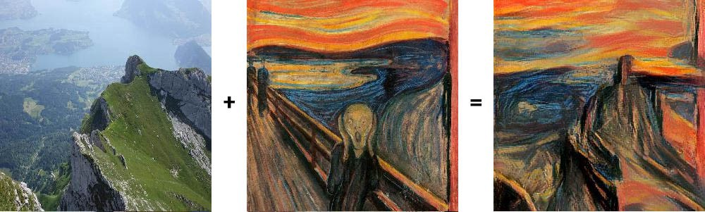

# 0x0C. Neural Style Transfer

<p align="center">
  
</p>

## Some Images Generated via Neural Style Transfer in this Project :)

Photograph: top left; Painting: top right; Styled-Image: bottom
<p align='center'>
  
  
  
</p>

Photograph: top left; Painting: top right; Styled-Image: bottom
<p align='center'>
  
  
  
</p>

## Learning Objectives

- What is Neural Style Transfer?
- What is a gram matrix?
- How to calculate style cost
- How to calculate content cost
- What is Tensorflow‘s Eager Execution?
- What is Gradient Tape and how do you use it?
- How to perform Neural Style Transfer

## Requirements

- Allowed editors: `vi`, `vim`, `emacs`
- All your files will be interpreted/compiled on Ubuntu 16.04 LTS using `python3` (version 3.5)
- Your files will be executed with `numpy` (version 1.15), tensorflow (version 1.12), `opencv-python` (version 4.1.0.25), and `dlib` (version 19.17.0)
- All your files should end with a new line
- The first line of all your files should be exactly `#!/usr/bin/env python3`
- All of your files must be executable
- A `README.md` file, at the root of the folder of the project, is mandatory
- Your code should use the `pycodestyle` style (version 2.4)
- All your modules should have documentation (`python3 -c 'print(__import__("my_module").__doc__)'`)
- All your classes should have documentation (`python3 -c 'print(__import__("my_module").MyClass.__doc__)'`)
- All your functions (inside and outside a class) should have documentation (`python3 -c 'print(__import__("my_module").my_function.__doc__)'` and `python3 -c 'print\
(__import__("my_module").MyClass.my_function.__doc__)'`)
- Unless otherwise noted, you are not allowed to import any module except `import numpy as np` and `import tensorflow as tf`

## Data

For the following main files, please use these images:

- `golden_gate.jpg`:


- `starry_night.jpg`


## Tasks

### [0. Initialize](./0-neural_style.py)

Create a class `NST` that performs tasks for neural style transfer:

*   Public class attributes:
    *   `style_layers` = `['block1_conv1', 'block2_conv1', 'block3_conv1', 'block4_conv1', 'block5_conv1']`
    *   `content_layer` = `'block5_conv2'`
*   Class constructor: `def __init__(self, style_image, content_image, alpha=1e4, beta=1):`
    *   `style_image` - the image used as a style reference, stored as a `numpy.ndarray`
    *   `content_image` - the image used as a content reference, stored as a `numpy.ndarray`
    *   `alpha` - the weight for content cost
    *   `beta` - the weight for style cost
    *   if `style_image` is not a `np.ndarray` with the shape `(h, w, 3)`, raise a `TypeError` with the message `style_image must be a numpy.ndarray with shape (h, w, 3)`
    *   if `content_image` is not a `np.ndarray` with the shape `(h, w, 3)`, raise a `TypeError` with the message `content_image must be a numpy.ndarray with shape (h, w, 3)`
    *   if `alpha` is not a non-negative number, raise a `TypeError` with the message `alpha must be a non-negative number`
    *   if `beta` is not a non-negative number, raise a `TypeError` with the message `beta must be a non-negative number`
    *   Sets Tensorflow to execute eagerly
    *   Sets the instance attributes:
        *   `style_image` - the preprocessed style image
        *   `content_image` - the preprocessed content image
        *   `alpha` - the weight for content cost
        *   `beta` - the weight for style cost
*   Static Method: `def scale_image(image):` that rescales an image such that its pixels values are between 0 and 1 and its largest side is 512 pixels
    *   `image` - a `numpy.ndarray` of shape `(h, w, 3)` containing the image to be scaled
    *   if `image` is not a `np.ndarray` with the shape `(h, w, 3)`, raise a `TypeError` with the message `image must be a numpy.ndarray with shape (h, w, 3)`
    *   The scaled image should be a `tf.tensor` with the shape `(1, h_new, w_new, 3)` where `max(h_new, w_new)` == `512` and `min(h_new, w_new)` is scaled proportionately
    *   The image should be resized using bicubic interpolation
    *   After resizing, the image’s pixel values should be rescaled from the range `[0, 255]` to `[0, 1]`.
    *   Returns: the scaled image

```
    root@alexa-ml2:~/0x0C-neural_style_transfer# ./0-main.py
    ['block1_conv1', 'block2_conv1', 'block3_conv1', 'block4_conv1', 'block5_conv1']
    block5_conv2
    <class 'EagerTensor'> (1, 320, 512, 3) 0.0 1.0
    <class 'EagerTensor'> (1, 343, 512, 3) 0.0 1.0
    10000.0
    1
    True
```


---

### [1. Load the Model](./1-neural_style.py)

Update the class `NST` to load the model for neural style transfer:

*   Update the class constructor: `def __init__(self, style_image, content_image, alpha=1e4, beta=1):`
    *   `style_image` - the image used as a style reference, stored as a `numpy.ndarray`
    *   `content_image` - the image used as a content reference, stored as a `numpy.ndarray`
    *   `alpha` - the weight for content cost
    *   `beta` - the weight for style cost
    *   if `style_image` is not a `np.ndarray` with the shape `(h, w, 3)`, raise a `TypeError` with the message `style_image must be a numpy.ndarray with shape (h, w, 3)`
    *   if `content_image` is not a `np.ndarray` with the shape `(h, w, 3)`, raise a `TypeError` with the message `content_image must be a numpy.ndarray with shape (h, w, 3)`
    *   if `alpha` is not a non-negative number, raise a `TypeError` with the message `alpha must be a non-negative number`
    *   if `beta` is not a non-negative number, raise a `TypeError` with the message `beta must be a non-negative number`
    *   Sets `Tensorflow` to execute eagerly
    *   Sets the instance attributes:
        *   `style_image` - the preprocessed style image
        *   `content_image` - the preprocessed content image
        *   `alpha` - the weight for content cost
        *   `beta` - the weight for style cost
        *   `model` - the `Keras` model used to calculate cost
*   Public Instance Method: `def load_model(self):`
    *   creates the model used to calculate cost
    *   the model should use the `VGG19` `Keras` model as a base
    *   the model’s input should be the same as the `VGG19` input
    *   the model’s output should be a list containing the outputs of the `VGG19` layers listed in `style_layers` followed by `content _layer`
    *   saves the model in the instance attribute `model`

```
    root@alexa-ml2:~/0x0C-neural_style_transfer# ./1-main.py 
    Model: "model"
    _________________________________________________________________
    Layer (type)                 Output Shape              Param #   
    =================================================================
    input_1 (InputLayer)         [(None, None, None, 3)]   0         
    _________________________________________________________________
    block1_conv1 (Conv2D)        (None, None, None, 64)    1792      
    _________________________________________________________________
    block1_conv2 (Conv2D)        (None, None, None, 64)    36928     
    _________________________________________________________________
    block1_pool (AveragePooling2 (None, None, None, 64)    0         
    _________________________________________________________________
    block2_conv1 (Conv2D)        (None, None, None, 128)   73856     
    _________________________________________________________________
    block2_conv2 (Conv2D)        (None, None, None, 128)   147584    
    _________________________________________________________________
    block2_pool (AveragePooling2 (None, None, None, 128)   0         
    _________________________________________________________________
    block3_conv1 (Conv2D)        (None, None, None, 256)   295168    
    _________________________________________________________________
    block3_conv2 (Conv2D)        (None, None, None, 256)   590080    
    _________________________________________________________________
    block3_conv3 (Conv2D)        (None, None, None, 256)   590080    
    _________________________________________________________________
    block3_conv4 (Conv2D)        (None, None, None, 256)   590080    
    _________________________________________________________________
    block3_pool (AveragePooling2 (None, None, None, 256)   0         
    _________________________________________________________________
    block4_conv1 (Conv2D)        (None, None, None, 512)   1180160   
    _________________________________________________________________
    block4_conv2 (Conv2D)        (None, None, None, 512)   2359808   
    _________________________________________________________________
    block4_conv3 (Conv2D)        (None, None, None, 512)   2359808   
    _________________________________________________________________
    block4_conv4 (Conv2D)        (None, None, None, 512)   2359808   
    _________________________________________________________________
    block4_pool (AveragePooling2 (None, None, None, 512)   0         
    _________________________________________________________________
    block5_conv1 (Conv2D)        (None, None, None, 512)   2359808   
    _________________________________________________________________
    block5_conv2 (Conv2D)        (None, None, None, 512)   2359808   
    =================================================================
    Total params: 15,304,768
    Trainable params: 0
    Non-trainable params: 15,304,768
    _________________________________________________________________
    root@alexa-ml2-1:~/0x0C-neural_style_transfer#
```

---

### [2. Gram Matrix](./2-neural_style.py)


See "A Neural Algorithm of Artistic Style"

Update the class `NST` to be able to calculate gram matrices:

*   Static Method: `def gram_matrix(input_layer):`
    *   `input_layer` - an instance of `tf.Tensor` or `tf.Variable` of shape `(1, h, w, c)`containing the layer output whose gram matrix should be calculated
    *   if `input_layer` is not an instance of `tf.Tensor` or `tf.Variable` of rank 4, raise a `TypeError` with the message `input_layer must be a tensor of rank 4`
    *   Returns: a `tf.Tensor` of shape `(1, c, c)` containing the gram matrix of `input_layer`

```
    root@alexa-ml2-1:~/0x0C-neural_style_transfer# ./2-main.py
    tf.Tensor(
    [[[ 0.92385894 -0.04459446  0.01773124]
      [-0.04459446  0.9918023  -0.03037722]
      [ 0.01773124 -0.03037722  0.9517656 ]]], shape=(1, 3, 3), dtype=float32)
    root@alexa-ml2-1:~/0x0C-neural_style_transfer#
```

---

### [3. Extract Features](./3-neural_style.py)

Update the class `NST` to extract the style and content features:

*   Public Instance Method: `def generate_features(self):`
    *   extracts the features used to calculate neural style cost
    *   Sets the public instance attributes:
        *   `gram_style_features` - a list of gram matrices calculated from the style layer outputs of the style image
        *   `content_feature` - the content layer output of the content image
*   Update the class constructor: `def __init__(self, style_image, content_image, alpha=1e4, beta=1):`
    *   `style_image` - the image used as a style reference, stored as a `numpy.ndarray`
    *   `content_image` - the image used as a content reference, stored as a `numpy.ndarray`
    *   `alpha` - the weight for content cost
    *   `beta` - the weight for style cost
    *   if `style_image` is not a `np.ndarray` with the shape `(h, w, 3)`, raise a `TypeError` with the message `style_image must be a numpy.ndarray with shape (h, w, 3)`
    *   if `content_image` is not a `np.ndarray` with the shape `(h, w, 3)`, raise a `TypeError` with the message `content_image must be a numpy.ndarray with shape (h, w, 3)`
    *   if `alpha` is not a non-negative number, raise a `TypeError` with the message `alpha must be a non-negative number`
    *   if `beta` is not a non-negative number, raise a `TypeError` with the message `beta must be a non-negative number`
    *   Sets `Tensorflow` to execute eagerly
    *   Sets the instance attributes:
        *   `style_image` - the preprocessed style image
        *   `content_image` - the preprocessed content image
        *   `alpha` - the weight for content cost
        *   `beta` - the weight for style cost
        *   `model` - the Keras model used to calculate cost
        *   `gram_style_features` - a list of gram matrices calculated from the style layer outputs of the style image
        *   `content_feature` - the content layer output of the content image

```
    root@alexa-ml2:~/0x0C-neural_style_transfer# ./3-main.py 
    [<tf.Tensor: id=799, shape=(1, 64, 64), dtype=float32, numpy=
    array([[[10117.937  ,  3632.9949 ,  2837.061  , ...,  2320.762  ,
              2786.7412 ,  4394.7983 ],
            [ 3632.9949 ,  6109.1045 ,  2801.3657 , ...,  1546.3984 ,
              2895.7065 ,  2676.98   ],
            [ 2837.061  ,  2801.3657 ,  2320.755  , ...,   404.45453,
              2576.8477 ,  3001.9785 ],
            ...,
            [ 2320.762  ,  1546.3984 ,   404.45453, ..., 11506.09   ,
              1703.8668 ,  1146.6345 ],
            [ 2786.7412 ,  2895.7065 ,  2576.8477 , ...,  1703.8668 ,
              5416.046  ,  4916.1455 ],
            [ 4394.7983 ,  2676.98   ,  3001.9785 , ...,  1146.6345 ,
              4916.1455 ,  5770.69   ]]], dtype=float32)>, <tf.Tensor: id=813, shape=(1, 128, 128), dtype=float32, numpy=
    array([[[1.0340007e+03, 1.6785077e+02, 2.0454919e+00, ...,
             9.6093683e+02, 6.6789148e+02, 2.8331918e+02],
            [1.6785077e+02, 2.7325260e+04, 1.1075416e+04, ...,
             3.3825312e+04, 1.9214223e+04, 1.1647773e+04],
            [2.0454919e+00, 1.1075416e+04, 5.0351730e+04, ...,
             4.6401344e+04, 6.6870049e+03, 1.1928916e+04],
            ...,
            [9.6093683e+02, 3.3825312e+04, 4.6401344e+04, ...,
             1.5774328e+05, 4.1294875e+04, 2.9561838e+04],
            [6.6789148e+02, 1.9214223e+04, 6.6870049e+03, ...,
             4.1294875e+04, 3.8928957e+04, 8.8152246e+03],
            [2.8331918e+02, 1.1647773e+04, 1.1928916e+04, ...,
             2.9561838e+04, 8.8152246e+03, 3.8357566e+04]]], dtype=float32)>, <tf.Tensor: id=827, shape=(1, 256, 256), dtype=float32, numpy=
    array([[[ 45538.586 ,   9898.365 ,   5619.3315, ...,   7110.035 ,
              53310.887 ,  32294.38  ],
            [  9898.365 ,  32030.277 ,   2501.6538, ...,   2788.8848,
              34041.008 ,  24710.574 ],
            [  5619.3315,   2501.6538,   7139.999 , ...,   1214.9128,
              11906.448 ,   6979.2695],
            ...,
            [  7110.035 ,   2788.8848,   1214.9128, ...,   7978.4375,
              10834.678 ,   9714.795 ],
            [ 53310.887 ,  34041.008 ,  11906.448 , ...,  10834.678 ,
             223792.83  ,  76626.87  ],
            [ 32294.38  ,  24710.574 ,   6979.2695, ...,   9714.795 ,
              76626.87  , 117599.734 ]]], dtype=float32)>, <tf.Tensor: id=841, shape=(1, 512, 512), dtype=float32, numpy=
    array([[[190597.6   ,  40070.414 ,  26633.95  , ...,  13380.908 ,
              91238.02  , 158255.77  ],
            [ 40070.414 , 120548.58  ,  52226.977 , ...,   3763.1313,
              76132.445 , 112699.67  ],
            [ 26633.95  ,  52226.977 , 112424.36  , ...,   8139.7563,
              54489.5   , 124537.02  ],
            ...,
            [ 13380.908 ,   3763.1313,   8139.7563, ...,  25265.354 ,
              13992.213 ,  13919.466 ],
            [ 91238.02  ,  76132.445 ,  54489.5   , ...,  13992.213 ,
             285843.7   , 222846.25  ],
            [158255.77  , 112699.67  , 124537.02  , ...,  13919.466 ,
             222846.25  , 668564.3   ]]], dtype=float32)>, <tf.Tensor: id=855, shape=(1, 512, 512), dtype=float32, numpy=
    array([[[3.9703134e+02, 1.6746365e+00, 1.2505182e+02, ...,
             1.7054070e+01, 7.9794908e+00, 8.1333923e+00],
            [1.6746365e+00, 4.1432198e+01, 1.8310619e+01, ...,
             4.5274348e+00, 3.1620708e+00, 5.0136942e-02],
            [1.2505182e+02, 1.8310619e+01, 1.4879531e+03, ...,
             1.7645000e+02, 7.7020477e+01, 3.3535778e+01],
            ...,
            [1.7054070e+01, 4.5274348e+00, 1.7645000e+02, ...,
             4.3797250e+02, 2.7251205e+01, 1.1177759e+01],
            [7.9794908e+00, 3.1620708e+00, 7.7020477e+01, ...,
             2.7251205e+01, 1.9335913e+02, 6.9403586e+00],
            [8.1333923e+00, 5.0136942e-02, 3.3535778e+01, ...,
             1.1177759e+01, 6.9403586e+00, 3.2074142e+01]]], dtype=float32)>]
    tf.Tensor(
    [[[[ 0\.          0\.         20.313574   ...  0\.         11.952988
         5.0829473 ]
       [ 0\.          0\.          0\.         ...  0\.         25.50344
         0\.        ]
       [ 0\.          0\.          0\.         ...  0\.         20.33689
         0\.        ]
       ...
       [ 0\.          0\.          0\.         ...  0\.         30.18788
         0\.        ]
       [ 0\.          0\.          0\.         ...  0\.         27.294909
         0\.        ]
       [ 0\.          0\.          0\.         ...  0\.         13.151826
         0\.        ]]

      [[ 0\.          0\.         21.640657   ...  0\.          0.
         0\.        ]
       [ 0\.          0\.          0\.         ...  0\.          0.
         0\.        ]
       [ 0\.          0\.          0\.         ...  0\.          0.
         0\.        ]
       ...
       [ 0\.          0\.          0\.         ...  0\.          0.
         0\.        ]
       [ 0\.          0\.          0\.         ...  0\.          0.
         0\.        ]
       [ 0\.          0\.          0\.         ...  0\.          0.
         0\.        ]]

      [[ 0\.          0\.         10.712096   ...  0\.          0.
         0\.        ]
       [ 0\.          0\.          0\.         ...  0\.          0.
         0\.        ]
       [ 0\.          0\.          0\.         ...  0\.          0.
         0\.        ]
       ...
       [ 0\.          0\.          0\.         ...  0.64342225  0.
         0\.        ]
       [ 0\.          0\.          0\.         ...  0\.          0.
         0\.        ]
       [ 0\.          0\.          0\.         ...  0\.          0.
         0\.        ]]

      ...

      [[ 0\.          6.711955   64.202385   ...  0\.         27.531242
        37.96317   ]
       [ 0\.         10.656848    9.822975   ...  0\.         18.780155
        12.810781  ]
       [ 0\.          0\.          0\.         ...  0\.          0.
         0\.        ]
       ...
       [ 0\.          0\.          0\.         ...  0\.          0.
         0\.        ]
       [ 0\.          0\.          0\.         ...  0\.          0.
         0\.        ]
       [ 0\.          0\.          0\.         ...  0\.          0.
         0\.        ]]

      [[ 0\.          0\.         38.209297   ...  0\.          7.8412485
        22.142263  ]
       [ 0\.          0\.          0\.         ...  0\.          0.
         2.0132864 ]
       [ 0\.          0\.          0\.         ...  0\.          0.
         0\.        ]
       ...
       [ 0\.          0\.          4.1680317  ...  0\.          0.
         0\.        ]
       [ 0\.          5.867378    0\.         ...  0\.          0.
         0\.        ]
       [ 0\.          9.78546     0\.         ...  0\.          0.
         0\.        ]]

      [[ 0\.          0\.         25.473978   ...  0\.          0.
        13.794867  ]
       [ 0\.          0\.         11.173271   ...  0.30903208  0.
         0.54414564]
       [ 0\.          0\.          2.95831    ...  2.7850637   0.
         0\.        ]
       ...
       [ 0\.          0\.         22.45163    ...  8.907583    0.
         0\.        ]
       [ 0\.          0\.          0\.         ...  8.88123     0.
         0\.        ]
       [ 2.2065077   0\.          0\.         ...  6.6553516   0.
         0\.        ]]]], shape=(1, 21, 32, 512), dtype=float32)
    root@alexa-ml2:~/0x0C-neural_style_transfer#
```

---

### [4. Layer Style Cost](./4-neural_style.py)

^{2} "E_{l} = \frac{1}{C_{l}^{2}}\sum_{i}^{C_{l}}\sum_{j}^{C_{l}}(G^{l}_{ij} - A^{l}_{ij})^{2}")

See "A Neural Algorithm of Artistic Style"

Update the class `NST` to calculate the style cost for a single layer:

*   Public Instance Method: `def layer_style_cost(self, style_output, gram_target):`
    *   Calculates the style cost for a single layer
    *   `style_output` - `tf.Tensor` of shape `(1, h, w, c)` containing the layer style output of the generated image
    *   `gram_target` - `tf.Tensor` of shape `(1, c, c)` the gram matrix of the target style output for that layer
    *   if `style_output` is not an instance of `tf.Tensor` or `tf.Variable` of rank 4, raise a `TypeError` with the message `style_output must be a tensor of rank 4`
    *   if `gram_target` is not an instance of `tf.Tensor` or `tf.Variable` with shape `(1, c, c)`, raise a `TypeError` with the message `gram_target must be a tensor of shape [1, {c}, {c}]` where `{c}` is the number of channels in `style_output`
    *   Returns: the layer’s style cost

```
    root@alexa-ml2:~/0x0C-neural_style_transfer# ./4-main.py
    tf.Tensor(3239105.0, shape=(), dtype=float32)
    root@alexa-ml2:~/0x0C-neural_style_transfer# 
```

---

### [5. Style Cost](./5-neural_style.py)


See "A Neural Algorithm of Artistic Style"

Update the class `NST` to calculate the style cost:

*   Public Instance Method: `def style_cost(self, style_outputs):`
    *   Calculates the style cost for generated image
    *   `style_outputs` - a list of `tf.Tensor` style outputs for the generated image
    *   if `style_outputs` is not a list with the same length as `self.style_layers`, raise a `TypeError` with the message `style_outputs must be a list with a length of {l}` where `{l}` is the length of `self.style_layers`
    *   each layer should be weighted evenly with all weights summing to `1`
    *   Returns: the style cost

```
    root@alexa-ml2:~/0x0C-neural_style_transfer# ./5-main.py
    tf.Tensor(2547305200.0, shape=(), dtype=float32)
    root@alexa-ml2:~/0x0C-neural_style_transfer#
```

---

### [6. Content Cost](./6-neural_style.py)

^2 "L_{content} = \frac{1}{H_{l}W_{l}C_{l}}\sum_{i}^{H_{l}}\sum_{j}^{W_{l}}\sum_{k}^{C_{l}}(F_{ijk}^{l}-P_{ijk}^{l})^2")

See "A Neural Algorithm of Artistic Style"

Update the class `NST` to calculate the content cost:

*   Public Instance Method: `def content_cost(self, content_output):`
    *   Calculates the content cost for the generated image
    *   `content_output` - a `tf.Tensor` containing the content output for the generated image
    *   if `content_output` is not an instance of `tf.Tensor` or `tf.Variable` with the same shape as `self.content_feature`, raise a `TypeError` with the message `content_output must be a tensor of shape {s}` where `{s}` is the shape of `self.content_feature`
    *   Returns: the content cost

```
    root@alexa-ml2:~/0x0C-neural_style_transfer# ./6-main.py
    tf.Tensor(113.58054, shape=(), dtype=float32)
    root@alexa-ml2:~/0x0C-neural_style_transfer#
```

---

### [7. Total Cost](./7-neural_style.py)


See "A Neural Algorithm of Artistic Style"

Update the class `NST` to calculate the total cost:

*   Public Instance Method: `def total_cost(self, generated_image):`
    *   Calculates the total cost for the generated image
    *   `generated_image` - a `tf.Tensor` of shape `(1, nh, nw, 3)` containing the generated image
    *   if `generated_image` is not an instance of `tf.Tensor` or `tf.Variable` with the same shape as `self.content_image`, raise a `TypeError` with the message `generated_image must be a tensor of shape {s}` where `{s}` is the shape of `self.content_image`
    *   Returns: `(J, J_content, J_style)`
        *   `J` is the total cost
        *   `J_content` is the content cost
        *   `J_style` is the style cost

```
    root@alexa-ml2:~/0x0C-neural_style_transfer# ./7-main.py
    tf.Tensor(1662946600.0, shape=(), dtype=float32)
    tf.Tensor(113.58054, shape=(), dtype=float32)
    tf.Tensor(1661810800.0, shape=(), dtype=float32)
    root@alexa-ml2:~/0x0C-neural_style_transfer#
```

---

### [8. Compute Gradients](./8-neural_style.py)

Update the class `NST` to compute the gradients for the generated image:

*   Public Instance Method: `def compute_grads(self, generated_image):`
    *   Calculates the gradients for the `tf.Tensor` generated image of shape `(1, nh, nw, 3)`
    *   if `generated_image` is not an instance of `tf.Tensor` or `tf.Variable` with the same shape as `self.content_image`, raise a `TypeError` with the message `generated_image must be a tensor of shape {s}` where `{s}` is the shape of `self.content_image`
    *   Returns: `gradients, J_total, J_content, J_style`
        *   `gradients` is a `tf.Tensor` containing the gradients for the generated image
        *   `J_total` is the total cost for the generated image
        *   `J_content` is the content cost for the generated image
        *   `J_style` is the style cost for the generated image

```
    root@alexa-ml2:~/0x0C-neural_style_transfer# ./8-main.py
    tf.Tensor(2547305200.0, shape=(), dtype=float32)
    tf.Tensor(0.0, shape=(), dtype=float32)
    tf.Tensor(2547305200.0, shape=(), dtype=float32)
    tf.Tensor(
    [[[[-33734.645   -33019.418    -5820.8916 ]
       [-39225.73    -41287.79      2747.7456 ]
       [-47754.906   -56826.95     -1177.0037 ]
       ...
       [-37313.64    -27447\.       -6036.915  ]
       [-53454.78    -45679.43    -16942.145  ]
       [-26092.371   -22006.455    -1149.2682 ]]

      [[-32580.334   -28911.047     3999.5776 ]
       [-17056.354   -17322.344    35779.75   ]
       [-33409.484   -48955.023    24575.697  ]
       ...
       [ -5060.3564   14107.254    24705.256  ]
       [-51268.094   -37455.266    -6392.8076 ]
       [-32204.918   -26578.467     1642.2123 ]]

      [[ -8199.522    -1993.0387   22258.451  ]
       [ 17137.125    15967.735    59777.5    ]
       [-12594.959   -41273.734    34513.277  ]
       ...
       [ 49479.418    71545.47     54459.016  ]
       [-36900.703   -23403.379    -3376.6526 ]
       [-32545.992   -29117.547    -1464.5963 ]]

      ...

      [[ 15293.4      -8773.8545   -5915.0537 ]
       [ 21812.098   -18238.758   -15912.337  ]
       [ 25543.822   -20133.24    -21510.22   ]
       ...
       [-38560.227    39529.668   -34640.12   ]
       [-40377.32     23284.191   -36875.32   ]
       [-18351.604    19301.234   -17020.982  ]]

      [[  8489.55     -4544.63     -2587.9448 ]
       [  7150.138   -15967.534   -11470.947  ]
       [  4022.6936  -24046.932   -17767.27   ]
       ...
       [-29258.457    23601.465   -20375.77   ]
       [-23586.088    18805.53    -18341.484  ]
       [ -8243.217    16321.596    -6621.5913 ]]

      [[  1863.0039   -3168.6963   -1973.3911 ]
       [  -171.57155  -9313.149    -6366.4893 ]
       [  -959.4642  -12004.192    -8630.6    ]
       ...
       [ -8447.542    17190.31     -4048.2705 ]
       [ -7379.744    12945.291    -4729.5396 ]
       [ -1941.1278    9638.27     -1198.413  ]]]], shape=(1, 343, 512, 3), dtype=float32)
    root@alexa-ml2:~/0x0C-neural_style_transfer#
```
**NOTE: Due to floating point errors on GPUs, your gradient array may be _slightly_ off from the one listed above. It should, however, round to the same integer**

---

### [9. Generate Image](./9-neural_style.py)

Update the class `NST` to generate the neural style transfered image:

*   Public Instance Method: `def generate_image(self, iterations=1000, step=None, lr=0.01, beta1=0.9, beta2=0.99)`
    *   `iterations` - the number of iterations to perform gradient descent over
    *   `step` - if not `None`, the step at which you should print information about the training, including the final iteration:
        *   print `Cost at iteration {i}: {J_total}, content {J_content}, style {J_style}`
        *   `i` is the iteration
        *   `J_total` is the total cost
        *   `J_content` is the content cost
        *   `J_style` is the style cost
    *   `lr` - the learning rate for gradient descent
    *   `beta1` - the beta1 parameter for gradient descent
    *   `beta2` - the beta2 parameter for gradient descent
    *   if `iterations` is not an integer, raise a `TypeError` with the message `iterations must be an integer`
    *   if `iterations` is not positive, raise a `ValueError` with the message `iterations must be positive`
    *   if `step` is not `None` and not an integer, raise a `TypeError` with the message `step must be an integer`
    *   if `step` is not `None` and not positive or less than `iterations` , raise a `ValueError` with the message `step must be positive and less than iterations`
    *   if `lr` is not a float or an integer, raise a `TypeError` with the message `lr must be a number`
    *   if `lr` is not positive, raise a `ValueError` with the message `lr must be positive`
    *   if `beta1` is not a float, raise a `TypeError` with the message `beta1 must be a float`
    *   if `beta1` is not in the range `[0, 1]`, raise a `ValueError` with the message `beta1 must be in the range [0, 1]`
    *   if `beta2` is not a float, raise a `TypeError` with the message `beta2 must be a float`
    *   if `beta2` is not in the range `[0, 1]`, raise a `ValueError` with the message `beta2 must be in the range [0, 1]`
    *   gradient descent should be performed using Adam optimization
    *   the generated image should be initialized as the content image
    *   keep track of the best cost and the image associated with that cost
    *   Returns: `generated_image, cost`
        *   `generated_image` is the best generated image
        *   `cost` is the best cost

```
    root@alexa-ml2:~/0x0C-neural_style_transfer# ./9-main.py
    Cost at iteration 0: 2547305216.0, content 0.0, style 2547305216.0
    Cost at iteration 100: 113608488.0, content 104.19120025634766, style 112566576.0
    Cost at iteration 200: 42308540.0, content 116.20802307128906, style 41146460.0
    Cost at iteration 300: 21483506.0, content 119.70703125, style 20286436.0
    Cost at iteration 400: 11869532.0, content 120.90178680419922, style 10660514.0
    Cost at iteration 500: 7152916.5, content 120.04371643066406, style 5952479.5
    Cost at iteration 600: 4749164.0, content 116.18102264404297, style 3587353.5
    Cost at iteration 700: 3422469.5, content 109.51019287109375, style 2327367.75
    Cost at iteration 800: 2609326.5, content 102.07743072509766, style 1588552.25
    Cost at iteration 900: 2112369.0, content 94.97010803222656, style 1162668.0
    Cost at iteration 1000: 1791985.0, content 89.10218811035156, style 900963.125
    Cost at iteration 1100: 1670579.25, content 84.31024169921875, style 827476.875
    Cost at iteration 1200: 1456656.75, content 80.50343322753906, style 651622.5
    Cost at iteration 1300: 1357738.0, content 77.38887023925781, style 583849.3125
    Cost at iteration 1400: 1295360.75, content 75.01945495605469, style 545166.25
    Cost at iteration 1500: 1231752.875, content 73.21160888671875, style 499636.84375
    Cost at iteration 1600: 1196999.375, content 71.51673889160156, style 481832.0
    Cost at iteration 1700: 1156050.875, content 70.17066192626953, style 454344.25
    Cost at iteration 1800: 1120683.0, content 68.94771575927734, style 431205.75
    Cost at iteration 1900: 1118258.625, content 67.75394439697266, style 440719.1875
    Cost at iteration 2000: 1071022.0, content 66.81963348388672, style 402825.71875
    Best cost: 1071022.0
```


**NOTE: Due to floating point errors on GPUs, your gradients will be _slightly_ off and therefore, so will your image and costs. It should, however, have the same initial cost. The remaining costs should be in the _general_ vicinity of those listed above**

---

### [10. Variational Cost](./100-neural_style.py)

Update the class `NST` to account for variational cost:

*   Update the class constructor: `def __init__(self, style_image, content_image, alpha=1e4, beta=1, var=10):`
    *   `style_image` - the image used as a style reference, stored as a `numpy.ndarray`
    *   `content_image` - the image used as a content reference, stored as a `numpy.ndarray`
    *   `alpha` - the weight for content cost
    *   `beta` - the weight for style cost
    *   `var` is the weight for the variational cost
    *   if `style_image` is not a `np.ndarray` with the shape `(h, w, 3)`, raise a `TypeError` with the message `style_image must be a numpy.ndarray with shape (h, w, 3)`
    *   if `content_image` is not a `np.ndarray` with the shape `(h, w, 3)`, raise a `TypeError` with the message `content_image must be a numpy.ndarray with shape (h, w, 3)`
    *   if `alpha` is not a non-negative number, raise a `TypeError` with the message `alpha must be a non-negative number`
    *   if `beta` is not a non-negative number, raise a `TypeError` with the message `beta must be a non-negative number`
    *   if `var` is not a non-negative number, raise a `TypeError` with the message `var must be a non-negative number`
    *   Sets `Tensorflow` to execute eagerly
    *   Sets the instance attributes:
        *   `style_image` - the preprocessed style image
        *   `content_image` - the preprocessed content image
        *   `alpha` - the weight for content cost
        *   `beta` - the weight for style cost
        *   `model` - the Keras model used to calculate cost
        *   `gram_style_features` - a list of gram matrices calculated from the style layer outputs of the style image
        *   `content_feature` - the content layer output of the content image
*   Static Method: `def variational_cost(generated_image):`
    *   Calculates the variational cost for the generated image
    *   `generated_image` - a `tf.Tensor` of shape `(1, nh, nw, 3)` containing the generated image
    *   Returns: the variational cost
*   Public Instance Method: `def total_cost(self, generated_image):`
    *   Calculates the total cost for the generated image
    *   `generated_image` - a `tf.Tensor` of shape `(1, nh, nw, 3)` containing the generated image
    *   Returns: `(J, J_content, J_style, J_var)`
        *   `J` is the total cost
        *   `J_content` is the content cost
        *   `J_style` is the style cost
        *   `J_var` is the variational cost
*   Public Instance Method: `def generate_image(self, iterations=1000, step=None, lr=0.01, beta1=0.9, beta2=0.99)`
    *   `iterations` - the number of iterations to perform gradient descent over
    *   `step` - if not `None`, the step at which you should print information about the training, including the final iteration:
        *   print `Cost at iteration {i}: {J_total}, content {J_content}, style {J_style}, var {J_var}`
        *   `i` is the iteration
        *   `J_total` is the total cost
        *   `J_content` is the content cost
        *   `J_style` is the style cost
        *   `J_var` is the variational cost
    *   `lr` - the learning rate for gradient descent
    *   `beta1` - the beta1 parameter for gradient descent
    *   `beta2` - the beta2 parameter for gradient descent
    *   if `iterations` is not an integer, raise a `TypeError` with the message `iterations must be an integer`
    *   if `iterations` is not positive, raise a `ValueError` with the message `iterations must be positive`
    *   if `step` is not `None` and not an integer, raise a `TypeError` with the message `step must be an integer`
    *   if `step` is not `None` and not positive or less than `iterations` , raise a `ValueError` with the message `iterations must be positive and less than iterations`
    *   if `lr` is not a float or an integer, raise a `TypeError` with the message `lr must be a number`
    *   if `lr` is not positive, raise a `ValueError` with the message `lr must be positive`
    *   if `beta1` is not a float, raise a `TypeError` with the message `beta1 must be a float`
    *   if `beta1` is not in the range `[0, 1]`, raise a `ValueError` with the message `beta1 must be in the range [0, 1]`
    *   if `beta2` is not a float, raise a `TypeError` with the message `beta2 must be a float`
    *   if `beta2` is not in the range `[0, 1]`, raise a `ValueError` with the message `beta2 must be in the range [0, 1]`
    *   gradient descent should be performed using Adam optimization
    *   the generated image should be initialized as the content image
    *   keep track of the best cost and the image associated with that cost
    *   Returns: `generated_image, cost`
        *   `generated_image` is the best generated image
        *   `cost` is the best cost

```
    root@alexa-ml2:~/0x0C-neural_style_transfer# ./10-main.py
    Cost at iteration 0: 2547649024.0, content 0.0, style 2547305216.0, var 34373.359375
    Cost at iteration 100: 114436648.0, content 104.2284927368164, style 112621936.0, var 77242.5625
    Cost at iteration 200: 43247312.0, content 116.19231414794922, style 41183912.0, var 90147.453125
    Cost at iteration 300: 22536680.0, content 119.67940521240234, style 20353110.0, var 98677.625
    Cost at iteration 400: 12996910.0, content 120.98223876953125, style 10721682.0, var 106540.5625
    Cost at iteration 500: 8338074.0, content 120.05815124511719, style 6005842.5, var 113165.015625
    Cost at iteration 600: 5967053.5, content 116.14998626708984, style 3627127.5, var 117842.59375
    Cost at iteration 700: 4652752.5, content 109.44412994384766, style 2353675.5, var 120463.5859375
    Cost at iteration 800: 3840754.0, content 101.9711685180664, style 1608451.125, var 121259.109375
    Cost at iteration 900: 3382462.0, content 94.89058685302734, style 1228232.875, var 120532.328125
    Cost at iteration 1000: 3006839.5, content 89.17443084716797, style 925054.1875, var 119004.1171875
    Cost at iteration 1100: 2792022.0, content 84.64460754394531, style 774341.125, var 117123.484375
    Cost at iteration 1200: 2650394.5, content 81.16043853759766, style 685480.875, var 115330.921875
    Cost at iteration 1300: 2535272.5, content 78.2227783203125, style 616780.3125, var 113626.453125
    Cost at iteration 1400: 2473207.5, content 76.15706634521484, style 590197.5, var 112143.9375
    Cost at iteration 1500: 2394406.5, content 74.42024993896484, style 542943.25, var 110726.0625
    Cost at iteration 1600: 2334190.25, content 72.93126678466797, style 510258.15625, var 109461.9375
    Cost at iteration 1700: 2287328.5, content 71.6542739868164, style 487872.84375, var 108291.2890625
    Cost at iteration 1800: 2250719.75, content 70.57796478271484, style 472113.40625, var 107282.671875
    Cost at iteration 1900: 2215642.75, content 69.60478210449219, style 456324.90625, var 106327.0
    Cost at iteration 2000: 2194439.0, content 68.76910400390625, style 452312.3125, var 105443.5625
    Cost at iteration 2100: 2159185.5, content 68.02582550048828, style 432746.4375, var 104618.0625
    Cost at iteration 2200: 2230331.25, content 67.36085510253906, style 517923.84375, var 103879.890625
    Cost at iteration 2300: 2112841.25, content 66.68968963623047, style 414824.8125, var 103111.953125
    Cost at iteration 2400: 2091948.75, content 66.0895767211914, style 406765.125, var 102428.78125
    Cost at iteration 2500: 2135322.0, content 65.46969604492188, style 463194.40625, var 101743.0546875
    Cost at iteration 2600: 2074491.0, content 64.9677963256836, style 413354.75, var 101145.8203125
    Cost at iteration 2700: 2054912.0, content 64.53636932373047, style 403793.0, var 100575.53125
    Cost at iteration 2800: 2027222.5, content 64.07811737060547, style 386180.96875, var 100026.03125
    Cost at iteration 2900: 2010686.0, content 63.71524429321289, style 378194.8125, var 99533.875
    Cost at iteration 3000: 1997099.125, content 63.34220504760742, style 373218.1875, var 99045.890625
    Best cost: 1997081.2
```
**NOTE: Due to floating point errors on GPUs, your gradients will be _slightly_ off and therefore, so will your image and costs. It should, however, have the same initial cost. The remaining costs should be in the _general_ vicinity of those listed above**


**If you zoom in, you can see the pixel variation has significantly decreased:**

Without Variational Cost:


With Variational Cost:


_Replace the content and style images with your own to create your own artwork!_

---

## Author

- **Pierre Beaujuge** - [PierreBeaujuge](https://github.com/PierreBeaujuge)