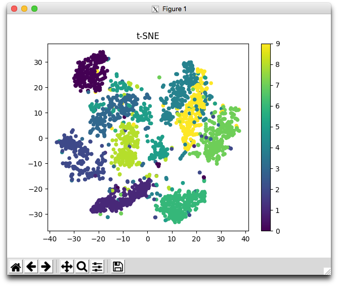
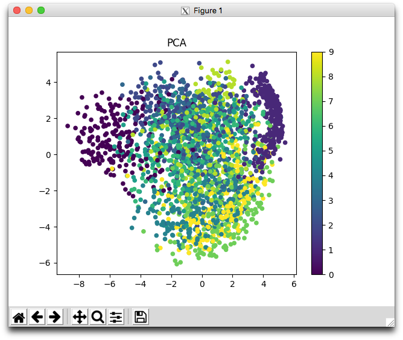

# 0x00. Dimensionality Reduction

## Learning Objectives

- What is eigendecomposition?
- What is singular value decomposition?
- What is the difference between eig and svd?
- What is dimensionality reduction and what are its purposes?
- What is principal components analysis (PCA)?
- What is t-distributed stochastic neighbor embedding (t-SNE)?
- What is a manifold?
- What is the difference between linear and non-linear dimensionality reduction?
- Which techniques are linear/non-linear?

## Requirements

- Allowed editors: `vi`, `vim`, `emacs`
- All your files will be interpreted/compiled on Ubuntu 16.04 LTS using `python3` (version 3.5)
- Your files will be executed with `numpy` (version 1.15)
- All your files should end with a new line
- The first line of all your files should be exactly `#!/usr/bin/env python3`
- All of your files must be executable
- A `README.md` file, at the root of the folder of the project, is mandatory
- Your code should use the `pycodestyle` style (version 2.4)
- All your modules should have documentation (`python3 -c 'print(__import__("my_module").__doc__)'`)
- All your classes should have documentation (`python3 -c 'print(__import__("my_module").MyClass.__doc__)'`)
- All your functions (inside and outside a class) should have documentation (`python3 -c 'print(__import__("my_module").my_function.__doc__)'` and `python3 -c 'print\
(__import__("my_module").MyClass.my_function.__doc__)'`)
- Unless otherwise noted, you are not allowed to import any module except `import numpy as np`
- Your code should use the minimum number of operations to avoid floating point errors

## Data

Please test your main files with the following data:

- `mnist2500_X.txt`
- `mnist2500_labels.txt`

## Tasks

### [0. PCA](./0-pca.py)

Write a function `def pca(X, var=0.95):` that performs PCA on a dataset:

*   `X` is a `numpy.ndarray` of shape `(n, d)` where:
    *   `n` is the number of data points
    *   `d` is the number of dimensions in each point
    *   all dimensions have a mean of 0 across all data points
*   `var` is the fraction of the variance that the PCA transformation should maintain
*   Returns: the weights matrix, `W`, that maintains `var` fraction of `X`‘s original variance
*   `W` is a `numpy.ndarray` of shape `(d, nd)` where `nd` is the new dimensionality of the transformed `X`

```
    alexa@ubuntu-xenial:0x00-dimensionality_reduction$ ./0-main.py 
    [[-16.71379391   3.25277063  -3.21956297]
     [ 16.22654311  -0.7283969   -0.88325252]
     [ 15.05945199   3.81948929  -1.97153621]
     [ -7.69814111   5.49561088  -4.34581561]
     [ 14.25075197   1.37060228  -4.04817187]
     [-16.66888233  -3.77067823   2.6264981 ]
     [  6.71765183   0.18115089  -1.91719288]
     [ 10.20004065  -0.84380128   0.44754302]
     [-16.93427229   1.72241573   0.9006236 ]
     [-12.4100987    0.75431367  -0.36518129]
     [-16.40464248   1.98431953   0.34907508]
     [ -6.69439671   1.30624703  -2.77438892]
     [ 10.84363895   4.99826372  -1.36502623]
     [-17.2656016    7.29822621   0.63226953]
     [  5.32413372  -0.54822516  -0.79075935]
     [ -5.63240657   1.50278876  -0.27590797]
     [ -7.63440366   7.72788006  -2.58344477]
     [  4.3348786   -2.14969035   0.61262033]
     [ -3.95417052   4.22254889  -0.14601319]
     [ -6.59947069  -1.00867621   2.29551761]
     [ -0.78942283  -4.15454151   5.87117533]
     [ 13.62292856   0.40038586  -1.36043631]
     [  0.03536684  -5.85950737  -1.86196569]
     [-11.1841298    5.20313078   2.37753549]
     [  9.62095425  -1.17179699  -4.97535412]
     [  3.85296648   3.55808      3.65166717]
     [  6.57934417   4.87503426   0.30243418]
     [-16.17025935   1.49358788   1.0663259 ]
     [ -4.33639793   1.26186205  -2.99149191]
     [ -1.52947063  -0.39342225  -2.96475006]
     [  9.80619496   6.65483286   0.07714817]
     [ -2.45893463  -4.89091813  -0.6918453 ]
     [  9.56282904  -1.8002211    2.06720323]
     [  1.70293073   7.68378254   5.03581954]
     [  9.58030378  -6.97453776   0.64558546]
     [ -3.41279182 -10.07660784  -0.39277019]
     [ -2.74983634  -6.25461193  -2.65038235]
     [  4.54987003   1.28692201  -2.40001675]
     [ -1.81149682   5.16735962   1.4245976 ]
     [ 13.97823555  -4.39187437   0.57600155]
     [ 17.39107161   3.26808567   2.50429006]
     [ -1.25835112  -6.60720376   3.24220508]
     [  1.06405562  -1.25980089   4.06401644]
     [ -3.44578711  -5.21002054  -4.20836152]
     [-21.1181523   -3.72353504   1.6564066 ]
     [ -6.56723647  -4.31268383   1.22783639]
     [ 11.77670231   0.67338386   2.94885044]
     [ -7.89417224  -9.82300322  -1.69743681]
     [ 15.87543091   0.3804009    3.67627751]
     [  7.38044431  -1.58972122   0.60154138]]
    2.306623725743524e-29
    alexa@ubuntu-xenial:0x00-dimensionality_reduction$
```

---

### [1. PCA v2](./1-pca.py)

Write a function `def pca(X, ndim):` that performs PCA on a dataset:

*   `X` is a `numpy.ndarray` of shape `(n, d)` where:
    *   `n` is the number of data points
    *   `d` is the number of dimensions in each point
*   `ndim` is the new dimensionality of the transformed `X`
*   Returns: `T`, a `numpy.ndarray` of shape `(n, ndim)` containing the transformed version of `X`

```
    alexa@ubuntu-xenial:0x00-dimensionality_reduction$ ./1-main.py 
    X: (2500, 784)
    [[1\. 1\. 1\. ... 1\. 1\. 1.]
     [1\. 1\. 1\. ... 1\. 1\. 1.]
     [1\. 1\. 1\. ... 1\. 1\. 1.]
     ...
     [1\. 1\. 1\. ... 1\. 1\. 1.]
     [1\. 1\. 1\. ... 1\. 1\. 1.]
     [1\. 1\. 1\. ... 1\. 1\. 1.]]
    T: (2500, 50)
    [[-0.61344587  1.37452188 -1.41781926 ...  0.42685217 -0.02276617
      -0.1076424 ]
     [-5.00379081  1.94540396  1.49147124 ... -0.26249077  0.4134049
       1.15489853]
     [-0.31463237 -2.11658407  0.36608266 ...  0.71665401  0.18946283
      -0.32878802]
     ...
     [ 3.52302175  4.1962009  -0.52129062 ...  0.24412645 -0.02189273
      -0.19223197]
     [-0.81387035 -2.43970416  0.33244717 ...  0.55367626  0.64632309
      -0.42547833]
     [-2.25717018  3.67177791  2.83905021 ...  0.35014766  0.01807652
      -0.31548087]]
    alexa@ubuntu-xenial:0x00-dimensionality_reduction$
```

---

### [2. Initialize t-SNE](./2-P_init.py)

Write a function `def P_init(X, perplexity):` that initializes all variables required to calculate the P affinities in t-SNE:

*   `X` is a `numpy.ndarray` of shape `(n, d)` containing the dataset to be transformed by t-SNE
    *   `n` is the number of data points
    *   `d` is the number of dimensions in each point
*   `perplexity` is the perplexity that all Gaussian distributions should have
*   Returns: `(D, P, betas, H)`
    *   `D`: a `numpy.ndarray` of shape `(n, n)` that calculates the pairwise distance between two data points
    *   `P`: a `numpy.ndarray` of shape `(n, n)` initialized to all `0`‘s that will contain the P affinities
    *   `betas`: a `numpy.ndarray` of shape `(n, 1)` initialized to all `1`’s that will contain all of the `beta` values
        *   
    *   `H` is the Shannon entropy for `perplexity` perplexity

```
    alexa@ubuntu-xenial:0x00-dimensionality_reduction$ ./2-main.py 
    X: (2500, 50)
    [[-0.61344587  1.37452188 -1.41781926 ...  0.42685217 -0.02276617
      -0.1076424 ]
     [-5.00379081  1.94540396  1.49147124 ... -0.26249077  0.4134049
       1.15489853]
     [-0.31463237 -2.11658407  0.36608266 ...  0.71665401  0.18946283
      -0.32878802]
     ...
     [ 3.52302175  4.1962009  -0.52129062 ...  0.24412645 -0.02189273
      -0.19223197]
     [-0.81387035 -2.43970416  0.33244717 ...  0.55367626  0.64632309
      -0.42547833]
     [-2.25717018  3.67177791  2.83905021 ...  0.35014766  0.01807652
      -0.31548087]]
    D: (2500, 2500)
    [[ 2.84217094e-14  1.07877842e+02  1.60077565e+02 ...  1.29616280e+02
       1.27614971e+02  1.21674503e+02]
     [ 1.07877842e+02 -2.84217094e-14  1.70966269e+02 ...  1.42576625e+02
       1.47691617e+02  1.16644621e+02]
     [ 1.60077565e+02  1.70966269e+02  2.84217094e-14 ...  1.38659027e+02
       1.10260229e+02  1.15886305e+02]
     ...
     [ 1.29616280e+02  1.42576625e+02  1.38659027e+02 ...  1.42108547e-14
       1.56117514e+02  1.09988643e+02]
     [ 1.27614971e+02  1.47691617e+02  1.10260229e+02 ...  1.56117514e+02
       2.84217094e-14  1.14083963e+02]
     [ 1.21674503e+02  1.16644621e+02  1.15886305e+02 ...  1.09988643e+02
       1.14083963e+02  0.00000000e+00]]
    P: (2500, 2500)
    [[0\. 0\. 0\. ... 0\. 0\. 0.]
     [0\. 0\. 0\. ... 0\. 0\. 0.]
     [0\. 0\. 0\. ... 0\. 0\. 0.]
     ...
     [0\. 0\. 0\. ... 0\. 0\. 0.]
     [0\. 0\. 0\. ... 0\. 0\. 0.]
     [0\. 0\. 0\. ... 0\. 0\. 0.]]
    betas: (2500, 1)
    [[1.]
     [1.]
     [1.]
     ...
     [1.]
     [1.]
     [1.]]
    H: 4.906890595608519
    alexa@ubuntu-xenial:0x00-dimensionality_reduction$
```

---

### [3. Entropy](./3-entropy.py)

Write a function `def HP(Di, beta):` that calculates the Shannon entropy and P affinities relative to a data point:

*   `Di` is a `numpy.ndarray` of shape `(n - 1,)` containing the pariwise distances between a data point and all other points except itself
    *   `n` is the number of data points
*   `beta` is the beta value for the Gaussian distribution
*   Returns: `(Hi, Pi)`
    *   `Hi`: the Shannon entropy of the points
    *   `Pi`: a `numpy.ndarray` of shape `(n - 1,)` containing the P affinities of the points

```
    alexa@ubuntu-xenial:0x00-dimensionality_reduction$ ./3-main.py 
    0.05743609363617145
    [0.00000000e+00 3.74413188e-35 8.00385528e-58 ... 1.35664798e-44
     1.00374765e-43 3.81537517e-41]
    alexa@ubuntu-xenial:0x00-dimensionality_reduction$ 
```

---

### [4. P affinities](./4-P_affinities.py)

Write a function `def P_affinities(X, tol=1e-5, perplexity=30.0):` that calculates the symmetric P affinities of a data set:

*   `X` is a `numpy.ndarray` of shape `(n, d)` containing the dataset to be transformed by t-SNE
    *   `n` is the number of data points
    *   `d` is the number of dimensions in each point
*   `perplexity` is the perplexity that all Gaussian distributions should have
*   `tol` is the maximum tolerance allowed (inclusive) for the difference in Shannon entropy from `perplexity` for all Gaussian distributions
*   You should use `P_init = __import__('2-P_init').P_init` and `HP = __import__('3-entropy').HP`
*   Returns: `P`, a `numpy.ndarray` of shape `(n, n)` containing the symmetric P affinities

_Hint: For this task, you will need to perform a binary search on each distribution to find the correct value of `beta` that will give a Shannon Entropy within the tolerance (Think about why we analyze the Shannon entropy instead of perplexity). Since beta can be in the range `(0, inf)`, you will have to do a binary search with the `high` and `low` set to `None`. If in your search, you are supposed to increase/decrease `beta` to `high`/`low` but they are still set to `None`, you should double/half the value of `beta` instead._

```
    alexa@ubuntu-xenial:0x00-dimensionality_reduction$ ./4-main.py 
    P: (2500, 2500)
    [[0.00000000e+00 7.40714907e-10 9.79862968e-13 ... 2.37913671e-11
      1.22844912e-10 1.75011944e-10]
     [7.40714907e-10 0.00000000e+00 1.68735728e-13 ... 2.11150140e-12
      1.05003596e-11 2.42913116e-10]
     [9.79862968e-13 1.68735728e-13 0.00000000e+00 ... 2.41827214e-11
      3.33128330e-09 1.25696380e-09]
     ...
     [2.37913671e-11 2.11150140e-12 2.41827214e-11 ... 0.00000000e+00
      3.62850172e-12 4.11671350e-10]
     [1.22844912e-10 1.05003596e-11 3.33128330e-09 ... 3.62850172e-12
      0.00000000e+00 6.70800054e-10]
     [1.75011944e-10 2.42913116e-10 1.25696380e-09 ... 4.11671350e-10
      6.70800054e-10 0.00000000e+00]]
    1.0000000000000009
    alexa@ubuntu-xenial:0x00-dimensionality_reduction$
```

---

### [5. Q affinities](./5-Q_affinities.py)

Write a function `def Q_affinities(Y):` that calculates the Q affinities:

*   `Y` is a `numpy.ndarray` of shape `(n, ndim)` containing the low dimensional transformation of `X`
    *   `n` is the number of points
    *   `ndim` is the new dimensional representation of `X`
*   Returns: `Q, num`
    *   `Q` is a `numpy.ndarray` of shape `(n, n)` containing the Q affinities
    *   `num` is a `numpy.ndarray` of shape `(n, n)` containing the numerator of the Q affinities

```
    alexa@ubuntu-xenial:0x00-dimensionality_reduction$ ./5-main.py
    num: (2500, 2500)
    [[0\.         0.1997991  0.34387413 ... 0.08229525 0.43197616 0.29803545]
     [0.1997991  0\.         0.08232739 ... 0.0780192  0.36043254 0.20418429]
     [0.34387413 0.08232739 0\.         ... 0.07484357 0.16975081 0.17792688]
     ...
     [0.08229525 0.0780192  0.07484357 ... 0\.         0.13737822 0.22790422]
     [0.43197616 0.36043254 0.16975081 ... 0.13737822 0\.         0.65251175]
     [0.29803545 0.20418429 0.17792688 ... 0.22790422 0.65251175 0\.        ]]
    2113140.980877581
    Q: (2500, 2500)
    [[0.00000000e+00 9.45507652e-08 1.62731275e-07 ... 3.89445137e-08
      2.04423728e-07 1.41039074e-07]
     [9.45507652e-08 0.00000000e+00 3.89597234e-08 ... 3.69209645e-08
      1.70567198e-07 9.66259681e-08]
     [1.62731275e-07 3.89597234e-08 0.00000000e+00 ... 3.54181605e-08
      8.03310395e-08 8.42001935e-08]
     ...
     [3.89445137e-08 3.69209645e-08 3.54181605e-08 ... 0.00000000e+00
      6.50113847e-08 1.07850932e-07]
     [2.04423728e-07 1.70567198e-07 8.03310395e-08 ... 6.50113847e-08
      0.00000000e+00 3.08787608e-07]
     [1.41039074e-07 9.66259681e-08 8.42001935e-08 ... 1.07850932e-07
      3.08787608e-07 0.00000000e+00]]
    1.0000000000000004
    alexa@ubuntu-xenial:0x00-dimensionality_reduction$
```

---

### [6. Gradients](./6-grads.py)

Write a function `def grads(Y, P):` that calculates the gradients of Y:

*   `Y` is a `numpy.ndarray` of shape `(n, ndim)` containing the low dimensional transformation of `X`
*   `P` is a `numpy.ndarray` of shape `(n, n)` containing the P affinities of `X`
*   Returns: `(dY, Q)`
    *   `dY` is a `numpy.ndarray` of shape `(n, ndim)` containing the gradients of `Y`
    *   `Q` is a `numpy.ndarray` of shape `(n, n)` containing the Q affinities of `Y`
*   You may use `Q_affinities = __import__('5-Q_affinities').Q_affinities`

```
    alexa@ubuntu-xenial:0x00-dimensionality_reduction$ ./6-main.py 
    dY: (2500, 2)
    [[ 1.28824814e-05  1.55400363e-05]
     [ 3.21435525e-05  4.35358938e-05]
     [-1.02947106e-05  3.53998421e-07]
     ...
     [-2.27447049e-05 -3.05191863e-06]
     [ 9.69379032e-06  1.00659610e-06]
     [ 5.75113416e-05  7.65517123e-09]]
    Q: (2500, 2500)
    [[0.00000000e+00 9.45507652e-08 1.62731275e-07 ... 3.89445137e-08
      2.04423728e-07 1.41039074e-07]
     [9.45507652e-08 0.00000000e+00 3.89597234e-08 ... 3.69209645e-08
      1.70567198e-07 9.66259681e-08]
     [1.62731275e-07 3.89597234e-08 0.00000000e+00 ... 3.54181605e-08
      8.03310395e-08 8.42001935e-08]
     ...
     [3.89445137e-08 3.69209645e-08 3.54181605e-08 ... 0.00000000e+00
      6.50113847e-08 1.07850932e-07]
     [2.04423728e-07 1.70567198e-07 8.03310395e-08 ... 6.50113847e-08
      0.00000000e+00 3.08787608e-07]
     [1.41039074e-07 9.66259681e-08 8.42001935e-08 ... 1.07850932e-07
      3.08787608e-07 0.00000000e+00]]
    1.0000000000000004
    alexa@ubuntu-xenial:0x00-dimensionality_reduction$ 
```

---

### [7. Cost](./7-cost.py)

Write a function `def cost(P, Q):` that calculates the cost of the t-SNE transformation:

*   `P` is a `numpy.ndarray` of shape `(n, n)` containing the P affinities
*   `Q` is a `numpy.ndarray` of shape `(n, n)` containing the Q affinities
*   Returns: `C`, the cost of the transformation

_Hint: Watch out for division by `0` errors! Take the minimum of all values, and almost `0` (ex. `1e-12`)_

```
    alexa@ubuntu-xenial:0x00-dimensionality_reduction$ ./7-main.py 
    4.531113944164374
    alexa@ubuntu-xenial:0x00-dimensionality_reduction$
```

---

### [8. t-SNE](./8-tsne.py)

Write a function `def tsne(X, ndims=2, idims=50, perplexity=30.0, iterations=1000, lr=500):` that performs a t-SNE transformation:

*   `X` is a `numpy.ndarray` of shape `(n, d)` containing the dataset to be transformed by t-SNE
    *   `n` is the number of data points
    *   `d` is the number of dimensions in each point
*   `ndims` is the new dimensional representation of `X`
*   `idims` is the intermediate dimensional representation of `X` after PCA
*   `perplexity` is the perplexity
*   `iterations` is the number of iterations
*   `lr` is the learning rate
*   Every 100 iterations, not including 0, print `Cost at iteration {iteration}: {cost}`
    *   `{iteration}` is the number of times Y has been updated and `{cost}` is the corresponding cost
*   Returns: `Y`, a `numpy.ndarray` of shape `(n, ndim)` containing the optimized low dimensional transformation of `X`
*   You should use:
    *   `pca = __import__('1-pca').pca`
    *   `P_affinities = __import__('4-P_affinities').P_affinities`
    *   `grads = __import__('6-grads').grads`
    *   `cost = __import__('7-cost').cost`
*   For the first 100 iterations, perform early exaggeration with an exaggeration of 4
*   `a(t)` = 0.5 for the first 20 iterations and 0.8 thereafter

_Be careful of off-by-one errors!_

```   
    alexa@ubuntu-xenial:0x00-dimensionality_reduction$ ./8-main.py 
    Cost at iteration 100: 15.132745380504453
    Cost at iteration 200: 1.4499349051185875
    Cost at iteration 300: 1.299196107400927
    Cost at iteration 400: 1.225553022181153
    Cost at iteration 500: 1.1797532644514792
    Cost at iteration 600: 1.147630679133037
    Cost at iteration 700: 1.1235015025736461
    Cost at iteration 800: 1.1044968276172742
    Cost at iteration 900: 1.0890468673949136
    Cost at iteration 1000: 1.0762018736143135
    Cost at iteration 1100: 1.0652921250043608
    Cost at iteration 1200: 1.0558751316523143
    Cost at iteration 1300: 1.0476533388700722
    Cost at iteration 1400: 1.040398188071647
    Cost at iteration 1500: 1.0339353593266645
    Cost at iteration 1600: 1.028128752446572
    Cost at iteration 1700: 1.022888534479414
    Cost at iteration 1800: 1.018126557673678
    Cost at iteration 1900: 1.0137760713813615
    Cost at iteration 2000: 1.0097825451815519
    Cost at iteration 2000: 1.0097825451815519
    Cost at iteration 2100: 1.006100712557423
    Cost at iteration 2200: 1.0026950513450208
    Cost at iteration 2300: 0.999533533326889
    Cost at iteration 2400: 0.9965894332394137
    Cost at iteration 2500: 0.9938399255561283
    Cost at iteration 2600: 0.9912653473151111
    Cost at iteration 2700: 0.9888485527807178
    Cost at iteration 2800: 0.9865746432480411
    Cost at iteration 2900: 0.9844307720012043
    Cost at iteration 3000: 0.9824051809484148
```


**Awesome! We can see pretty good clusters! For comparison, here’s how PCA performs on the same dataset:**

```
    alexa@ubuntu-xenial:0x00-dimensionality_reduction$ ./pca.py
```


---

## Author

- **Pierre Beaujuge** - [PierreBeaujuge](https://github.com/PierreBeaujuge)