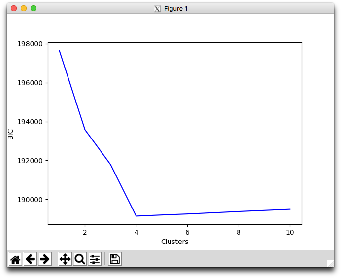

# 0x01. Clustering

## Learning Objectives

- What is a multimodal distribution?
- What is a cluster?
- What is cluster analysis?
- What is “soft” vs “hard” clustering?
- What is K-means clustering?
- What are mixture models?
- What is a Gaussian Mixture Model (GMM)?
- What is the Expectation-Maximization (EM) algorithm?
- How to implement the EM algorithm for GMMs
- What is cluster variance?
- What is the mountain/elbow method?
- What is the Bayesian Information Criterion?
- How to determine the correct number of clusters
- What is Hierarchical clustering?
- What is Agglomerative clustering?
- What is Ward’s method?
- What is Cophenetic distance?
- What is scikit-learn?
- What is scipy?

## Requirements

- Allowed editors: `vi`, `vim`, `emacs`
- All your files will be interpreted/compiled on Ubuntu 16.04 LTS using `python3` (version 3.5)
- Your files will be executed with `numpy` (version 1.15), `sklearn` (version 0.21), and `scipy` (version 1.3)
- All your files should end with a new line
- The first line of all your files should be exactly `#!/usr/bin/env python3`
- All of your files must be executable
- A `README.md` file, at the root of the folder of the project, is mandatory
- Your code should use the `pycodestyle` style (version 2.4)
- All your modules should have documentation (`python3 -c 'print(__import__("my_module").__doc__)'`)
- All your classes should have documentation (`python3 -c 'print(__import__("my_module").MyClass.__doc__)'`)
- All your functions (inside and outside a class) should have documentation (`python3 -c 'print(__import__("my_module").my_function.__doc__)'` and `python3 -c 'print\
(__import__("my_module").MyClass.my_function.__doc__)'`)
- Unless otherwise noted, you are not allowed to import any module except `import numpy as np`
- Your code should use the minimum number of operations to avoid floating point errors

## Installing Scikit-Learn 0.21.x

```
pip install --user scikit-learn==0.21
```

## Installing Scipy 1.3.x

`scipy` should have already been installed with `matplotlib` and `numpy`, but just in case:

```
pip install --user scipy==1.3
```

## Tasks

### [0. Initialize K-means](./0-initialize.py)

Write a function `def initialize(X, k):` that initializes cluster centroids for K-means:

*   `X` is a `numpy.ndarray` of shape `(n, d)` containing the dataset that will be used for K-means clustering
    *   `n` is the number of data points
    *   `d` is the number of dimensions for each data point
*   `k` is a positive integer containing the number of clusters
*   The cluster centroids should be initialized with a **multivariate uniform distribution** along each dimension in `d`:
    *   The minimum values for the distribution should be the minimum values of `X` along each dimension in `d`
    *   The maximum values for the distribution should be the maximum values of `X` along each dimension in `d`
    *   You should use `numpy.random.uniform` exactly once
*   You are not allowed to use any loops
*   Returns: a `numpy.ndarray` of shape `(k, d)` containing the initialized centroids for each cluster, or `None` on failure

```
    alexa@ubuntu-xenial:0x01-clustering$ ./0-main.py
```

```
    [[14.54730144 13.46780434]
     [20.57098466 33.55245039]
     [ 9.55556506 51.51143281]
     [48.72458008 20.03154959]
     [25.43826106 60.35542243]]
    alexa@ubuntu-xenial:0x01-clustering$
```

---

### [1. K-means](./1-kmeans.py)

Write a function `def kmeans(X, k, iterations=1000):` that performs K-means on a dataset:

*   `X` is a `numpy.ndarray` of shape `(n, d)` containing the dataset
    *   `n` is the number of data points
    *   `d` is the number of dimensions for each data point
*   `k` is a positive integer containing the number of clusters
*   `iterations` is a positive integer containing the maximum number of iterations that should be performed
*   If no change occurs between iterations, your function should return
*   Initialize the cluster centroids using a multivariate uniform distribution (based on`0-initialize.py`)
*   If a cluster contains no data points during the update step, reinitialize its centroid
*   You should use `numpy.random.uniform` exactly twice
*   You may use at most 2 loops
*   Returns: `C, clss`, or `None, None` on failure
    *   `C` is a `numpy.ndarray` of shape `(k, d)` containing the centroid means for each cluster
    *   `clss` is a `numpy.ndarray` of shape `(n,)` containing the index of the cluster in `C` that each data point belongs to

```
    alexa@ubuntu-xenial:0x01-clustering$ ./0-main.py 
    [[ 9.92511389 25.73098987]
     [30.06722465 40.41123947]
     [39.62770705 19.89843487]
     [59.22766628 29.19796006]
     [20.0835633  69.81592298]]
```


---

### [2. Variance](./2-variance.py)

Write a function `def variance(X, C):` that calculates the total intra-cluster variance for a data set:

*   `X` is a `numpy.ndarray` of shape `(n, d)` containing the data set
*   `C` is a `numpy.ndarray` of shape `(k, d)` containing the centroid means for each cluster
*   You are not allowed to use any loops
*   Returns: `var`, or `None` on failure
    *   `var` is the total variance

```
    alexa@ubuntu-xenial:0x01-clustering$ ./2-main.py
    Variance with 1 clusters: 157927.7051982233
    Variance with 2 clusters: 82095.68297089571
    Variance with 3 clusters: 34784.23722832676
    Variance with 4 clusters: 23158.400954993216
    Variance with 5 clusters: 7868.521232857259
    Variance with 6 clusters: 7406.930772639364
    Variance with 7 clusters: 6930.663612549055
    Variance with 8 clusters: 6162.158842251449
    Variance with 9 clusters: 5843.924549992556
    Variance with 10 clusters: 5727.411244965718
    alexa@ubuntu-xenial:0x01-clustering$
```

---

### [3. Optimize k](./3-optimum.py)

Write a function`def optimum_k(X, kmin=1, kmax=None, iterations=1000):` that tests for the optimum number of clusters by variance:

*   `X` is a `numpy.ndarray` of shape `(n, d)` containing the data set
*   `kmin` is a positive integer containing the minimum number of clusters to check for (inclusive)
*   `kmax` is a positive integer containing the maximum number of clusters to check for (inclusive)
*   `iterations` is a positive integer containing the maximum number of iterations for K-means
*   You should use:
    *   `kmeans = __import__('1-kmeans').kmeans`
    *   `variance = __import__('2-variance').variance`
*   You may use at most 2 loops
*   Returns: `results, d_vars`, or `None, None` on failure
    *   `results` is a list containing the outputs of K-means for each cluster size
    *   `d_vars` is a list containing the difference in variance from the smallest cluster size for each cluster size

```
    alexa@ubuntu-xenial:0x01-clustering$ ./3-main.py 
    [(array([[31.78625503, 37.01090945]]), array([0, 0, 0, 0, 0, 0, 0, 0, 0, 0, 0, 0, 0, 0, 0, 0, 0, 0, 0, 0, 0, 0,
           0, 0, 0, 0, 0, 0, 0, 0, 0, 0, 0, 0, 0, 0, 0, 0, 0, 0, 0, 0, 0, 0,
           0, 0, 0, 0, 0, 0, 0, 0, 0, 0, 0, 0, 0, 0, 0, 0, 0, 0, 0, 0, 0, 0,
           0, 0, 0, 0, 0, 0, 0, 0, 0, 0, 0, 0, 0, 0, 0, 0, 0, 0, 0, 0, 0, 0,
           0, 0, 0, 0, 0, 0, 0, 0, 0, 0, 0, 0, 0, 0, 0, 0, 0, 0, 0, 0, 0, 0,
           0, 0, 0, 0, 0, 0, 0, 0, 0, 0, 0, 0, 0, 0, 0, 0, 0, 0, 0, 0, 0, 0,
           0, 0, 0, 0, 0, 0, 0, 0, 0, 0, 0, 0, 0, 0, 0, 0, 0, 0, 0, 0, 0, 0,
           0, 0, 0, 0, 0, 0, 0, 0, 0, 0, 0, 0, 0, 0, 0, 0, 0, 0, 0, 0, 0, 0,
           0, 0, 0, 0, 0, 0, 0, 0, 0, 0, 0, 0, 0, 0, 0, 0, 0, 0, 0, 0, 0, 0,
           0, 0, 0, 0, 0, 0, 0, 0, 0, 0, 0, 0, 0, 0, 0, 0, 0, 0, 0, 0, 0, 0,
           0, 0, 0, 0, 0, 0, 0, 0, 0, 0, 0, 0, 0, 0, 0, 0, 0, 0, 0, 0, 0, 0,
           0, 0, 0, 0, 0, 0, 0, 0])), (array([[34.76990289, 28.71421162],
           [20.14417812, 69.38429903]]), array([0, 0, 1, 0, 0, 0, 0, 0, 1, 0, 0, 0, 1, 0, 1, 0, 0, 0, 0, 1, 0, 0,
           1, 0, 0, 0, 0, 0, 0, 0, 0, 0, 1, 0, 0, 0, 0, 0, 0, 1, 1, 0, 0, 0,
           0, 0, 0, 0, 1, 0, 0, 1, 0, 1, 0, 0, 0, 0, 0, 0, 0, 0, 0, 0, 0, 0,
           0, 0, 1, 0, 1, 0, 0, 0, 0, 0, 1, 0, 0, 1, 0, 0, 0, 1, 0, 0, 0, 0,
           0, 1, 0, 0, 0, 0, 0, 1, 0, 1, 0, 0, 0, 0, 0, 0, 0, 0, 0, 0, 0, 0,
           0, 0, 0, 1, 0, 0, 0, 1, 0, 0, 0, 0, 0, 1, 0, 1, 1, 0, 1, 0, 0, 0,
           0, 1, 0, 0, 0, 0, 0, 0, 0, 0, 1, 0, 1, 1, 0, 0, 0, 1, 0, 0, 0, 0,
           1, 1, 1, 0, 0, 0, 0, 0, 0, 0, 0, 0, 0, 0, 1, 1, 1, 1, 0, 0, 0, 1,
           0, 0, 0, 0, 0, 0, 0, 1, 0, 1, 0, 0, 1, 1, 0, 0, 0, 0, 0, 0, 0, 0,
           0, 0, 0, 0, 0, 0, 0, 1, 0, 0, 0, 0, 0, 0, 0, 0, 0, 0, 0, 0, 1, 0,
           1, 0, 0, 0, 1, 0, 0, 0, 0, 1, 1, 0, 0, 0, 0, 0, 0, 1, 0, 0, 0, 0,
           0, 1, 0, 0, 0, 0, 0, 0])), (array([[49.55185774, 24.76080087],
           [20.0835633 , 69.81592298],
           [19.8719982 , 32.85851127]]), array([2, 2, 1, 2, 0, 2, 2, 0, 1, 0, 0, 2, 1, 0, 1, 2, 2, 0, 0, 1, 2, 2,
           1, 0, 2, 2, 0, 0, 2, 0, 0, 2, 1, 2, 0, 2, 0, 2, 0, 1, 1, 0, 2, 2,
           0, 2, 2, 2, 1, 0, 0, 1, 2, 1, 2, 2, 2, 2, 2, 2, 2, 2, 0, 2, 0, 0,
           2, 0, 1, 0, 1, 0, 2, 2, 2, 2, 1, 2, 2, 1, 0, 2, 0, 1, 2, 0, 2, 2,
           0, 1, 2, 2, 0, 2, 2, 1, 2, 1, 0, 0, 2, 2, 0, 0, 0, 2, 2, 0, 0, 0,
           2, 2, 0, 1, 0, 2, 2, 1, 2, 2, 0, 0, 2, 1, 0, 1, 1, 0, 1, 2, 2, 2,
           0, 1, 0, 2, 2, 0, 2, 0, 2, 0, 1, 0, 1, 1, 0, 2, 2, 1, 0, 2, 0, 0,
           1, 1, 1, 0, 0, 0, 2, 2, 2, 0, 0, 0, 0, 2, 1, 1, 1, 1, 2, 0, 0, 1,
           2, 0, 0, 2, 0, 0, 2, 1, 2, 1, 2, 0, 1, 1, 0, 0, 0, 2, 0, 0, 0, 0,
           2, 2, 0, 0, 0, 0, 0, 1, 0, 2, 2, 0, 2, 2, 2, 2, 2, 2, 2, 2, 1, 2,
           1, 0, 0, 2, 1, 0, 0, 0, 0, 1, 1, 0, 0, 0, 0, 0, 0, 2, 2, 0, 0, 0,
           2, 1, 0, 2, 2, 0, 2, 0])), (array([[39.57566544, 20.48452248],
           [20.0835633 , 69.81592298],
           [19.62313956, 33.02895961],
           [59.22766628, 29.19796006]]), array([2, 2, 1, 2, 3, 2, 2, 0, 1, 0, 0, 2, 1, 0, 1, 2, 0, 3, 0, 1, 2, 2,
           1, 3, 2, 2, 0, 0, 2, 3, 3, 2, 1, 2, 0, 2, 3, 2, 3, 1, 1, 0, 2, 2,
           0, 2, 2, 2, 1, 3, 3, 1, 2, 1, 2, 2, 2, 2, 2, 2, 2, 2, 3, 2, 3, 3,
           2, 0, 1, 3, 1, 0, 2, 2, 2, 2, 1, 2, 2, 1, 3, 2, 3, 1, 2, 0, 2, 2,
           3, 1, 2, 2, 3, 2, 2, 1, 2, 1, 0, 3, 2, 2, 3, 0, 0, 2, 2, 0, 3, 0,
           2, 2, 0, 1, 0, 2, 2, 1, 2, 2, 0, 0, 2, 1, 0, 1, 1, 3, 1, 2, 2, 2,
           3, 1, 3, 2, 2, 0, 2, 3, 2, 3, 1, 3, 1, 1, 3, 2, 2, 1, 3, 2, 3, 0,
           1, 1, 1, 3, 3, 0, 2, 2, 2, 0, 0, 3, 0, 2, 1, 1, 1, 1, 2, 0, 3, 1,
           2, 3, 3, 2, 0, 0, 2, 1, 2, 1, 0, 0, 1, 1, 3, 0, 3, 2, 0, 0, 3, 3,
           2, 2, 3, 0, 0, 0, 3, 1, 3, 2, 2, 3, 2, 2, 2, 2, 2, 2, 2, 2, 1, 2,
           1, 0, 0, 2, 1, 0, 3, 0, 3, 1, 1, 0, 0, 3, 0, 3, 0, 2, 2, 3, 3, 3,
           2, 1, 0, 2, 2, 0, 2, 0])), (array([[30.06722465, 40.41123947],
           [59.22766628, 29.19796006],
           [ 9.92511389, 25.73098987],
           [20.0835633 , 69.81592298],
           [39.62770705, 19.89843487]]), array([0, 0, 3, 0, 1, 2, 0, 4, 3, 4, 4, 0, 3, 4, 3, 2, 4, 1, 4, 3, 2, 0,
           3, 1, 0, 2, 4, 4, 2, 1, 1, 0, 3, 2, 4, 0, 1, 0, 1, 3, 3, 4, 0, 2,
           4, 0, 0, 0, 3, 1, 1, 3, 0, 3, 0, 2, 0, 2, 0, 0, 2, 2, 1, 2, 1, 1,
           0, 4, 3, 1, 3, 4, 0, 0, 2, 0, 3, 2, 0, 3, 1, 0, 1, 3, 2, 4, 2, 0,
           1, 3, 0, 2, 1, 0, 0, 3, 2, 3, 4, 1, 0, 2, 1, 4, 4, 0, 2, 4, 1, 4,
           2, 2, 4, 3, 4, 2, 2, 3, 2, 2, 4, 4, 0, 3, 0, 3, 3, 1, 3, 2, 0, 2,
           1, 3, 1, 2, 0, 4, 0, 1, 0, 1, 3, 1, 3, 3, 1, 2, 2, 3, 1, 2, 1, 4,
           3, 3, 3, 1, 1, 4, 2, 2, 0, 4, 4, 1, 4, 2, 3, 3, 3, 3, 0, 4, 1, 3,
           2, 1, 1, 2, 4, 4, 2, 3, 2, 3, 4, 4, 3, 3, 1, 4, 1, 0, 4, 4, 1, 1,
           2, 0, 1, 4, 4, 0, 1, 3, 1, 2, 0, 1, 0, 2, 0, 2, 2, 0, 0, 2, 3, 0,
           3, 4, 4, 2, 3, 4, 1, 4, 1, 3, 3, 4, 4, 1, 4, 1, 4, 0, 2, 1, 1, 1,
           2, 3, 4, 0, 2, 4, 2, 4])), (array([[44.18492017, 16.98881789],
           [30.06722465, 40.41123947],
           [38.18858711, 20.81726128],
           [59.22766628, 29.19796006],
           [20.0835633 , 69.81592298],
           [ 9.92511389, 25.73098987]]), array([1, 1, 4, 1, 3, 5, 1, 2, 4, 0, 2, 1, 4, 2, 4, 5, 2, 3, 2, 4, 5, 1,
           4, 3, 1, 5, 2, 2, 5, 3, 3, 1, 4, 5, 2, 1, 3, 1, 3, 4, 4, 2, 1, 5,
           0, 1, 1, 1, 4, 3, 3, 4, 1, 4, 1, 5, 1, 5, 1, 1, 5, 5, 3, 5, 3, 3,
           1, 2, 4, 3, 4, 2, 1, 1, 5, 1, 4, 5, 1, 4, 3, 1, 3, 4, 5, 2, 5, 1,
           3, 4, 1, 5, 3, 1, 1, 4, 5, 4, 2, 3, 1, 5, 3, 2, 2, 1, 5, 2, 3, 2,
           5, 5, 2, 4, 2, 5, 5, 4, 5, 5, 0, 2, 1, 4, 1, 4, 4, 3, 4, 5, 1, 5,
           3, 4, 3, 5, 1, 0, 1, 3, 1, 3, 4, 3, 4, 4, 3, 5, 5, 4, 3, 5, 3, 0,
           4, 4, 4, 3, 3, 0, 5, 5, 1, 0, 2, 3, 2, 5, 4, 4, 4, 4, 1, 0, 3, 4,
           5, 3, 3, 5, 2, 2, 5, 4, 5, 4, 2, 2, 4, 4, 3, 0, 3, 1, 0, 2, 3, 3,
           5, 1, 3, 2, 2, 1, 3, 4, 3, 5, 1, 3, 1, 5, 1, 5, 5, 1, 1, 5, 4, 1,
           4, 2, 2, 5, 4, 2, 3, 2, 3, 4, 4, 0, 2, 3, 0, 3, 2, 1, 5, 3, 3, 3,
           5, 4, 2, 1, 5, 2, 5, 2])), (array([[26.23935735, 39.56231098],
           [33.86397001, 36.21416257],
           [32.10246392, 43.52452575],
           [39.78587939, 19.72783208],
           [59.22766628, 29.19796006],
           [20.0835633 , 69.81592298],
           [ 9.92511389, 25.73098987]]), array([0, 1, 5, 2, 4, 6, 1, 3, 5, 3, 3, 2, 5, 3, 5, 6, 3, 4, 3, 5, 6, 0,
           5, 4, 1, 6, 3, 3, 6, 4, 4, 0, 5, 6, 3, 2, 4, 1, 4, 5, 5, 3, 2, 6,
           3, 0, 0, 1, 5, 4, 4, 5, 2, 5, 0, 6, 2, 6, 2, 1, 6, 6, 4, 6, 4, 4,
           0, 3, 5, 4, 5, 3, 0, 2, 6, 1, 5, 6, 2, 5, 4, 2, 4, 5, 6, 3, 6, 0,
           4, 5, 0, 6, 4, 2, 0, 5, 6, 5, 3, 4, 2, 6, 4, 3, 3, 0, 6, 3, 4, 3,
           6, 6, 3, 5, 3, 6, 6, 5, 6, 6, 3, 3, 0, 5, 1, 5, 5, 4, 5, 6, 0, 6,
           4, 5, 4, 6, 0, 3, 0, 4, 2, 4, 5, 4, 5, 5, 4, 6, 6, 5, 4, 6, 4, 3,
           5, 5, 5, 4, 4, 3, 6, 6, 2, 3, 3, 4, 3, 6, 5, 5, 5, 5, 0, 3, 4, 5,
           6, 4, 4, 6, 3, 3, 6, 5, 6, 5, 1, 3, 5, 5, 4, 3, 4, 2, 3, 3, 4, 4,
           6, 2, 4, 3, 3, 1, 4, 5, 4, 6, 1, 4, 0, 6, 0, 6, 6, 2, 2, 6, 5, 0,
           5, 3, 3, 6, 5, 3, 4, 3, 4, 5, 5, 3, 3, 4, 3, 4, 3, 0, 6, 4, 4, 4,
           6, 5, 3, 1, 6, 3, 6, 3])), (array([[46.45917139, 23.16813158],
           [17.46350686, 68.10438494],
           [59.60504708, 29.19922401],
           [32.37545229, 35.93762723],
           [38.66481538, 19.34921236],
           [28.96634723, 42.29059653],
           [ 9.92511389, 25.73098987],
           [24.01364794, 72.38323004]]), array([5, 3, 1, 5, 0, 6, 3, 4, 7, 4, 4, 5, 1, 4, 1, 6, 4, 2, 4, 1, 6, 5,
           7, 2, 3, 6, 4, 4, 6, 2, 2, 3, 7, 6, 4, 3, 2, 3, 2, 1, 7, 4, 5, 6,
           0, 5, 5, 3, 7, 2, 2, 1, 5, 7, 5, 6, 5, 6, 5, 3, 6, 6, 2, 6, 2, 2,
           5, 4, 1, 2, 1, 4, 5, 5, 6, 3, 7, 6, 5, 1, 2, 5, 2, 7, 6, 0, 6, 5,
           2, 1, 3, 6, 2, 5, 5, 7, 6, 7, 4, 2, 5, 6, 2, 4, 0, 5, 6, 4, 2, 4,
           6, 6, 4, 1, 4, 6, 6, 7, 6, 6, 0, 4, 5, 7, 3, 7, 1, 2, 1, 6, 3, 6,
           2, 1, 2, 6, 5, 4, 5, 2, 5, 2, 7, 2, 1, 7, 2, 6, 6, 1, 2, 6, 2, 4,
           7, 1, 1, 2, 2, 0, 6, 6, 5, 0, 4, 2, 0, 6, 7, 1, 1, 7, 5, 4, 2, 7,
           6, 2, 0, 6, 4, 4, 6, 1, 6, 1, 3, 4, 7, 1, 2, 4, 2, 5, 4, 4, 2, 2,
           6, 5, 2, 4, 4, 3, 2, 1, 2, 6, 3, 2, 3, 6, 5, 6, 6, 5, 5, 6, 1, 5,
           1, 4, 4, 6, 1, 4, 2, 4, 2, 1, 1, 0, 4, 2, 4, 2, 4, 5, 6, 2, 2, 2,
           6, 1, 4, 3, 6, 4, 6, 4])), (array([[41.41465903, 21.62570842],
           [37.61417321, 17.19733029],
           [26.6124459 , 43.91604964],
           [16.74238916, 69.20086704],
           [ 9.92511389, 25.73098987],
           [24.00581119, 70.53794517],
           [31.42335817, 38.75662838],
           [55.10816891, 27.75253127],
           [61.16625328, 29.87816185]]), array([6, 6, 3, 6, 7, 4, 6, 1, 5, 0, 1, 2, 3, 1, 3, 4, 1, 7, 0, 3, 4, 2,
           3, 7, 6, 4, 1, 0, 4, 8, 8, 6, 5, 4, 1, 6, 8, 6, 7, 3, 5, 0, 2, 4,
           0, 2, 6, 6, 5, 8, 7, 3, 2, 5, 6, 4, 6, 4, 6, 6, 4, 4, 8, 4, 8, 8,
           2, 1, 3, 8, 3, 0, 6, 6, 4, 6, 5, 4, 6, 3, 7, 6, 8, 5, 4, 0, 4, 2,
           7, 3, 6, 4, 7, 6, 6, 5, 4, 5, 0, 8, 6, 4, 8, 0, 0, 6, 4, 0, 8, 1,
           4, 4, 0, 3, 0, 4, 4, 5, 4, 4, 0, 0, 2, 5, 6, 5, 3, 8, 3, 4, 6, 4,
           8, 3, 7, 4, 2, 0, 2, 7, 2, 8, 5, 8, 3, 5, 8, 4, 4, 3, 7, 4, 7, 0,
           5, 3, 5, 8, 7, 0, 4, 4, 6, 0, 1, 8, 0, 4, 5, 3, 3, 5, 6, 1, 8, 5,
           4, 8, 7, 4, 1, 0, 4, 5, 4, 3, 6, 0, 5, 3, 8, 1, 8, 6, 1, 1, 8, 8,
           4, 6, 8, 1, 0, 6, 8, 3, 8, 4, 6, 8, 6, 4, 6, 4, 4, 6, 2, 4, 5, 2,
           3, 1, 0, 4, 3, 0, 7, 1, 8, 5, 3, 0, 1, 8, 1, 8, 0, 2, 4, 7, 8, 8,
           4, 3, 0, 6, 4, 1, 4, 1])), (array([[22.16577861, 70.20228452],
           [26.6124459 , 43.91604964],
           [19.74208872, 64.1000882 ],
           [39.78587939, 19.72783208],
           [15.57193046, 70.58516939],
           [60.58250295, 27.97262624],
           [25.38793378, 73.72176884],
           [ 9.92511389, 25.73098987],
           [55.37159269, 32.68544864],
           [31.42335817, 38.75662838]]), array([9, 9, 4, 9, 8, 7, 9, 3, 0, 3, 3, 1, 4, 3, 0, 7, 3, 8, 3, 0, 7, 1,
           4, 5, 9, 7, 3, 3, 7, 5, 5, 9, 0, 7, 3, 9, 5, 9, 5, 2, 0, 3, 1, 7,
           3, 1, 9, 9, 6, 5, 5, 4, 1, 6, 9, 7, 9, 7, 9, 9, 7, 7, 8, 7, 5, 5,
           1, 3, 2, 5, 0, 3, 9, 9, 7, 9, 0, 7, 9, 2, 8, 9, 5, 6, 7, 3, 7, 1,
           5, 4, 9, 7, 8, 9, 9, 0, 7, 6, 3, 5, 9, 7, 5, 3, 3, 9, 7, 3, 5, 3,
           7, 7, 3, 4, 3, 7, 7, 6, 7, 7, 3, 3, 1, 0, 9, 0, 4, 8, 4, 7, 9, 7,
           5, 4, 5, 7, 1, 3, 1, 8, 1, 8, 6, 5, 4, 0, 8, 7, 7, 4, 5, 7, 8, 3,
           6, 2, 2, 5, 5, 3, 7, 7, 9, 3, 3, 5, 3, 7, 6, 4, 2, 6, 9, 3, 5, 0,
           7, 5, 8, 7, 3, 3, 7, 0, 7, 4, 9, 3, 6, 2, 5, 3, 8, 9, 3, 3, 5, 8,
           7, 9, 5, 3, 3, 9, 5, 4, 5, 7, 9, 5, 9, 7, 9, 7, 7, 9, 1, 7, 2, 1,
           4, 3, 3, 7, 4, 3, 5, 3, 5, 2, 4, 3, 3, 5, 3, 5, 3, 1, 7, 5, 5, 5,
           7, 2, 3, 9, 7, 3, 7, 3]))]
    [0.0, 75832.02222732759, 123143.46796989653, 134769.3042432301, 150059.18396536604, 150520.77442558392, 150997.04158567425, 151765.54635597183, 152083.78064823075, 152200.29395325758]
```


---

### [4. Initialize GMM](./4-initialize.py)

Write a function `def initialize(X, k):` that initializes variables for a Gaussian Mixture Model:

*   `X` is a `numpy.ndarray` of shape `(n, d)` containing the data set
*   `k` is a positive integer containing the number of clusters
*   You are not allowed to use any loops
*   Returns: `pi, m, S`, or `None, None, None` on failure
    *   `pi` is a `numpy.ndarray` of shape `(k,)` containing the priors for each cluster, initialized evenly
    *   `m` is a `numpy.ndarray` of shape `(k, d)` containing the centroid means for each cluster, initialized with K-means
    *   `S` is a `numpy.ndarray` of shape `(k, d, d)` containing the covariance matrices for each cluster, initialized as identity matrices
*   You should use `kmeans = __import__('1-kmeans').kmeans`

```
    alexa@ubuntu-xenial:0x01-clustering$ ./4-main.py 
    [0.25 0.25 0.25 0.25]
    [[54.73711515 31.81393242]
     [16.84012557 31.20248225]
     [21.43215816 65.50449077]
     [32.3301925  41.80664127]]
    [[[1\. 0.]
      [0\. 1.]]

     [[1\. 0.]
      [0\. 1.]]

     [[1\. 0.]
      [0\. 1.]]

     [[1\. 0.]
      [0\. 1.]]]
    alexa@ubuntu-xenial:0x01-clustering$
```

---

### [5. PDF](./5-pdf.py)

Write a function `def pdf(X, m, S):` that calculates the probability density function of a Gaussian distribution:

*   `X` is a `numpy.ndarray` of shape `(n, d)` containing the data points whose PDF should be evaluated
*   `m` is a `numpy.ndarray` of shape `(d,)` containing the mean of the distribution
*   `S` is a `numpy.ndarray` of shape `(d, d)` containing the covariance of the distribution
*   You are not allowed to use any loops
*   Returns: `P`, or `None` on failure
    *   `P` is a `numpy.ndarray` of shape `(n,)` containing the PDF values for each data point
*   All values in `P` should have a minimum value of `1e-300`

```
    alexa@ubuntu-xenial:0x01-clustering$ ./5-main.py
    [3.47450910e-05 2.53649178e-06 1.80348301e-04 ... 1.24604061e-04
     1.86345129e-04 2.59397003e-05]
    alexa@ubuntu-xenial:0x01-clustering$

```

---

### [6. Expectation](./6-expectation.py)

Write a function `def expectation(X, pi, m, S):` that calculates the expectation step in the EM algorithm for a GMM:

*   `X` is a `numpy.ndarray` of shape `(n, d)` containing the data set
*   `pi` is a `numpy.ndarray` of shape `(k,)` containing the priors for each cluster
*   `m` is a `numpy.ndarray` of shape `(k, d)` containing the centroid means for each cluster
*   `S` is a `numpy.ndarray` of shape `(k, d, d)` containing the covariance matrices for each cluster
*   You may use at most 1 loop
*   Returns: `g, l`, or `None, None` on failure
    *   `g` is a `numpy.ndarray` of shape `(k, n)` containing the posterior probabilities for each data point in each cluster
    *   `l` is the total log likelihood
*   You should use `pdf = __import__('5-pdf').pdf`

```
    alexa@ubuntu-xenial:0x01-clustering$ ./6-main.py
    [[1.98542668e-055 1.00000000e+000 1.56526421e-185 ... 1.00000000e+000
      3.70567311e-236 1.91892348e-012]
     [6.97883333e-085 2.28658376e-279 9.28518983e-065 ... 8.12227631e-287
      1.53690661e-032 3.17417182e-181]
     [9.79811365e-234 2.28658376e-279 2.35073465e-095 ... 1.65904890e-298
      9.62514613e-068 5.67072057e-183]
     [1.00000000e+000 7.21133039e-186 1.00000000e+000 ... 2.42138447e-125
      1.00000000e+000 1.00000000e+000]]
    [1\. 1\. 1\. ... 1\. 1\. 1.]
    -652797.7866541843
    alexa@ubuntu-xenial:0x01-clustering$
```

---

### [7. Maximization](./7-maximization.py)

Write a function `def maximization(X, g):` that calculates the maximization step in the EM algorithm for a GMM:

*   `X` is a `numpy.ndarray` of shape `(n, d)` containing the data set
*   `g` is a `numpy.ndarray` of shape `(k, n)` containing the posterior probabilities for each data point in each cluster
*   You may use at most 1 loop
*   Returns: `pi, m, S`, or `None, None, None` on failure
    *   `pi` is a `numpy.ndarray` of shape `(k,)` containing the updated priors for each cluster
    *   `m` is a `numpy.ndarray` of shape `(k, d)` containing the updated centroid means for each cluster
    *   `S` is a `numpy.ndarray` of shape `(k, d, d)` containing the updated covariance matrices for each cluster

```
    alexa@ubuntu-xenial:0x01-clustering$ ./7-main.py
    [0.10104901 0.24748822 0.1193333  0.53212947]
    [[54.7440558  31.80888393]
     [16.84099873 31.20560148]
     [21.42588061 65.51441875]
     [32.33208369 41.80830251]]
    [[[64.05063663 -2.13941814]
      [-2.13941814 41.90354928]]

     [[72.72404579  9.96322554]
      [ 9.96322554 53.05035303]]

     [[46.20933259  1.08979413]
      [ 1.08979413 66.9841323 ]]

     [[35.04054823 -0.94790014]
      [-0.94790014 45.14948772]]]
    alexa@ubuntu-xenial:0x01-clustering$
```

---

### [8. EM](./8-EM.py)

Write a function `def expectation_maximization(X, k, iterations=1000, tol=1e-5, verbose=False):` that performs the expectation maximization for a GMM:

*   `X` is a `numpy.ndarray` of shape `(n, d)` containing the data set
*   `k` is a positive integer containing the number of clusters
*   `iterations` is a positive integer containing the maximum number of iterations for the algorithm
*   `tol` is a non-negative float containing tolerance of the log likelihood, used to determine early stopping i.e. if the difference is less than or equal to `tol` you should stop the algorithm
*   `verbose` is a boolean that determines if you should print information about the algorithm
    *   If `True`, print `Log Likelihood after {i} iterations: {l}` every 10 iterations and after the last iteration
    *   `{i}` is the number of iterations of the EM algorithm
    *   `{l}` is the log likelihood
*   You should use:
    *   `initialize = __import__('4-initialize').initialize`
    *   `expectation = __import__('6-expectation').expectation`
    *   `maximization = __import__('7-maximization').maximization`
*   You may use at most 1 loop
*   Returns: `pi, m, S, g, l`, or `None, None, None, None, None` on failure
    *   `pi` is a `numpy.ndarray` of shape `(k,)` containing the priors for each cluster
    *   `m` is a `numpy.ndarray` of shape `(k, d)` containing the centroid means for each cluster
    *   `S` is a `numpy.ndarray` of shape `(k, d, d)` containing the covariance matrices for each cluster
    *   `g` is a `numpy.ndarray` of shape `(k, n)` containing the probabilities for each data point in each cluster
    *   `l` is the log likelihood of the model

```
    alexa@ubuntu-xenial:0x01-clustering$ ./8-main.py
    Log Likelihood after 0 iterations: -652797.7866541843
    Log Likelihood after 10 iterations: -94855.45661994463
    Log Likelihood after 20 iterations: -94714.52057102861
    Log Likelihood after 30 iterations: -94590.8736168724
    Log Likelihood after 40 iterations: -94440.40558617737
    Log Likelihood after 50 iterations: -94439.93891221989
    Log Likelihood after 52 iterations: -94439.93889004056
```


```
    [ 761.03239903  747.62391034 1005.60275934 9985.74093129]
    [[60.18888335 30.19707607]
     [ 5.05794926 24.92588821]
     [20.03438453 69.84721009]
     [29.89607379 40.12519148]]
    [[[16.85183426  0.2547388 ]
      [ 0.2547388  16.49432111]]

     [[15.19555672  9.62661086]
      [ 9.62661086 15.47295413]]

     [[35.58332494 11.08419454]
      [11.08419454 33.09463207]]

     [[74.52083678  5.20755533]
      [ 5.20755533 73.87299705]]]
    -94439.93889004056
    alexa@ubuntu-xenial:0x01-clustering$
```

---

### [9. BIC](./9-BIC.py)

Write a function `def BIC(X, kmin=1, kmax=None, iterations=1000, tol=1e-5, verbose=False):` that finds the best number of clusters for a GMM using the Bayesian Information Criterion:

*   `X` is a `numpy.ndarray` of shape `(n, d)` containing the data set
*   `kmin` is a positive integer containing the minimum number of clusters to check for (inclusive)
*   `kmax` is a positive integer containing the maximum number of clusters to check for (inclusive)
*   `iterations` is a positive integer containing the maximum number of iterations for the EM algorithm
*   `tol` is a non-negative float containing the tolerance for the EM algorithm
*   `verbose` is a boolean that determines if the EM algorithm should print information to the standard output
*   You should use `expectation_maximization = __import__('7-EM').expectation_maximization`
*   You may use at most 1 loop
*   Returns: `best_k, best_result, l, b`, or `None, None, None, None` on failure
    *   `best_k` is the best value for k based on its BIC
    *   `best_result` is tuple containing `pi, m, S`
        *   `pi` is a `numpy.ndarray` of shape `(k,)` containing the cluster priors for the best number of clusters
        *   `m` is a `numpy.ndarray` of shape `(k, d)` containing the centroid means for the best number of clusters
        *   `S` is a `numpy.ndarray` of shape `(k, d, d)` containing the covariance matrices for the best number of clusters
    *   `l` is a `numpy.ndarray` of shape `(kmax - kmin + 1)` containing the log likelihood for each cluster size tested
    *   `b` is a `numpy.ndarray` of shape `(kmax - kmin + 1)` containing the BIC value for each cluster size tested
        *   Use: `BIC = p * ln(n) - 2 * l`
        *   `p` is the number of parameters required for the model
        *   `n` is the number of data points used to create the model
        *   `l` is the log likelihood of the model

```
    alexa@ubuntu-xenial:0x01-clustering$ ./9-main.py
    4
    (array([0.79885962, 0.08044842, 0.06088258, 0.05980938]), array([[29.89606417, 40.12518027],
           [20.0343883 , 69.84718588],
           [60.18888407, 30.19707372],
           [ 5.05788987, 24.92583792]]), array([[[74.52101284,  5.20770764],
            [ 5.20770764, 73.8729309 ]],

           [[35.58334497, 11.08416742],
            [11.08416742, 33.09483747]],

           [[16.85183256,  0.25475122],
            [ 0.25475122, 16.4943092 ]],

           [[15.19520213,  9.62633552],
            [ 9.62633552, 15.47268905]]]))
    [-98801.40298366 -96729.95558846 -95798.40406023 -94439.93888882
     -94435.87750008 -94428.62217176 -94426.71159745 -94425.5860871
     -94421.41864281 -94416.43390835]
    [197659.40687086 193582.54646792 191785.47779893 189134.58184357
     189192.49345356 189244.01718438 189306.23042322 189370.01378997
     189427.71328887 189483.77820741]
```




---

### [10. Hello, sklearn!](./10-kmeans.py)

Write a function `def kmeans(X, k):` that performs K-means on a dataset:

*   `X` is a `numpy.ndarray` of shape `(n, d)` containing the dataset
*   `k` is the number of clusters
*   The only import you are allowed to use is `import sklearn.cluster`
*   Returns: `C, clss`
    *   `C` is a `numpy.ndarray` of shape `(k, d)` containing the centroid means for each cluster
    *   `clss` is a `numpy.ndarray` of shape `(n,)` containing the index of the cluster in `C` that each data point belongs to

```
    alexa@ubuntu-xenial:0x01-clustering$ ./10-main.py 
    [[ 9.92511389 25.73098987]
     [30.06722465 40.41123947]
     [39.62770705 19.89843487]
     [59.22766628 29.19796006]
     [20.0835633  69.81592298]]
```


---

### [11. GMM](./11-gmm.py)

Write a function `def gmm(X, k):` that calculates a GMM from a dataset:

*   `X` is a `numpy.ndarray` of shape `(n, d)` containing the dataset
*   `k` is the number of clusters
*   The only import you are allowed to use is `import sklearn.mixture`
*   Returns: `pi, m, S, clss, bic`
    *   `pi` is a `numpy.ndarray` of shape `(k,)` containing the cluster priors
    *   `m` is a `numpy.ndarray` of shape `(k, d)` containing the centroid means
    *   `S` is a `numpy.ndarray` of shape `(k, d, d)` containing the covariance matrices
    *   `clss` is a `numpy.ndarray` of shape `(n,)` containing the cluster indices for each data point
    *   `bic` is a `numpy.ndarray` of shape `(kmax - kmin + 1)` containing the BIC value for each cluster size tested

```
    alexa@ubuntu-xenial:0x01-clustering$ ./11-main.py 
    [0.06054777 0.70467829 0.15613693 0.07863701]
    [[60.23478926 30.22428892]
     [30.59365755 40.63753599]
     [17.17946347 32.21805142]
     [20.00762691 70.0169833 ]]
    [[[ 1.65286199e+01  1.02543709e-01]
      [ 1.02543709e-01  1.65687019e+01]]

     [[ 7.09781098e+01 -2.18081013e+00]
      [-2.18081013e+00  7.78058769e+01]]

     [[ 1.41559799e+02  7.97703830e+01]
      [ 7.97703830e+01  6.39836725e+01]]

     [[ 3.54632094e+01  1.12791052e+01]
      [ 1.12791052e+01  3.21044161e+01]]]
    189727.91411998263
```


---

### [12. Agglomerative](./12-agglomerative.py)

Write a function `def agglomerative(X, dist):` that performs agglomerative clustering on a dataset:

*   `X` is a `numpy.ndarray` of shape `(n, d)` containing the dataset
*   `dist` is the maximum cophenetic distance for all clusters
*   Performs agglomerative clustering with Ward linkage
*   Displays the dendrogram with each cluster displayed in a different color
*   The only imports you are allowed to use are:
    *   `import scipy.cluster.hierarchy`
    *   `import matplotlib.pyplot as plt`
*   Returns: `clss`, a `numpy.ndarray` of shape `(n,)` containing the cluster indices for each data point

```
    alexa@ubuntu-xenial:0x01-clustering$ ./12-main.py
```


---

## Author

- **Pierre Beaujuge** - [PierreBeaujuge](https://github.com/PierreBeaujuge)