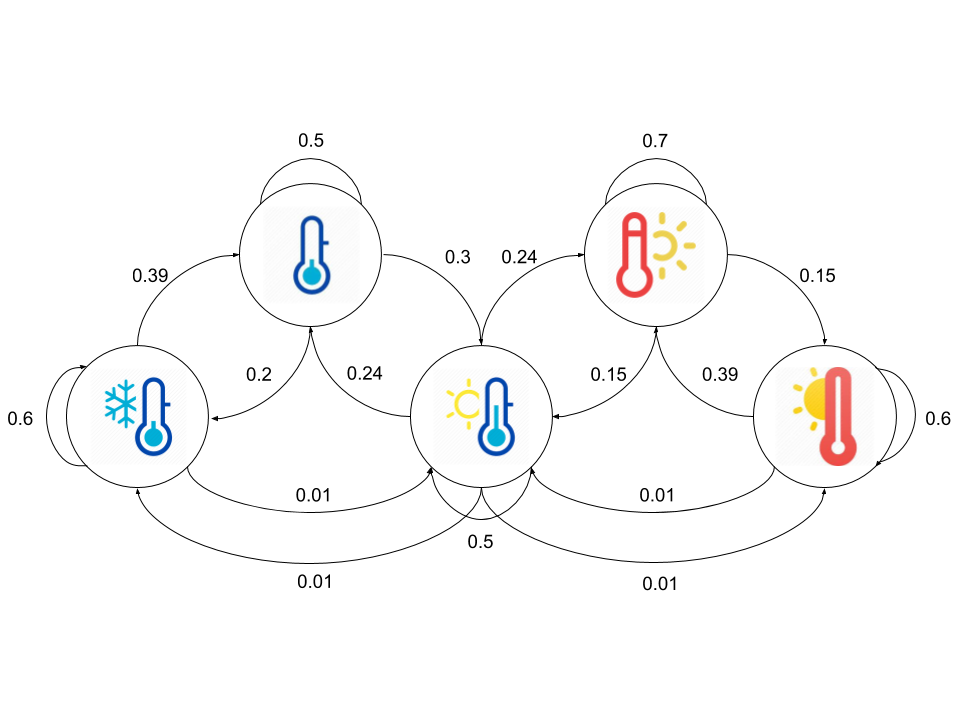

# 0x02. Hidden Markov Models

## Learning Objectives

- What is the Markov property?
- What is a Markov chain?
- What is a state?
- What is a transition probability/matrix?
- What is a stationary state?
- What is a regular Markov chain?
- How to determine if a transition matrix is regular
- What is an absorbing state?
- What is a transient state?
- What is a recurrent state?
- What is an absorbing Markov chain?
- What is a Hidden Markov Model?
- What is a hidden state?
- What is an observation?
- What is an emission probability/matrix?
- What is a Trellis diagram?
- What is the Forward algorithm and how do you implement it?
- What is decoding?
- What is the Viterbi algorithm and how do you implement it?
- What is the Forward-Backward algorithm and how do you implement it?
- What is the Baum-Welch algorithm and how do you implement it?

## Requirements

- Allowed editors: `vi`, `vim`, `emacs`
- All your files will be interpreted/compiled on Ubuntu 16.04 LTS using `python3` (version 3.5)
- Your files will be executed with `numpy` (version 1.15)
- All your files should end with a new line
- The first line of all your files should be exactly `#!/usr/bin/env python3`
- All of your files must be executable
- A `README.md` file, at the root of the folder of the project, is mandatory
- Your code should use the `pycodestyle` style (version 2.4)
- All your modules should have documentation (`python3 -c 'print(__import__("my_module").__doc__)'`)
- All your classes should have documentation (`python3 -c 'print(__import__("my_module").MyClass.__doc__)'`)
- All your functions (inside and outside a class) should have documentation (`python3 -c 'print(__import__("my_module").my_function.__doc__)'` and `python3 -c 'print\
(__import__("my_module").MyClass.my_function.__doc__)'`)
- Unless otherwise noted, you are not allowed to import any module except `import numpy as np`

## Tasks

### [0. Markov Chain](./0-markov_chain.py)

Write the function `def markov_chain(P, s, t=1):` that determines the probability of a markov chain being in a particular state after a specified number of iterations:

*   `P` is a square 2D `numpy.ndarray` of shape `(n, n)` representing the transition matrix
    *   `P[i, j]` is the probability of transitioning from state `i` to state `j`
    *   `n` is the number of states in the markov chain
*   `s` is a `numpy.ndarray` of shape `(1, n)` representing the probability of starting in each state
*   `t` is the number of iterations that the markov chain has been through
*   Returns: a `numpy.ndarray` of shape `(1, n)` representing the probability of being in a specific state after `t` iterations, or `None` on failure

```
    alexa@ubuntu-xenial:0x02-hmm$ ./0-main.py
    [[0.2494929  0.26335362 0.23394185 0.25321163]]
    alexa@ubuntu-xenial:0x02-hmm$
```

---

### [1. Regular Chains](./1-regular.py)

Write the function `def regular(P):` that determines the steady state probabilities of a regular markov chain:

*   `P` is a is a square 2D `numpy.ndarray` of shape `(n, n)` representing the transition matrix
    *   `P[i, j]` is the probability of transitioning from state `i` to state `j`
    *   `n` is the number of states in the markov chain
*   Returns: a `numpy.ndarray` of shape `(1, n)` containing the steady state probabilities, or `None` on failure

```
    alexa@ubuntu-xenial:0x02-hmm$ ./1-main.py
    None
    [[0.42857143 0.57142857]]
    [[0.2494929  0.26335362 0.23394185 0.25321163]]
    None
    None
    alexa@ubuntu-xenial:0x02-hmm$
```

---

### [2. Absorbing Chains](./2-absorbing.py)

Write the function `def absorbing(P):` that determines if a markov chain is absorbing:

*   P is a is a square 2D `numpy.ndarray` of shape `(n, n)` representing the transition matrix
    *   `P[i, j]` is the probability of transitioning from state `i` to state `j`
    *   `n` is the number of states in the markov chain
*   Returns: `True` if it is absorbing, or `False` on failure

```
    alexa@ubuntu-xenial:0x02-hmm$ ./2-main.py
    True
    False
    False
    False
    True
    alexa@ubuntu-xenial:0x02-hmm$
```

---

### [3. The Forward Algorithm](./3-forward.py)




Write the function `def forward(Observation, Emission, Transition, Initial):` that performs the forward algorithm for a hidden markov model:

*   `Observation` is a `numpy.ndarray` of shape `(T,)` that contains the index of the observation
    *   `T` is the number of observations
*   `Emission` is a `numpy.ndarray` of shape `(N, M)` containing the emission probability of a specific observation given a hidden state
    *   `Emission[i, j]` is the probability of observing `j` given the hidden state `i`
    *   `N` is the number of hidden states
    *   `M` is the number of all possible observations
*   `Transition` is a 2D `numpy.ndarray` of shape `(N, N)` containing the transition probabilities
    *   `Transition[i, j]` is the probability of transitioning from the hidden state `i` to `j`
*   `Initial` a `numpy.ndarray` of shape `(N, 1)` containing the probability of starting in a particular hidden state
*   Returns: `P, F`, or `None, None` on failure
    *   `P` is the likelihood of the observations given the model
    *   `F` is a `numpy.ndarray` of shape `(N, T)` containing the forward path probabilities
        *   `F[i, j]` is the probability of being in hidden state `i` at time `j` given the previous observations

```
    alexa@ubuntu-xenial:0x02-hmm$ ./3-main.py
    1.7080966131859584e-214
    [[0.00000000e+000 0.00000000e+000 2.98125000e-004 ... 0.00000000e+000
      0.00000000e+000 0.00000000e+000]
     [2.00000000e-002 0.00000000e+000 3.18000000e-003 ... 0.00000000e+000
      0.00000000e+000 0.00000000e+000]
     [2.50000000e-001 3.31250000e-002 0.00000000e+000 ... 2.13885975e-214
      1.17844112e-214 0.00000000e+000]
     [1.00000000e-002 4.69000000e-002 0.00000000e+000 ... 2.41642482e-213
      1.27375484e-213 9.57568349e-215]
     [0.00000000e+000 8.00000000e-004 0.00000000e+000 ... 1.96973759e-214
      9.65573676e-215 7.50528264e-215]]
    alexa@ubuntu-xenial:0x02-hmm$
```

---

### [4. The Viretbi Algorithm](./4-viterbi.py)

Write the function `def viterbi(Observation, Emission, Transition, Initial):` that calculates the most likely sequence of hidden states for a hidden markov model:

*   `Observation` is a `numpy.ndarray` of shape `(T,)` that contains the index of the observation
    *   `T` is the number of observations
*   `Emission` is a `numpy.ndarray` of shape `(N, M)` containing the emission probability of a specific observation given a hidden state
    *   `Emission[i, j]` is the probability of observing `j` given the hidden state `i`
    *   `N` is the number of hidden states
    *   `M` is the number of all possible observations
*   `Transition` is a 2D `numpy.ndarray` of shape `(N, N)` containing the transition probabilities
    *   `Transition[i, j]` is the probability of transitioning from the hidden state `i` to `j`
*   `Initial` a `numpy.ndarray` of shape `(N, 1)` containing the probability of starting in a particular hidden state
*   Returns: `path, P`, or `None, None` on failure
    *   `path` is the a list of length `T` containing the most likely sequence of hidden states
    *   `P` is the probability of obtaining the `path` sequence

```
    alexa@ubuntu-xenial:0x02-hmm$ ./4-main.py
    4.701733355108224e-252
    [2, 2, 1, 0, 0, 0, 0, 0, 0, 0, 0, 1, 1, 2, 1, 1, 1, 1, 0, 0, 1, 2, 2, 2, 3, 3, 3, 2, 1, 2, 1, 1, 2, 2, 2, 3, 3, 2, 2, 3, 4, 4, 3, 3, 2, 2, 3, 3, 3, 2, 1, 1, 1, 1, 1, 0, 0, 0, 0, 1, 0, 0, 1, 0, 0, 0, 1, 1, 2, 3, 3, 2, 1, 2, 1, 1, 1, 2, 2, 3, 4, 4, 4, 3, 3, 3, 4, 4, 4, 4, 4, 4, 4, 4, 3, 3, 3, 3, 2, 2, 2, 3, 3, 3, 4, 4, 4, 4, 4, 3, 2, 2, 3, 2, 2, 3, 4, 4, 4, 3, 2, 1, 0, 0, 0, 1, 2, 2, 1, 1, 2, 3, 3, 2, 1, 1, 1, 2, 3, 3, 3, 2, 1, 0, 0, 0, 0, 0, 0, 0, 0, 1, 1, 1, 2, 2, 2, 2, 3, 3, 3, 3, 3, 3, 3, 2, 1, 2, 1, 1, 1, 2, 2, 2, 2, 2, 2, 2, 1, 0, 0, 1, 2, 2, 1, 2, 1, 1, 1, 1, 2, 2, 2, 3, 3, 3, 3, 3, 3, 4, 4, 4, 4, 4, 3, 3, 4, 4, 4, 4, 3, 3, 3, 2, 1, 1, 1, 1, 2, 1, 0, 0, 0, 0, 1, 2, 2, 3, 3, 3, 3, 3, 3, 3, 3, 3, 3, 2, 2, 3, 4, 4, 4, 3, 3, 3, 3, 2, 2, 3, 3, 3, 3, 4, 4, 3, 3, 3, 3, 3, 3, 4, 4, 4, 4, 3, 3, 3, 3, 3, 3, 3, 3, 3, 3, 3, 3, 3, 3, 3, 3, 3, 3, 3, 3, 3, 3, 3, 3, 3, 3, 3, 3, 3, 3, 2, 2, 1, 2, 1, 2, 3, 3, 3, 3, 3, 3, 3, 3, 3, 3, 3, 2, 2, 1, 1, 2, 1, 1, 2, 2, 2, 1, 0, 0, 0, 0, 1, 0, 0, 0, 0, 1, 1, 2, 1, 1, 2, 3, 3, 4, 4, 4, 4, 3, 3, 3, 3, 3, 3, 3, 3, 3, 3, 3, 3, 3, 3, 4, 4, 3, 3, 3, 3, 3]
    alexa@ubuntu-xenial:0x02-hmm$
```

---

### [5. The Backward Algorithm](./5-backward.py)

Write the function `def backward(Observation, Emission, Transition, Initial):` that performs the backward algorithm for a hidden markov model:

*   `Observation` is a `numpy.ndarray` of shape `(T,)` that contains the index of the observation
    *   `T` is the number of observations
*   `Emission` is a `numpy.ndarray` of shape `(N, M)` containing the emission probability of a specific observation given a hidden state
    *   `Emission[i, j]` is the probability of observing `j` given the hidden state `i`
    *   `N` is the number of hidden states
    *   `M` is the number of all possible observations
*   `Transition` is a 2D `numpy.ndarray` of shape `(N, N)` containing the transition probabilities
    *   `Transition[i, j]` is the probability of transitioning from the hidden state `i` to `j`
*   `Initial` a `numpy.ndarray` of shape `(N, 1)` containing the probability of starting in a particular hidden state
*   Returns: `P, B`, or `None, None` on failure
    *   `P`is the likelihood of the observations given the model
    *   `B` is a `numpy.ndarray` of shape `(N, T)` containing the backward path probabilities
        *   `B[i, j]` is the probability of generating the future observations from hidden state `i` at time `j`

```
    alexa@ubuntu-xenial:0x02-hmm$ ./5-main.py
    1.7080966131859631e-214
    [[1.28912952e-215 6.12087935e-212 1.00555701e-211 ... 6.75000000e-005
      0.00000000e+000 1.00000000e+000]
     [3.86738856e-214 2.69573528e-212 4.42866330e-212 ... 2.02500000e-003
      0.00000000e+000 1.00000000e+000]
     [6.44564760e-214 5.15651808e-213 8.47145100e-213 ... 2.31330000e-002
      2.70000000e-002 1.00000000e+000]
     [1.93369428e-214 0.00000000e+000 0.00000000e+000 ... 6.39325000e-002
      1.15000000e-001 1.00000000e+000]
     [1.28912952e-215 0.00000000e+000 0.00000000e+000 ... 5.77425000e-002
      2.19000000e-001 1.00000000e+000]]
    alexa@ubuntu-xenial:0x02-hmm$
```

---

### [6. The Baum-Welch Algorithm](./6-baum_welch.py)

Write the function `def baum_welch(Observations, Transition, Emission, Initial, iterations=1000):` that performs the Baum-Welch algorithm for a hidden markov model:

*   `Observations` is a `numpy.ndarray` of shape `(T,)` that contains the index of the observation
    *   `T` is the number of observations
*   `Transition` is a `numpy.ndarray` of shape `(M, M)` that contains the initialized transition probabilities
    *   `M` is the number of hidden states
*   `Emission` is a `numpy.ndarray` of shape `(M, N)` that contains the initialized emission probabilities
    *   `N` is the number of output states
*   `Initial` is a `numpy.ndarray` of shape `(M, 1)` that contains the initialized starting probabilities
*   `iterations` is the number of times expectation-maximization should be performed
*   Returns: the converged `Transition, Emission`, or `None, None` on failure

```
    alexa@ubuntu-xenial:0x02-hmm$ ./6-main.py
    [[0.81 0.19]
     [0.28 0.72]]
    [[0.82 0.18 0\.  ]
     [0.26 0.58 0.16]]
    alexa@ubuntu-xenial:0x02-hmm$
```

_With very little data (only 365 observations), we have been able to get a pretty good estimate of the transition and emission probabilities. We have not used a larger sample size in this example because our implementation does not utilize logarithms to handle values approaching 0 with the increased sequence length_

---

## Author

- **Pierre Beaujuge** - [PierreBeaujuge](https://github.com/PierreBeaujuge)