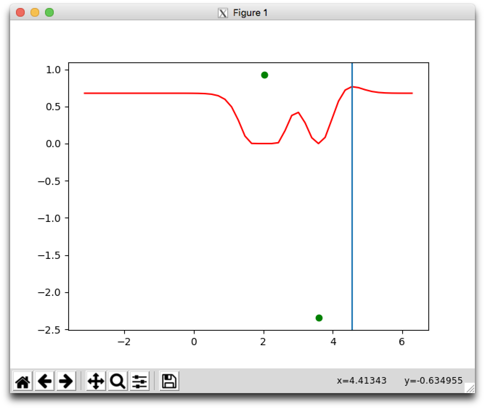

# 0x03. Hyperparameter Tuning

## This project was summarized in a Medium article (follow the link!):
### ["Bayesian Optimization on the Head Classifier of Pre-Trained CNNs Using the CIFAR10 Dataset: Transfer Learning 'Upgraded'"](https://medium.com/@pierre.beaujuge/bayesian-optimization-on-the-head-classifier-of-pre-trained-cnns-using-the-cifar10-dataset-48c440b67b2c)

## Learning Objectives

- What is Hyperparameter Tuning?
- What is random search? grid search?
- What is a Gaussian Process?
- What is a mean function?
- What is a Kernel function?
- What is Gaussian Process Regression/Kriging?
- What is Bayesian Optimization?
- What is an Acquisition function?
- What is Expected Improvement?
- What is Knowledge Gradient?
- What is Entropy Search/Predictive Entropy Search?
- What is GPy?
- What is GPyOpt?

## Requirements

- Allowed editors: `vi`, `vim`, `emacs`
- All your files will be interpreted/compiled on Ubuntu 16.04 LTS using `python3` (version 3.5)
- Your files will be executed with `numpy` (version 1.15)
- All your files should end with a new line
- The first line of all your files should be exactly `#!/usr/bin/env python3`
- All of your files must be executable
- A `README.md` file, at the root of the folder of the project, is mandatory
- Your code should use the `pycodestyle` style (version 2.4)
- All your modules should have documentation (`python3 -c 'print(__import__("my_module").__doc__)'`)
- All your classes should have documentation (`python3 -c 'print(__import__("my_module").MyClass.__doc__)'`)
- All your functions (inside and outside a class) should have documentation (`python3 -c 'print(__import__("my_module").my_function.__doc__)'` and `python3 -c 'print\
(__import__("my_module").MyClass.my_function.__doc__)'`)
- Unless otherwise noted, you are not allowed to import any module except `import numpy as np`

## Install GPy and GPyOpt

```
pip install --user GPy
pip install --user gpyopt
```

## Tasks

### [0. Initialize Gaussian Process](./0-gp.py)

Create the class `GaussianProcess` that represents a noiseless 1D Gaussian process:

*   Class constructor: `def __init__(self, X_init, Y_init, l=1, sigma_f=1)`:

    *   `X_init` is a `numpy.ndarray` of shape `(t, 1)` representing the inputs already sampled with the black-box function
    *   `Y_init` is a `numpy.ndarray` of shape `(t, 1)` representing the outputs of the black-box function for each input in `X_init`
    *   `t` is the number of initial samples
    *   `l` is the length parameter for the kernel
    *   `sigma_f` is the standard deviation given to the output of the black-box function
    *   Sets the public instance attributes `X`, `Y`, `l`, and `sigma_f` corresponding to the respective constructor inputs
    *   Sets the public instance attribute `K`, representing the current covariance kernel matrix for the Gaussian process
*   Public instance method `def kernel(self, X1, X2):` that calculates the covariance kernel matrix between two matrices:

    *   `X1` is a `numpy.ndarray` of shape `(m, 1)`
    *   `X2` is a `numpy.ndarray` of shape `(n, 1)`
    *   the kernel should use the Radial Basis Function (RBF)
    *   Returns: the covariance kernel matrix as a `numpy.ndarray` of shape `(m, n)`

```
    root@alexa-ml2-1:~/0x03-hyperparameter_opt# ./0-main.py
    True
    True
    0.6
    2
    (2, 2) [[4\.         0.13150595]
     [0.13150595 4\.        ]]
    True
    root@alexa-ml2-1:~/0x03-hyperparameter_opt#
```

---

### [1. Gaussian Process Prediction](./1-gp.py)

Based on `0-gp.py`, update the class `GaussianProcess`:

*   Public instance method `def predict(self, X_s):` that predicts the mean and standard deviation of points in a Gaussian process:
    *   `X_s` is a `numpy.ndarray` of shape `(s, 1)` containing all of the points whose mean and standard deviation should be calculated
        *   `s` is the number of sample points
    *   Returns: `mu, sigma`
        *   `mu` is a `numpy.ndarray` of shape `(s,)` containing the mean for each point in `X_s`, respectively
        *   `sigma` is a `numpy.ndarray` of shape `(s,)` containing the standard deviation for each point in `X_s`, respectively

```
    root@alexa-ml2-1:~/0x03-hyperparameter_opt# ./1-main.py
    (10,) [ 0.20148983  0.93469135  0.14512328 -0.99831012  0.21779183 -0.05063668
     -0.00116747  0.03434981 -1.15092063  0.9221554 ]
    (10,) [1.90890408 0.01512125 3.91606789 2.42958747 3.81083574 3.99817545
     3.99999903 3.9953012  3.05639472 0.37179608]
    root@alexa-ml2-1:~/0x03-hyperparameter_opt#
```

---

### [2. Update Gaussian Process](./2-gp.py)

Based on `1-gp.py`, update the class `GaussianProcess`:

*   Public instance method `def update(self, X_new, Y_new):` that updates a Gaussian Process:
    *   `X_new` is a `numpy.ndarray` of shape `(1,)` that represents the new sample point
    *   `Y_new` is a `numpy.ndarray` of shape `(1,)` that represents the new sample function value
    *   Updates the public instance attributes `X`, `Y`, and `K`

```
    root@alexa-ml2-1:~/0x03-hyperparameter_opt# ./2-main.py
    X_new: [2.53931833]
    Y_new: [1.99720866]
    (3, 1) [[2.03085276]
     [3.59890832]
     [2.53931833]]
    (3, 1) [[ 0.92485357]
     [-2.33925576]
     [ 1.99720866]]
    (3, 3) [[4\.         0.13150595 2.79327536]
     [0.13150595 4\.         0.84109203]
     [2.79327536 0.84109203 4\.        ]]
    root@alexa-ml2-1:~/0x03-hyperparameter_opt#
```

---

### [3. Initialize Bayesian Optimization](./3-bayes_opt.py)

Create the class `BayesianOptimization` that performs Bayesian optimization on a noiseless 1D Gaussian process:

*   Class constructor `def __init__(self, f, X_init, Y_init, bounds, ac_samples, l=1, sigma_f=1, xsi=0.01, minimize=True):`
    *   `f` is the black-box function to be optimized
    *   `X_init` is a `numpy.ndarray` of shape `(t, 1)` representing the inputs already sampled with the black-box function
    *   `Y_init` is a `numpy.ndarray` of shape `(t, 1)` representing the outputs of the black-box function for each input in `X_init`
    *   `t` is the number of initial samples
    *   `bounds` is a tuple of `(min, max)` representing the bounds of the space in which to look for the optimal point
    *   `ac_samples` is the number of samples that should be analyzed during acquisition
    *   `l` is the length parameter for the kernel
    *   `sigma_f` is the standard deviation given to the output of the black-box function
    *   `xsi` is the exploration-exploitation factor for acquisition
    *   `minimize` is a `bool` determining whether optimization should be performed for minimization (`True`) or maximization (`False`)
    *   Sets the following public instance attributes:
        *   `f`: the black-box function
        *   `gp`: an instance of the class `GaussianProcess`
        *   `X_s`: a `numpy.ndarray` of shape `(ac_samples, 1)` containing all acquisition sample points, evenly spaced between `min` and `max`
        *   `xsi`: the exploration-exploitation factor
        *   `minimize`: a `bool` for minimization versus maximization
*   You may use `GP = __import__('2-gp').GaussianProcess`

```
    root@alexa-ml2-1:~/0x03-hyperparameter_opt# ./3-main.py 
    True
    True
    True
    True
    2
    3
    (50, 1) [[-3.14159265]
     [-2.94925025]
     [-2.75690784]
     [-2.56456543]
     [-2.37222302]
     [-2.17988062]
     [-1.98753821]
     [-1.7951958 ]
     [-1.60285339]
     [-1.41051099]
     [-1.21816858]
     [-1.02582617]
     [-0.83348377]
     [-0.64114136]
     [-0.44879895]
     [-0.25645654]
     [-0.06411414]
     [ 0.12822827]
     [ 0.32057068]
     [ 0.51291309]
     [ 0.70525549]
     [ 0.8975979 ]
     [ 1.08994031]
     [ 1.28228272]
     [ 1.47462512]
     [ 1.66696753]
     [ 1.85930994]
     [ 2.05165235]
     [ 2.24399475]
     [ 2.43633716]
     [ 2.62867957]
     [ 2.82102197]
     [ 3.01336438]
     [ 3.20570679]
     [ 3.3980492 ]
     [ 3.5903916 ]
     [ 3.78273401]
     [ 3.97507642]
     [ 4.16741883]
     [ 4.35976123]
     [ 4.55210364]
     [ 4.74444605]
     [ 4.93678846]
     [ 5.12913086]
     [ 5.32147327]
     [ 5.51381568]
     [ 5.70615809]
     [ 5.89850049]
     [ 6.0908429 ]
     [ 6.28318531]]
    0.05
    True
    root@alexa-ml2-1:~/0x03-hyperparameter_opt#
```

---

### [4. Bayesian Optimization - Acquisition](./4-bayes_opt.py)

Based on `3-bayes_opt.py`, update the class `BayesianOptimization`:

*   Public instance method `def acquisition(self):` that calculates the next best sample location:
    *   Uses the Expected Improvement acquisition function
    *   Returns: `X_next, EI`
        *   `X_next` is a `numpy.ndarray` of shape `(1,)` representing the next best sample point
        *   `EI` is a `numpy.ndarray` of shape `(ac_samples,)` containing the expected improvement of each potential sample
*   You may use `from scipy.stats import norm`

```
    root@alexa-ml2-1:~/0x03-hyperparameter_opt# ./4-main.py
    [6.77642382e-01 6.77642382e-01 6.77642382e-01 6.77642382e-01
     6.77642382e-01 6.77642382e-01 6.77642382e-01 6.77642382e-01
     6.77642379e-01 6.77642362e-01 6.77642264e-01 6.77641744e-01
     6.77639277e-01 6.77628755e-01 6.77588381e-01 6.77448973e-01
     6.77014261e-01 6.75778547e-01 6.72513223e-01 6.64262238e-01
     6.43934968e-01 5.95940851e-01 4.93763541e-01 3.15415142e-01
     1.01026267e-01 1.73225936e-03 4.29042673e-28 0.00000000e+00
     4.54945116e-13 1.14549081e-02 1.74765619e-01 3.78063126e-01
     4.19729153e-01 2.79303426e-01 7.84942221e-02 0.00000000e+00
     8.33323492e-02 3.25320033e-01 5.70580150e-01 7.20239593e-01
     7.65975535e-01 7.52693111e-01 7.24099594e-01 7.01220863e-01
     6.87941196e-01 6.81608621e-01 6.79006118e-01 6.78063616e-01
     6.77759591e-01 6.77671794e-01]
    [4.55210364]
```


---

### [5. Bayesian Optimization](./5-bayes_opt.py)

Based on `4-bayes_opt.py`, update the class `BayesianOptimization`:

*   Public instance method `def optimize(self, iterations=100):` that optimizes the black-box function:
    *   `iterations` is the maximum number of iterations to perform
    *   If the next proposed point is one that has already been sampled, optimization should be stopped early
    *   Returns: `X_opt, Y_opt`
        *   `X_opt` is a `numpy.ndarray` of shape `(1,)` representing the optimal point
        *   `Y_opt` is a `numpy.ndarray` of shape `(1,)` representing the optimal function value

```
    root@alexa-ml2-1:~/0x03-hyperparameter_opt# ./5-main.py
    Optimal X: [0.8975979]
    Optimal Y: [-2.92478374]
    All sample inputs: [[ 2.03085276]
     [ 3.59890832]
     [ 4.55210364]
     [ 5.89850049]
     [-3.14159265]
     [-0.83348377]
     [ 0.70525549]
     [-2.17988062]
     [ 3.01336438]
     [ 3.97507642]
     [ 1.28228272]
     [ 5.12913086]
     [ 0.12822827]
     [ 6.28318531]
     [-1.60285339]
     [-2.75690784]
     [-2.56456543]
     [ 0.8975979 ]
     [ 2.43633716]
     [-0.44879895]]
    root@alexa-ml2-1:~/0x03-hyperparameter_opt#
```

---

### [6. Medium Article](https://medium.com/@pierre.beaujuge/bayesian-optimization-on-the-head-classifier-of-pre-trained-cnns-using-the-cifar10-dataset-48c440b67b2c)

Write a python script that optimizes a machine learning model of your choice using `GPyOpt`:

*   Your script should optimize at least 5 different hyperparameters. E.g. learning rate, number of units in a layer, dropout rate, L2 regularization weight, batch size
*   Your model should be optimized on a single satisficing metric
*   Your model should save a checkpoint of its best iteration during each training session
    *   The filename of the checkpoint should specify the values of the hyperparameters being tuned
*   Your model should perform early stopping
*   Bayesian optimization should run for a maximum of 30 iterations
*   Once optimization has been performed, your script should plot the acquisition function as well as the convergence
*   Your script should save a report of the optimization to the file `'bayes_opt.txt'`
*   There are no restrictions on imports

Once you have finished your script, write a blog post describing your approach to this task. Your blog post should include:

*   A description of what a Gaussian Process is
*   A description of Bayesian Optimization
*   The particular model that you chose to optimize
*   The reasons you chose to focus on your specific hyperparameters
*   The reason you chose your satisficing matric
*   Your reasoning behind any other approach choices
*   Any conclusions you made from performing this optimization
*   Final thoughts

---

## Author

- **Pierre Beaujuge** - [PierreBeaujuge](https://github.com/PierreBeaujuge)