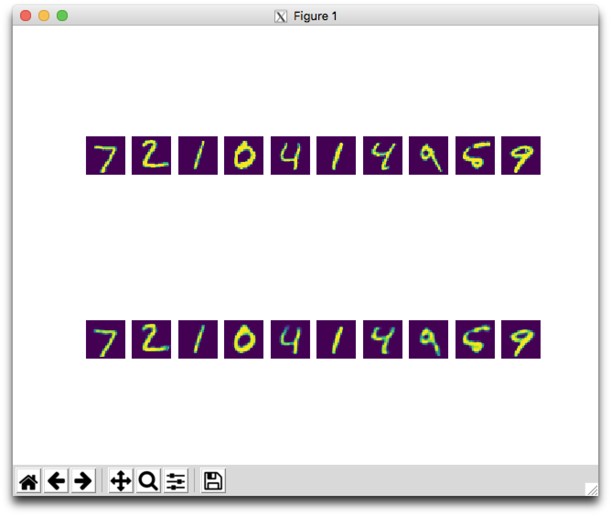
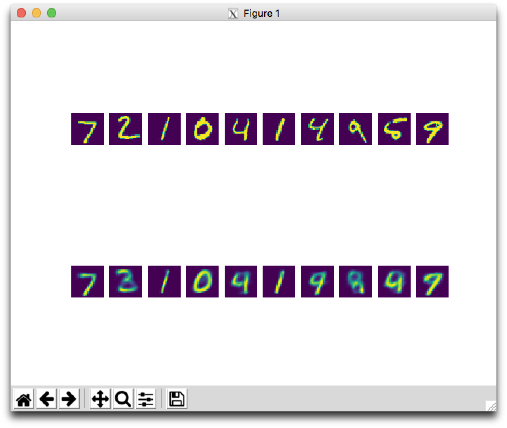
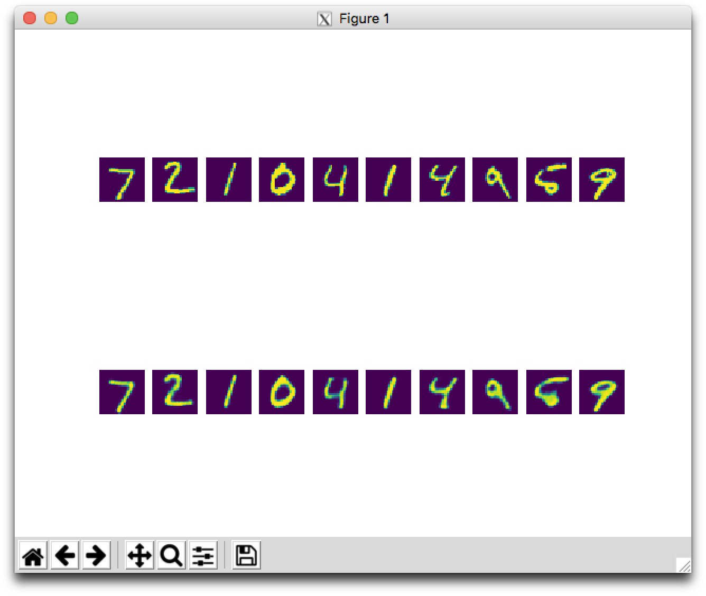
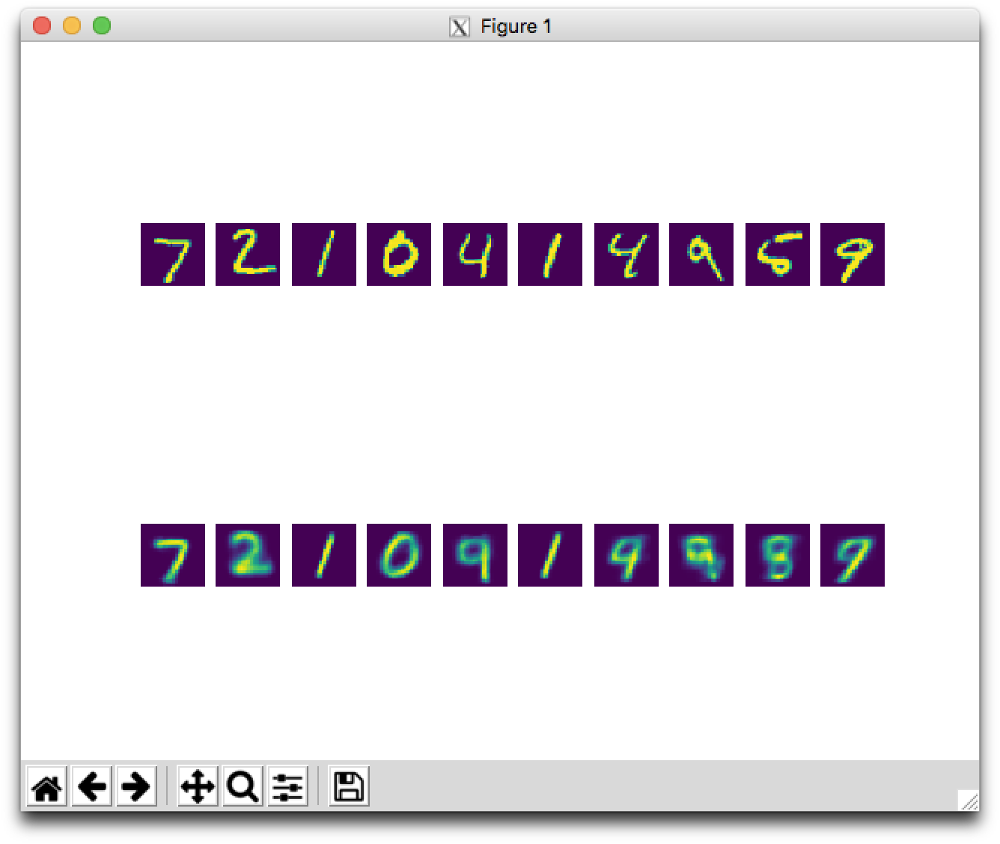
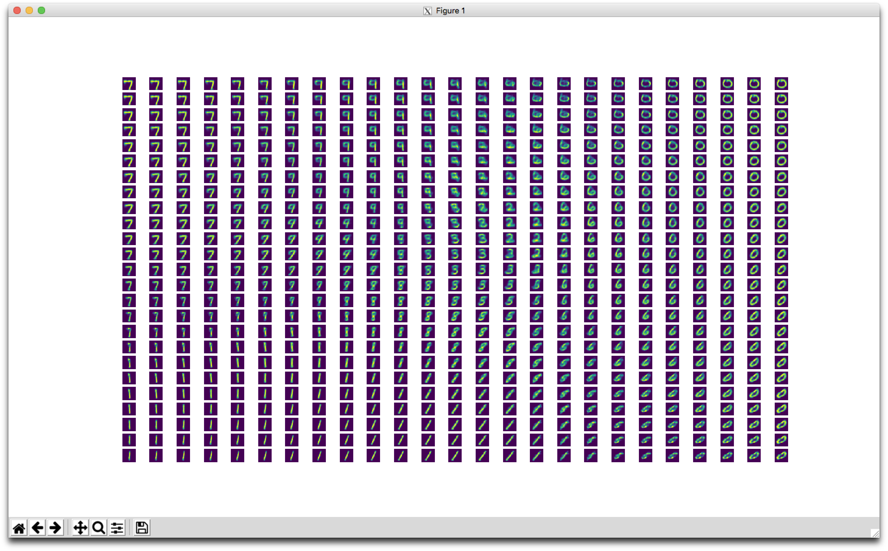

# 0x04. Autoencoders

## Learning Objectives

- What is an autoencoder?
- What is latent space?
- What is a bottleneck?
- What is a sparse autoencoder?
- What is a convolutional autoencoder?
- What is a generative model?
- What is a variational autoencoder?
- What is the Kullback-Leibler divergence?

## Requirements

- Allowed editors: `vi`, `vim`, `emacs`
- All your files will be interpreted/compiled on Ubuntu 16.04 LTS using `python3` (version 3.5)
- Your files will be executed with `numpy` (version 1.15) and `tensorflow` (version 1.12)
- All your files should end with a new line
- The first line of all your files should be exactly `#!/usr/bin/env python3`
- All of your files must be executable
- A `README.md` file, at the root of the folder of the project, is mandatory
- Your code should use the `pycodestyle` style (version 2.4)
- All your modules should have documentation (`python3 -c 'print(__import__("my_module").__doc__)'`)
- All your classes should have documentation (`python3 -c 'print(__import__("my_module").MyClass.__doc__)'`)
- All your functions (inside and outside a class) should have documentation (`python3 -c 'print(__import__("my_module").my_function.__doc__)'` and `python3 -c 'print\
(__import__("my_module").MyClass.my_function.__doc__)'`)
- Unless otherwise noted, you are not allowed to import any module except `import tensorflow.keras as keras`

## Tasks

### [0. "Vanilla" Autoencoder](./0-vanilla.py)

Write a function `def autoencoder(input_dims, hidden_layers, latent_dims):` that creates an autoencoder:

*   `input_dims` is an integer containing the dimensions of the model input
*   `hidden_layers` is a list containing the number of nodes for each hidden layer in the encoder, respectively
    *   the hidden layers should be reversed for the decoder
*   `latent_dims` is an integer containing the dimensions of the latent space representation
*   Returns: `encoder, decoder, auto`
    *   `encoder` is the encoder model
    *   `decoder` is the decoder model
    *   `auto` is the full autoencoder model
*   The autoencoder model should be compiled using adam optimization and binary cross-entropy loss
*   All layers should use a `relu` activation except for the last layer in the decoder, which should use `sigmoid`

```
    $ ./0-main.py
    Epoch 1/50
    60000/60000 [==============================] - 5s 85us/step - loss: 0.2504 - val_loss: 0.1667
    Epoch 2/50
    60000/60000 [==============================] - 5s 84us/step - loss: 0.1498 - val_loss: 0.1361
    Epoch 3/50
    60000/60000 [==============================] - 5s 83us/step - loss: 0.1312 - val_loss: 0.1242
    Epoch 4/50
    60000/60000 [==============================] - 5s 79us/step - loss: 0.1220 - val_loss: 0.1173
    Epoch 5/50
    60000/60000 [==============================] - 5s 79us/step - loss: 0.1170 - val_loss: 0.1132

    ...

    Epoch 46/50
    60000/60000 [==============================] - 5s 80us/step - loss: 0.0852 - val_loss: 0.0850
    Epoch 47/50
    60000/60000 [==============================] - 5s 81us/step - loss: 0.0851 - val_loss: 0.0846
    Epoch 48/50
    60000/60000 [==============================] - 5s 84us/step - loss: 0.0850 - val_loss: 0.0848
    Epoch 49/50
    60000/60000 [==============================] - 5s 80us/step - loss: 0.0849 - val_loss: 0.0845
    Epoch 50/50
    60000/60000 [==============================] - 5s 85us/step - loss: 0.0848 - val_loss: 0.0844
    6.5280433
```


---

### [1. Sparse Autoencoder](./1-sparse.py)

Write a function `def sparse(input_dims, hidden_layers, latent_dims, lambtha):` that creates a sparse autoencoder:

*   `input_dims` is an integer containing the dimensions of the model input
*   `hidden_layers` is a list containing the number of nodes for each hidden layer in the encoder, respectively
    *   the hidden layers should be reversed for the decoder
*   `latent_dims` is an integer containing the dimensions of the latent space representation
*   `lambtha` is the regularization parameter used for L1 regularization on the encoded output
*   Returns: `encoder, decoder, auto`
    *   `encoder` is the encoder model
    *   `decoder` is the decoder model
    *   `auto` is the sparse autoencoder model
*   The sparse autoencoder model should be compiled using adam optimization and binary cross-entropy loss
*   All layers should use a `relu` activation except for the last layer in the decoder, which should use `sigmoid`

```
    $ ./1-main.py
    Epoch 1/50
    60000/60000 [==============================] - 6s 102us/step - loss: 0.3123 - val_loss: 0.2538
    Epoch 2/100
    60000/60000 [==============================] - 6s 96us/step - loss: 0.2463 - val_loss: 0.2410
    Epoch 3/100
    60000/60000 [==============================] - 5s 90us/step - loss: 0.2400 - val_loss: 0.2381
    Epoch 4/100
    60000/60000 [==============================] - 5s 80us/step - loss: 0.2379 - val_loss: 0.2360
    Epoch 5/100
    60000/60000 [==============================] - 5s 82us/step - loss: 0.2360 - val_loss: 0.2339

    ...

    Epoch 96/100
    60000/60000 [==============================] - 5s 80us/step - loss: 0.1602 - val_loss: 0.1609
    Epoch 97/100
    60000/60000 [==============================] - 5s 84us/step - loss: 0.1601 - val_loss: 0.1608
    Epoch 98/100
    60000/60000 [==============================] - 5s 87us/step - loss: 0.1601 - val_loss: 0.1601
    Epoch 99/100
    60000/60000 [==============================] - 5s 89us/step - loss: 0.1601 - val_loss: 0.1604
    Epoch 100/100
    60000/60000 [==============================] - 5s 82us/step - loss: 0.1597 - val_loss: 0.1601
    0.016292876
```


---

### [2. Convolutional Autoencoder](./2-convolutional.py)

Write a function `def autoencoder(input_dims, filters, latent_dims):` that creates a convolutional autoencoder:

*   `input_dims` is a tuple of integers containing the dimensions of the model input
*   `filters` is a list containing the number of filters for each convolutional layer in the encoder, respectively
    *   the filters should be reversed for the decoder
*   `latent_dims` is a tuple of integers containing the dimensions of the latent space representation
*   Each convolution in the encoder should use a kernel size of `(3, 3)` with same padding and `relu` activation, followed by max pooling of size `(2, 2)`
*   Each convolution in the decoder, except for the last two, should use a filter size of `(3, 3)` with same padding and `relu` activation, followed by upsampling of size `(2, 2)`
    *   The second to last convolution should instead use valid padding
    *   The last convolution should have the same number of filters as the number of channels in `input_dims` with `sigmoid` activation and no upsampling
*   Returns: `encoder, decoder, auto`
    *   `encoder` is the encoder model
    *   `decoder` is the decoder model
    *   `auto` is the full autoencoder model
*   The autoencoder model should be compiled using adam optimization and binary cross-entropy loss

```
    $ ./2-main.py
    Epoch 1/50
    60000/60000 [==============================] - 49s 810us/step - loss: 63.9743 - val_loss: 43.5109
    Epoch 2/50
    60000/60000 [==============================] - 48s 804us/step - loss: 39.9287 - val_loss: 37.1333
    Epoch 3/50
    60000/60000 [==============================] - 48s 803us/step - loss: 35.7883 - val_loss: 34.1952
    Epoch 4/50
    60000/60000 [==============================] - 48s 792us/step - loss: 33.4408 - val_loss: 32.2462
    Epoch 5/50
    60000/60000 [==============================] - 47s 791us/step - loss: 31.8871 - val_loss: 30.9729

    ...

    Epoch 46/50
    60000/60000 [==============================] - 45s 752us/step - loss: 23.9016 - val_loss: 23.6926
    Epoch 47/50
    60000/60000 [==============================] - 45s 754us/step - loss: 23.9029 - val_loss: 23.7102
    Epoch 48/50
    60000/60000 [==============================] - 45s 750us/step - loss: 23.8331 - val_loss: 23.5239
    Epoch 49/50
    60000/60000 [==============================] - 46s 771us/step - loss: 23.8047 - val_loss: 23.5510
    Epoch 50/50
    60000/60000 [==============================] - 46s 772us/step - loss: 23.7744 - val_loss: 23.4939
    2.4494107
```


---

### [3. Variational Autoencoder](./3-variational.py)

Write a function `def autoencoder(input_dims, hidden_layers, latent_dims):` that creates a variational autoencoder:

*   `input_dims` is an integer containing the dimensions of the model input
*   `hidden_layers` is a list containing the number of nodes for each hidden layer in the encoder, respectively
    *   the hidden layers should be reversed for the decoder
*   `latent_dims` is an integer containing the dimensions of the latent space representation
*   Returns: `encoder, decoder, auto`
    *   `encoder` is the encoder model, which should output the latent representation, the mean, and the log variance, respectively
    *   `decoder` is the decoder model
    *   `auto` is the full autoencoder model
*   The autoencoder model should be compiled using adam optimization and binary cross-entropy loss
*   All layers should use a `relu` activation except for the mean and log variance layers in the encoder, which should use `None`, and the last layer in the decoder, which should use `sigmoid`

```
    $ ./3-main.py
    Epoch 1/50
    60000/60000 [==============================] - 15s 242us/step - loss: 214.4525 - val_loss: 177.2306
    Epoch 2/50
    60000/60000 [==============================] - 11s 175us/step - loss: 171.7558 - val_loss: 168.7191
    Epoch 3/50
    60000/60000 [==============================] - 11s 182us/step - loss: 167.4977 - val_loss: 166.5061
    Epoch 4/50
    60000/60000 [==============================] - 11s 179us/step - loss: 165.6473 - val_loss: 165.1279
    Epoch 5/50
    60000/60000 [==============================] - 11s 181us/step - loss: 164.0918 - val_loss: 163.7083

    ...

    Epoch 46/50
    60000/60000 [==============================] - 15s 249us/step - loss: 148.1491 - val_loss: 151.3205
    Epoch 47/50
    60000/60000 [==============================] - 12s 204us/step - loss: 148.0358 - val_loss: 151.2141
    Epoch 48/50
    60000/60000 [==============================] - 11s 179us/step - loss: 147.9396 - val_loss: 151.3823
    Epoch 49/50
    60000/60000 [==============================] - 13s 223us/step - loss: 147.8144 - val_loss: 151.4026
    Epoch 50/50
    60000/60000 [==============================] - 11s 189us/step - loss: 147.6572 - val_loss: 151.1969
    [[-0.33454233 -3.0770888 ]
     [-0.68772286  0.52945304]
     [ 3.1372023  -1.5037178 ]
     [-0.46997875  2.4711971 ]
     [-2.239822   -0.91364074]
     [ 2.7829633  -1.2185467 ]
     [-0.8319831  -0.97430193]
     [-1.3994675  -0.16924876]
     [-0.2642493  -0.45080736]
     [-0.3476941  -1.5133704 ]]
    [[0.07307572 0.18656202]
     [0.04450396 0.03617072]
     [0.15917557 0.09816898]
     [0.07885559 0.056187  ]
     [0.11542598 0.07378525]
     [0.14280568 0.0857826 ]
     [0.0790622  0.07540198]
     [0.08175724 0.05216441]
     [0.05364255 0.05444151]
     [0.04280119 0.07214296]]
```




---

## Author

- **Pierre Beaujuge** - [PierreBeaujuge](https://github.com/PierreBeaujuge)