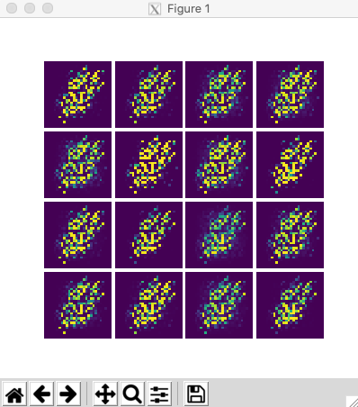

# 0x05. Generative Adversarial Networks

## Some GAN-generated Images in this Project :)

<p align='center'>
  
  
  
  
  
</p>

* `Train output`
```
vagrant@ubuntu-xenial:~/holbertonschool-machine_learning/unsupervised_learning/0x05-GANs$ ./5-main.py
Epoch: 0
D_loss: 1.838328242301941
G_loss: 1.8368370532989502
Epoch: 1000
D_loss: 0.026001393795013428
G_loss: 10.522038459777832
Epoch: 2000
D_loss: 0.007320269476622343
G_loss: 8.28874397277832
Epoch: 3000
D_loss: 0.12734414637088776
G_loss: 6.635959625244141
Epoch: 4000
D_loss: 0.10047760605812073
G_loss: 6.356070518493652
Epoch: 5000
D_loss: 0.0552017018198967
G_loss: 5.478587627410889
Epoch: 6000
D_loss: 0.2517339587211609
G_loss: 4.47649621963501
Epoch: 7000
D_loss: 0.22253933548927307
G_loss: 3.5398597717285156
Etc...
```

## Learning Objectives

- What is a generator?
- What is a discriminator?
- What is the minimax loss? modified minimax loss? wasserstein loss?
- How do you train a GAN?
- What are the use cases for GANs?
- What are the shortcoming of GANs?

## Requirements

- Allowed editors: `vi`, `vim`, `emacs`
- All your files will be interpreted/compiled on Ubuntu 16.04 LTS using `python3` (version 3.5)
- Your files will be executed with `numpy` (version 1.15) and `tensorflow` (version 1.12)
- All your files should end with a new line
- The first line of all your files should be exactly `#!/usr/bin/env python3`
- All of your files must be executable
- A `README.md` file, at the root of the folder of the project, is mandatory
- Your code should use the `pycodestyle` style (version 2.4)
- All your modules should have documentation (`python3 -c 'print(__import__("my_module").__doc__)'`)
- All your classes should have documentation (`python3 -c 'print(__import__("my_module").MyClass.__doc__)'`)
- All your functions (inside and outside a class) should have documentation (`python3 -c 'print(__import__("my_module").my_function.__doc__)'` and `python3 -c 'print\
(__import__("my_module").MyClass.my_function.__doc__)'`)
- Unless otherwise noted, you are not allowed to import any module except `import tensorflow.keras as keras` and `import numpy as np`, as needed

## Tasks

### [0. Generator](./0-generator.py)

---

### [1. Discriminator](./1-discriminator.py)

---

### [2. Train Discriminator](./2-train_discriminator.py)

---

### [3. Train Generator](./3-train_generator.py)

---

### [4. Sample Z](./4-sample_Z.py)

---

### [5. Train GAN](./5-train_GAN.py)

---

## Author

- **Pierre Beaujuge** - [PierreBeaujuge](https://github.com/PierreBeaujuge)